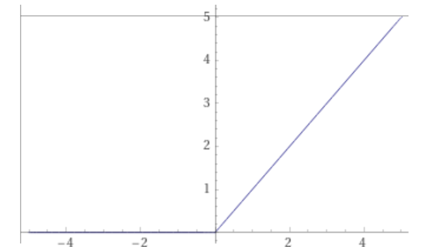

# Activation functions

Activation functions are used to "squishify" the weighted sum of activations + bias of the node

## ReLU Rectified Linear Unit

$$y = max(0, x)$$

-   Most popular activation function in neural networks
-   Gradient descent requires a derivative for all points and technically ReLU does not have a derivative where it is bent at 0. We work around this by simply defining the derivative at the bent part to be 0 or 1.

### Why is ReLU so popular

https://stats.stackexchange.com/questions/226923/why-do-we-use-relu-in-neural-networks-and-how-do-we-use-it

> The main advantage of using the ReLU function over other activation functions
> is that it does not activate all the neurons at the same time.

> One way ReLUs improve neural networks is by speeding up training. The gradient
> computation is very simple (either 0 or 1 depending on the sign of 𝑥). Also,
> the computational step of a ReLU is easy: any negative elements are set to 0.0
> -- no exponentials, no multiplication or division operations.

> They are simple, fast to compute, and don't suffer from vanishing gradients,
> like sigmoid functions (logistic, tanh, erf, and similar). The simplicity of
> implementation makes them suitable for use on GPUs, which are very common today
> due to being optimised for matrix operations (which are also needed for 3D
> graphics).

https://datascience.stackexchange.com/questions/23493/why-relu-is-better-than-the-other-activation-functions

> The biggest advantage of ReLu is indeed non-saturation of its gradient, which
> greatly accelerates the convergence of stochastic gradient descent compared to
> the sigmoid / tanh functions (paper by Krizhevsky et al).

## softplus

$$y = log(1 + e^x) $$

