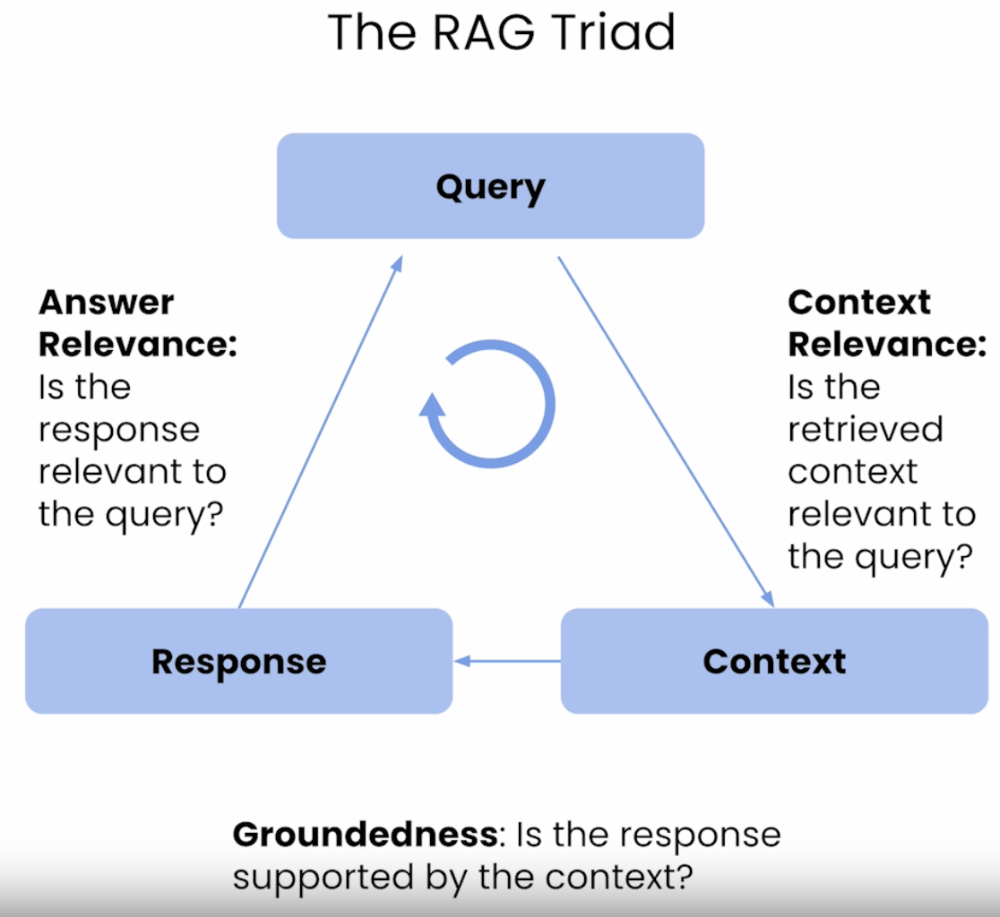
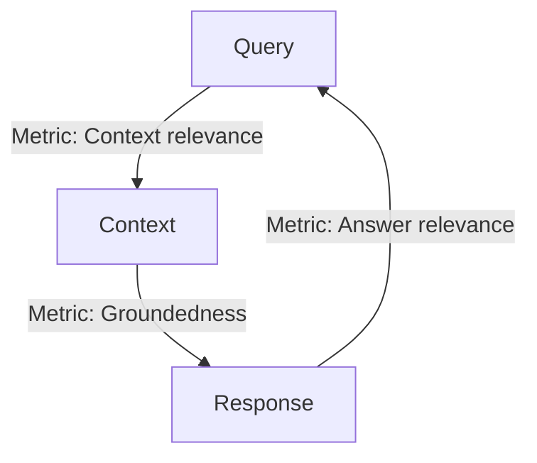
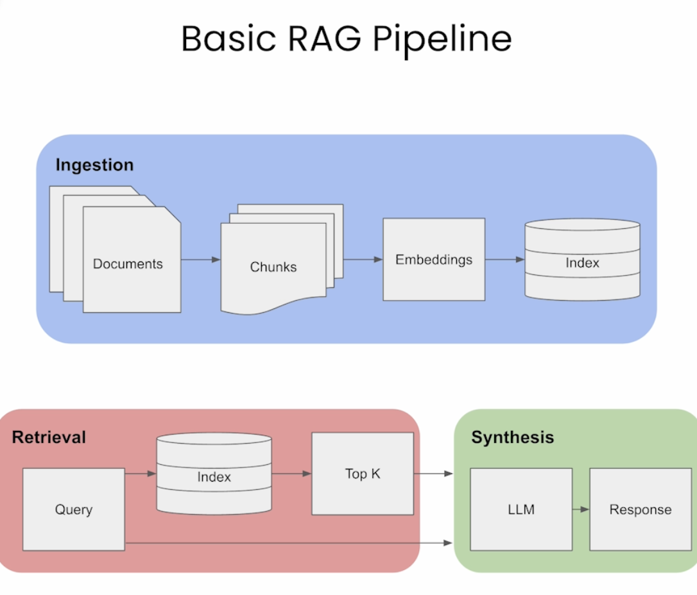

# Retrieveal augmented genreation RAG

https://learn.deeplearning.ai/building-evaluating-advanced-rag/lesson/1/introduction

## Overall impressions

RAG isn't a "one and done" kind of feature. It seems you need to build out the
infrastructure for a build -> deploy -> eval loop because you will want to tweak

1. The embeddings model you use
1. How you chunk your documents (chunk size, chunk heirarchy (if any))
1. Cost/performance trade-offs - great results might cost too much at runtime in
   latency or dollars
1. The questions you use to do evaluation

Python AI code is at an "experimenter" level - the APIs tend to be small and
fairly magical because people want to do AI not write python

## Advanced RAG techniques

Course coverstwo advanced techniques for RAG:

1. Sentence window retrieval
    - get not just the relevant sentence but the window of sentences which occur
      before and after it in the document.
2. Auto-merging retrieval
    - organises the document as a tree structure
        - each parent node contains it's child node sentences
        - if a child sentence matches then the whole prent node is provided as
          context for the LLM

### Sentence window retrieval

### Auto-merging retrieval

## The RAG triad

A triad of evaluation metrics for RAG systems:

1. Context relevance
    - How relevant are the retrieved chunks of text to the users question?
1. Groundedness
1. Answer relevance

Each metric compares two of the three data items of a RAG system (the query, the
context, the response)

More context on the triad:

- a triad of metrics for the 3 main steps of a RAGs execution
- is quite effective
- ?? steps are?

The 3 steps of a RAG execution:

1. Retrieve context
1. ?
1. ?

Trulens uses LLMs to do evaluations records the prompts, outputs of your app in
a sqlite db

## RAG Pipeline

1. Ingestion
    - `documents -> chunks -> embeddings -> index`
2. Retrieval
    - `query -> index -> Top-K ->`
3. Synthesis
    - `(query, top-k) -> LLM -> response`
