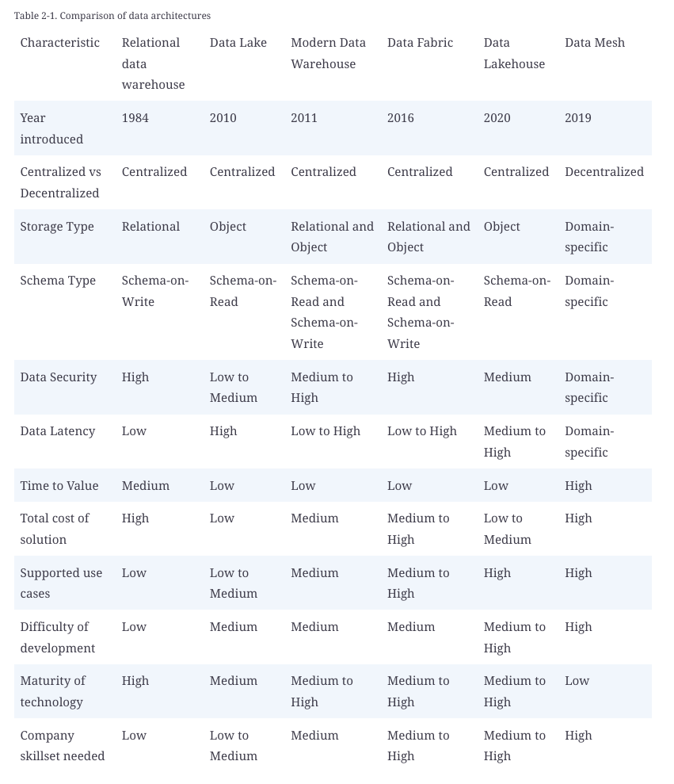
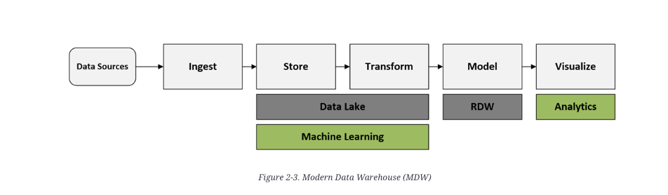
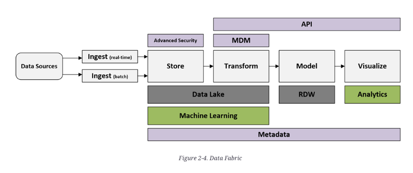
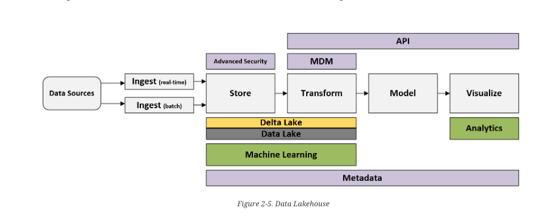
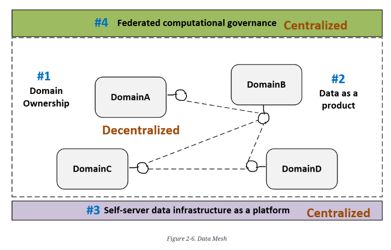
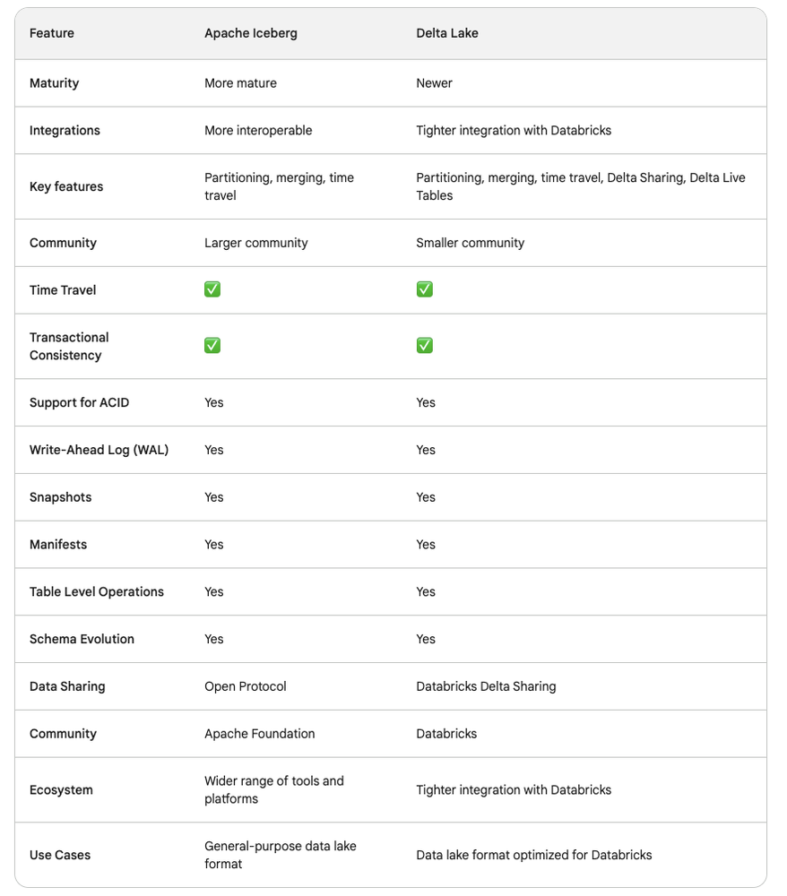
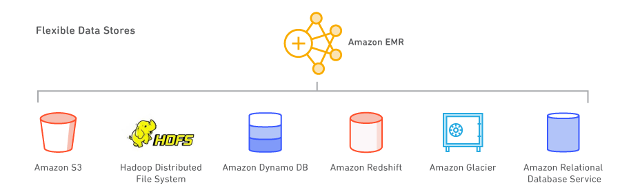
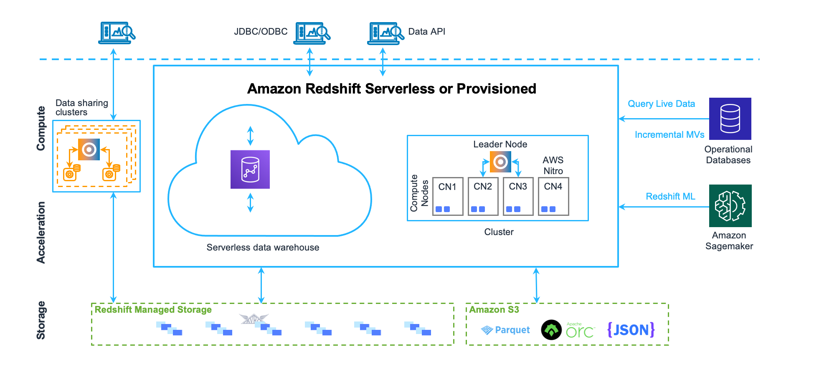

# Big data overview

- [Big data overview](#big-data-overview)
  - [Sources](#sources)
  - [Data architectures](#data-architectures)
  - [Categorise "big" data](#categorise-big-data)
  - [Data formats](#data-formats)
    - [RCFile (File format)](#rcfile-file-format)
    - [Parquet (File format)](#parquet-file-format)
    - [Delta lake (database built on Parquet)](#delta-lake-database-built-on-parquet)
    - [Apache ORC (Optimized Row Columnar) file format](#apache-orc-optimized-row-columnar-file-format)
    - [DuckDB (in-memory DB)](#duckdb-in-memory-db)
    - [Apache Arrow (in memory framework)](#apache-arrow-in-memory-framework)
    - [Apache Iceberg (on-disk table format)](#apache-iceberg-on-disk-table-format)
    - [Apache arvo](#apache-arvo)
    - [Apache Hudi](#apache-hudi)
    - [Comparing file formats](#comparing-file-formats)
  - [Apache spark (A data analytics framework)](#apache-spark-a-data-analytics-framework)
  - [Apache Hive (A SQL DB running on HDFS)](#apache-hive-a-sql-db-running-on-hdfs)
  - [Trino](#trino)
  - [Apache Flink](#apache-flink)
  - [Presto](#presto)
  - [Apache Impala](#apache-impala)
  - [Apache Hadoop](#apache-hadoop)
  - [AWS EMR](#aws-emr)
  - [AWS Lake formation](#aws-lake-formation)
    - [Lake formation: Governed tables](#lake-formation-governed-tables)
  - [AWS Redshift](#aws-redshift)

## Sources

-   [Deciphering data architectures book](https://learning.oreilly.com/library/view/deciphering-data-architectures/9781098150754/)

## Data architectures

No standard definitions of data architectures and concepts



1. Relational data warehouse (1984)
    - storage and compute
    - schema-on-write which makes data ingestion hard
    - can be hard to scale
    - still viable solution now despite the hype around other options
    - despite the name it can use some non-relational but still structured storage e.g. columunar
1. Data lake (2010)
    - Glorified file system
    - Storage only, no compute **required** (but you still have it to do anything with the data)
    - Started with Apache Hadoop
    - schema-on-read
        - schema can be in a separate file
    - defining characteristic is data stored in it's natural/raw format (not transformed on the way in)
    - started as solutions to the problems of data warehouses
    - querying is actually pretty hard with a data lake
        - data lake vendors went out of business
    - the concept has morphed into a place to stage and prepare data
    - suggested zones within your lake
        - raw layer/landing area
        - conformed/base/standardised layer (CSV, JSON, Parquet)
        - cleansed/refined/enriched data layer
        - presentation/application/curated/consumption/gold/production-ready data layer
        - sandbox/exploration/development layer for data scientists to play in
1. Modern Data warehouse (2011)
    - use both a data warehouse and a data lake for the bits they are good at
    - 
1. Data fabric (2016)
    - an evolution of MDW
    - 
1. Data Lakehouse (2020)
    - portmanteau of data lake and data warehouse
    - started with Databricks
    - store your data as in a data-lake but have a layer of transactional storage software which runs on top and lets you do queries
    - can think of it as "data lake with the problems fixed"
    - Open source options
        - Apache iceberg
        - Delta lake
        - Apache Hudi
    - 
1. Data mesh (2019)
    - Fashionable and hyped
    - Only suitable for narrow set of use-cases
    - decentralised
    - data stored in multiple "domains" each owned by a separate area of the business
    - data mesh is a concept not a technology - you cannot buy data mesh
    - requires an org culture shift
    - 

## Categorise "big" data

Define data by 6 metrics:

1. Size/volume
    - how much data is stored
2. Speed/velocity
    - how fast is new data generated
3. Type/Variety
    - structured (RDBMS)
    - semi-structured (logs, CSV, XML, JSON)
    - unstructured (email, docs, PDFs
    - binary (audio, video)
4. Veracity
    - how accurate and reliable
5. Variability
    - how consistent is the format, the quality, the meaning
6. Value
    - how useful and relevant

## Data formats

### RCFile (File format)

> The RCFile (Row Columnar File) data format is designed and implemented for data processing in distributed systems. RCfile is a hybrid data format that forms a table in a sequence row groups. A row group consists of multiple rows. Furtherfore, each row group is partitioned into columns.

-   Sources
    -   https://en.wikipedia.org/wiki/RCFile
    -   https://cwiki.apache.org/confluence/display/Hive/RCFile
-   Supported by Apache Hive
-   has a CLI tool for reading data & metadata - https://cwiki.apache.org/confluence/display/Hive/RCFileCat
-   is maybe a bit old-school now

### Parquet (File format)

-   Forms the basis of _Delta Lake_
-   A superior CSV
-   Is compressed on disk (I think, TODO check)
-   View with https://www.tadviewer.com/
-   https://github.com/apache/parquet-format/
-   https://www.databricks.com/glossary/what-is-parquet
-   https://parquet.apache.org/docs/file-format/

### Delta lake (database built on Parquet)

-   Important in the data lakehouse architecture
-   sits on top of Apache spark (it is NOT a standalone file format)
-   uses a file format which is an extension of parquet format to add ACID transactions, time travel, schema evolution and simple DML
-   Docs https://docs.delta.io/latest/index.html
-   Uses versioned parquet files to store data
-   AWS Glue 3.0 and later supports the Linux Foundation Delta Lake framework.

> Delta Lake is an open data format incubated and maintained by Databricks, the
> company started by the founders of Apache Spark

> Delta Lake is an open storage format used to store tabular data in data lake
> storage systems, offering ACID guarantees

### Apache ORC (Optimized Row Columnar) file format

-   https://orc.apache.org/
-   columnar storage for Hadoop
-   seems similar to Delta lake
-   faster than RCFile or Parquet
-   can be [read directly read/written in Python](https://arrow.apache.org/docs/python/orc.html) with `pyarrow` or `dask`
    -   couldn't find a JS/Ruby package easily
        -   only found abondoned Ruby gems
    -   python libs use the underlying C++ lib
-   stored in `*.orc` files
-   an on-disk format

> Many large Hadoop users have adopted ORC. For instance, Facebook uses ORC to
> save tens of petabytes in their data warehouse and demonstrated that ORC is
> significantly faster than RC File or Parquet. Yahoo uses ORC to store their
> production data and has released some of their benchmark results.
>
> ORC files are divided in to stripes that are roughly 64MB by default. The
> stripes in a file are independent of each other and form the natural unit of
> distributed work. Within each stripe, the columns are separated from each other
> so the reader can read just the columns that are required.

### DuckDB (in-memory DB)

> is an in-process SQL OLAP database management system

-   In-process SQL relational DBMD
-   designed for analytic workloads not transactional workloads
-   ++ very fast, faster than SQLite
-   ++ can natively import and export
    -   parquet
    -   CSV
    -   JSON
    -   Excel
-   ++ a way of pulling a parquet/csv file into memory and doing SQL on it

```
brew install duckdb
```

### Apache Arrow (in memory framework)

-   https://arrow.apache.org/
-   An in-memory format
-   Ruby: [red-arrow](https://github.com/apache/arrow/tree/main/ruby/red-arrow)
-   Python: pyarrow
-   Has libraries for many/most languages
-   Format details: https://arrow.apache.org/overview/
-   The arrow and Parquet projects have libs to allow reading/writing between Parquet and Arrow
-   Typically saved in `*.arrow` files

> Apache Arrow defines a language-independent columnar memory format for flat
> and hierarchical data, organized for efficient analytic operations on modern
> hardware like CPUs and GPUs. The Arrow memory format also supports zero-copy
> reads for lightning-fast data access without serialization overhead.

> Parquet and ORC are designed to be used for storage on disk and Arrow is
> designed to be used for storage in memory

### Apache Iceberg (on-disk table format)

> The open table format for analytic datasets.
>
> Iceberg is a high-performance format for huge analytic tables. Iceberg brings
> the reliability and simplicity of SQL tables to big data, while making it
> possible for engines like Spark, Trino, Flink, Presto, Hive and Impala to safely
> work with the same tables, at the same time.

-   AWS Lake Formation supports it
-   https://iceberg.apache.org/
-   is a Java JAR file
-   can be used from Hive or Spark
- actually stores it's data in Avro, Parquet or ORC
- ??? competes with Delta Lake
    - Good comparison: https://www.linkedin.com/pulse/ultimate-guide-open-table-formats-delta-lake-vs-part-1-pottammal/



```
Q: How does iceberg compare to governed table
```

### Apache arvo

-   https://avro.apache.org/
-   competes with protocol buffers but different approach - no code generation required

> Apache Avro™ is the leading serialization format for record data, and first
> choice for streaming data pipelines. It offers excellent schema evolution, and
> has implementations for the JVM (Java, Kotlin, Scala, …), Python, C/C++/C#, PHP,
> Ruby, Rust, JavaScript, and even Perl.

### Apache Hudi

https://hudi.apache.org/

> Apache Hudi is a transactional data lake platform that brings database and data warehouse capabilities to the data lake. Hudi reimagines slow old-school batch data processing with a powerful new incremental processing framework for low latency minute-level analytics.

- ??? A competitor AWS EMR? It seems to have similar scope

### Comparing file formats

> If you need to exchange data among different systems, your schema changes frequently — Consider Apache Avro
> Building Data Warehousing using Hive for transactional workloads — Consider ORC
> Analytical Workloads, data lakes, processing with Apache Spark — Consider Apache Parquet
> https://blog.det.life/choosing-the-right-big-data-file-format-avro-vs-parquet-vs-orc-c868ffbe5a4e

> https://medium.com/@diehardankush/why-parquet-vs-orc-an-in-depth-comparison-of-file-formats-5fc3b5fdac2e

> https://medium.com/@diehardankush/comparing-data-storage-parquet-vs-arrow-aa2231e51c8a

## Apache spark (A data analytics framework)

-   A data analytics framework for processing large amounts of data in-memory
-   Spark does not include storage - it uses Hive etc. for that
-   Is "a faster map-reduce"
-   A way of doing distributed computing for jobs that take a long time or need to process a whole lot of data
-   You have a cluster of VMs each running the JVM and having some way to accept compute jobs
-   There is a "cluster manager" which can be a spark thing or can be something like k8s
-   You run your query/app on your computer which breaks the app up into chunks of JVM bytecode which it passes to each worker node to run
-   If you have HDFS then something (presumably the client node) looks up the HDFS name server thing to figure out which nodes have which chunks of the input file - compute chunks are passed to nodes to maximise data locality
    -   presumably this only works with HDFS and not at all with S3 and friends?
-   Spark can pull data from Hive, Hadoop or HBase
-   Spark does the analytics in-memory

> Spark extracts data from Hadoop and performs analytics in-memory. The data is pulled into the memory in parallel and in chunks, then the resulting data sets are pushed across to their destination. The data sets can also reside in the memory until they are consumed

## Apache Hive (A SQL DB running on HDFS)

https://cwiki.apache.org/confluence/display/hive/design

> The Apache Hive is a distributed, fault-tolerant data warehouse system that
> enables analytics at a massive scale and facilitates reading, writing, and
> managing petabytes of data residing in distributed storage using SQL.

> Hive Metastore(HMS) provides a central repository of metadata that can easily
> be analyzed to make informed, data driven decisions, and therefore it is a
> critical component of many data lake architectures. Hive is built on top of
> Apache Hadoop and supports storage on S3, adls, gs etc though hdfs. Hive allows
> users to read, write, and manage petabytes of data using SQL.

-   Hive provides full ACID support for ORC tables and insert only support to all other formats.
-   Provides a SQL interface to Hadoop
-   It only runs on HDFS
-   Stores data in tables on HDFS
-   Cons
    -   Data must have structure
    -   Not good for OLTP or OLAP type operations

> Hive is primarily designed to perform extraction and analytics using SQL-like
> queries, while Spark is an analytical platform offering high-speed performance
> Both these tools have respective benefits and cons with specific capabilities and features. Spark, for instance, is highly memory expensive, thereby increasing the total hardware costs. Hive, on the other hand, does not support real-time transaction processing.

> Both these tools are open-source and the products of Apache. However, it is incorrect to consider either of the tools as the replacement of the other. The selection of the tool must be as per the specifications and requirements considering the operating systems, database models, languages, and likewise.

## Trino

https://trino.io/

> Fast distributed SQL query engine for big data analytics that helps you explore your data universe.

- A java jar file


## Apache Flink

https://flink.apache.org/

> Stateful Computations over Data Streams
> Apache Flink is a framework and distributed processing engine for stateful
> computations over unbounded and bounded data streams. Flink has been designed to
> run in all common cluster environments, perform computations at in-memory speed
> and at any scale.

## Presto

https://prestodb.io/

> Presto is an open source SQL query engine that’s fast, reliable, and efficient at scale. Use Presto to run interactive/ad hoc queries at sub-second performance for your high volume apps.

## Apache Impala

https://impala.apache.org/

> Apache Impala is the open source, native analytic database for open data and table formats.

## Apache Hadoop

A distributed compute thing similar idea to Spark

## AWS EMR

-   https://aws.amazon.com/emr/
-   managed service for running Spark, Hive, Presto and other big data workloads
    -   Apache Spark
    -   Apache Spark MLib
    -   Apache Spark GraphX
    -   Apache Spark Streaming
    -   Apache Hive (open source data warehouse)
    -   Apache HBase
    -   Apache FLink
    -   Presto
    -   TensorFlow
    -   Apache MXNet
    -   Hue Notebooks
    -   EMR Notebooks
    -   Apache Hudi
-   has a serverless option where you don't manage any servers
-   has a "serverful" option where you choose the type and number of EC2 nodes and choose an AMI with your big-data framework on it
-   can connect to AWS SageMaker for large-scale model work
-   has an "EMR Studio" IDE
    -   aimed at data scientists and data engineers
    -   lets you create & debug apps built in R, Python, Scala, PySpark
    -   provides Jupyter notebooks
    -   Spark UI
    -   YARN Timeline for debugging
-   Can use many data stores
    -   
    -   Including
        -   Apache Hadoop Distributed File System (HDFS)
        -   S3 by layering an EMR File System (EMRFS) on top
        -   Dynamo DB
        -   Redshift
        -   S3 Glacier
        -   RDS
-   Can do HA multi-master configurations of the frameworks
-   Manages autoscaling your cluster for you

## AWS Lake formation

### Lake formation: Governed tables

-   a fully managed service to build data lakes
    -   manages
        -   moving data in
        -   choosing how to store
        -   cataloging the data
        -   security policies
        -   governance policies
        -   auditing policies
        -   build a catalog of data assets
        -   define user access policies
-   a kind of database built on top of S3
-   Saving in a governed table does something like this
    -   take your CSV
    -   save it as one row per file in S3 with the file in a heirarchy of prefix names which represent it's location
    -   create a catalog so that row can be found easily
-   have transactions so queries see consistent set of data even if an ETL job is mid-run
-   have a storage optimizer which will group small files together for performance
-   supports time travel
    -   you can search older versions of a table
-   When creating a table in _AWS Lake Formation_ you can create a "standard glue table" with data format one of
    -   Arvo
    -   CSV
    -   JSON
    -   XML
    -   Parquet
    -   ORC
    -   or you can create an Apache Iceberg v2 table

```
Q: how does this compare perf and features to Parquet, Orc, Arrow etc.
```

## AWS Redshift



-   A hotrodded postgres which separates compute and storage to handle much larger data volumes than RDS postgres could.
    -   Tuned for OLAP but you can do OLTP if you need to.
    -   has a serverless option
-   A data warehouse product
-   an enterprise-class relational database query and management system.
-   achieves efficient storage and optimum query performance through a combination of massively parallel processing, columnar data storage, and very efficient, targeted data compression encoding schemes.
-   based on postgres
    -   uses a different data storage schema and query execution engine
    -   stores data in columns not rols
    -   stores data compressed
    -   is missing some OLTP focused postgres features e.g. secondary indexes, efficient single row manipulation operations
    -   seems like it might be a fork off postgres 9.x
    -   it's kind of a postgres on top but everything different underneath https://docs.aws.amazon.com/redshift/latest/dg/c_redshift-sql-implementated-differently.html
    -   psql is not supported, they have their own query tool
-   Amazon Redshift is a relational database management system (RDBMS), so it is compatible with other RDBMS applications. Although it provides the same functionality as a typical RDBMS, including online transaction processing (OLTP) functions such as inserting and deleting data, Amazon Redshift is optimized for high-performance analysis and reporting of very large datasets.
