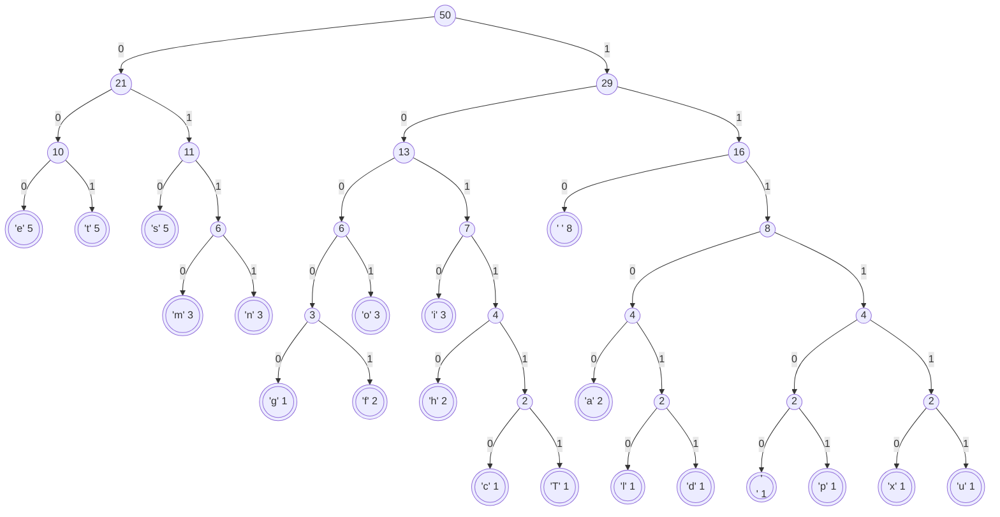

```mermaid
graph TD
  node60(("50"))
  node60 -->|0| node80
  node80(("21"))
  node80 -->|0| node100
  node100(("10"))
  node100 -->|0| node120
  node120((("'e' 5")))
  node100 -->|1| node140
  node140((("'t' 5")))
  node80 -->|1| node160
  node160(("11"))
  node160 -->|0| node180
  node180((("'s' 5")))
  node160 -->|1| node200
  node200(("6"))
  node200 -->|0| node220
  node220((("'m' 3")))
  node200 -->|1| node240
  node240((("'n' 3")))
  node60 -->|1| node260
  node260(("29"))
  node260 -->|0| node280
  node280(("13"))
  node280 -->|0| node300
  node300(("6"))
  node300 -->|0| node320
  node320(("3"))
  node320 -->|0| node340
  node340((("'g' 1")))
  node320 -->|1| node360
  node360((("'f' 2")))
  node300 -->|1| node380
  node380((("'o' 3")))
  node280 -->|1| node400
  node400(("7"))
  node400 -->|0| node420
  node420((("'i' 3")))
  node400 -->|1| node440
  node440(("4"))
  node440 -->|0| node460
  node460((("'h' 2")))
  node440 -->|1| node480
  node480(("2"))
  node480 -->|0| node500
  node500((("'c' 1")))
  node480 -->|1| node520
  node520((("'T' 1")))
  node260 -->|1| node540
  node540(("16"))
  node540 -->|0| node560
  node560((("' ' 8")))
  node540 -->|1| node580
  node580(("8"))
  node580 -->|0| node600
  node600(("4"))
  node600 -->|0| node620
  node620((("'a' 2")))
  node600 -->|1| node640
  node640(("2"))
  node640 -->|0| node660
  node660((("'l' 1")))
  node640 -->|1| node680
  node680((("'d' 1")))
  node580 -->|1| node700
  node700(("4"))
  node700 -->|0| node720
  node720(("2"))
  node720 -->|0| node740
  node740((("'
' 1")))
  node720 -->|1| node760
  node760((("'p' 1")))
  node700 -->|1| node780
  node780(("2"))
  node780 -->|0| node800
  node800((("'x' 1")))
  node780 -->|1| node820
  node820((("'u' 1")))
```
