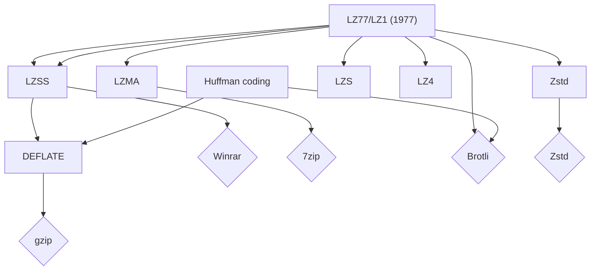
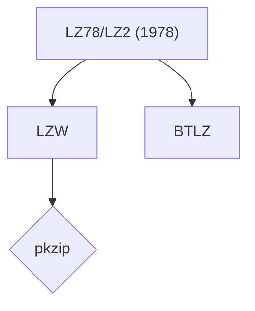

# Compression

- [Compression](#compression)
- [Variable length codes (VLCs)](#variable-length-codes-vlcs)
- [Lempel-Ziv family](#lempel-ziv-family)
- [Compression in the real world](#compression-in-the-real-world)
  - [LZ77 family tree](#lz77-family-tree)
  - [LZ78 family tree](#lz78-family-tree)

# Variable length codes (VLCs)

* prefix property
  * once a code has been assigned to a given symbol, no other code can start with that pattern
  * A shorter valid code cannot be the prefix of another, longer, code
* example
  * morse code is variable length encoding
  * ASCII is a fixed length encoding
* Shannon noticed there was a correlation between the probability of a symbol appearing and the "information content" of that symbol given by $log_2P$

Before huffman, people created VLCs codes by hand e.g. unary, gamma, delta, omega
These codes where optimized for certain probability distribution of symbols e.g if your symbols have probability distribution A then use code X etc.

e.g. Unary code was optimized for when $P(N) =  2^{-N}$

All that was fine except if your symbols didn't follow one of the given probability distributions

# Lempel-Ziv family

LZ77 and LZ78 are the parents of most (maybe all all) modern compression techniques.

# Compression in the real world

* Zlib library
  * a portable, free, general-purpose, patent unencumbered lossless data-compression library
  * has builds for many OSes, architectures and devices
  * used everywhere (it's kind of the sqlite of compressing stuff)
  * RFCS
    * [RFC 1950](https://datatracker.ietf.org/doc/html/rfc1950)
      * describes compressed data format
      * uses DEFLATE but can be changed (??? has it ever been?)
      * includes ADLER-32 checksum
    * [RFC 1951](https://datatracker.ietf.org/doc/html/rfc1951)
      * describes deflate stream format
      * defines a lossless compressed data format that compresses data using a combination of the LZ77 algorithm and Huffman coding
  * zlib has it's own file format but supports reading and writing files in gzip (.gz) format
    * zlib has a lighter header than gzip
    * I think it.s `.Z` files
* gzip
    * described in [RFC 1952](https://datatracker.ietf.org/doc/html/rfc1952)
    * is a **file format** not an encryption algorithm (it uses DEFLATE as algorithm but can be extended to others
      * ??? has it ever been extended?
    * includes a CRC check to detect errors
    * is a documenting of how the `gzip` utility behaves (implementation preceded the RFC)
    * compresses a single file - it does not make archives
* brotli
  * developed by Google
  * supported in all modern browsers and servers for HTTP compression
  * more efficient
* LZ4
  * faster compression and decompression speed vs DEFLATE (gzip)
  * worse compression ratio vs DEFLATE
  * used in situations where speed matters more than the absolute compression ratio
* 7z
  * is a compressed archive format
  * https://www.7-zip.org/7z.html
  * contains a whole bunch of algorithms
  * uses LZMA by default
  * supports encryption
* Zstd
  * An algorithm developed by Facebook
  * The `Zstandard` (often `Zstd`) algorithm is implemented in the `zstd` tool
  * implemented in
    * linux kernel (for squashfs and btrfs filesystems)
    * [RFC 8478]()
    * `.zst` file extension
    * has it's own mime type and HTTP content encoding header
    * used in various linux distro packaging files
* bzip2
  * is a tool that compresses a single file (relies on tar to archive first)
  * uses a combination of many techniques
  * has no formal spec
* xz utils
  * often has better compression rates than gzip or bzip2
  * decompression speed is better than bzip2 but worse than gzip
  * compression speed very slow compared to bzip2 and gzip
  * includes a cli tool `xz` and a library
  * can use the xz format or lzma format
  * lzma format is now legacy so it defaults to xz
  * file extension is `.xz` or `.txz` for tar files which have been compressed
  * > The xz format improves on lzma by allowing for preprocessing filters. The exact filters used are similar to those used in 7z, as 7z's filters are available in the public domain via the LZMA SDK
  * uses
    * is the compression in `.deb` packages
* PostgreSQL
  * TOAST compression
    * Prior to 13 it used an LZ derivative called `pglz`
        * It seems like an in-tree variant of LZ but it's not documented as being of the of the common "children" of LZ
        * It's significantly faster, but has a lower compression ratio than gzip. It's optimised for lower CPU costs.
        * https://github.com/postgres/postgres/blob/master/src/common/pg_lzcompress.c
    * PG 13 added compile time option to use LZ4 for TOAST compression
    * Compression method can be chosen via `default_toast_compression` setting
    * TOAST compresses only variable-length data
        * varchar, text, jsonb, hstore, tsvector etc.
    * WAL compression
        * can be turned on via setting
        * also used `pglz`

Postgres also uses zstd and zlib in other places e.g. libpq

## LZ77 family tree

  ?? where does lz4 fit in?

## LZ78 family tree

> No formal specification for bzip2 exists, although an informal specification has been reverse engineered from the reference implementation.
