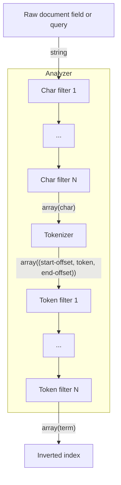
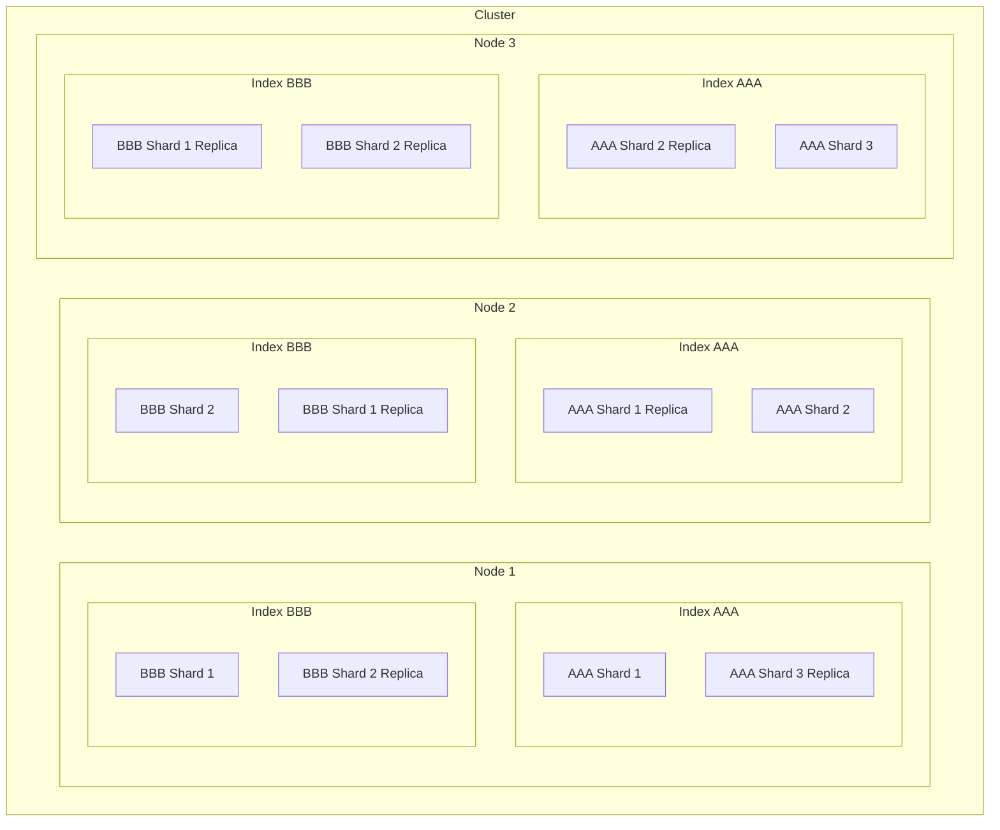

# Elasticsearch

- [Elasticsearch](#elasticsearch)
  - [Questions](#questions)
  - [Sources](#sources)
  - [Installing](#installing)
  - [Designing a cluster](#designing-a-cluster)
  - [Setup](#setup)
    - [Logging](#logging)
  - [Overview](#overview)
    - [Default ports](#default-ports)
    - [Things it isn't good at](#things-it-isnt-good-at)
    - [Elasticstack](#elasticstack)
  - [Cat APIs](#cat-apis)
  - [JSON API Overview](#json-api-overview)
    - [Searching and aggregating across indexes](#searching-and-aggregating-across-indexes)
  - [Documents (CRUD)](#documents-crud)
    - [C: Index a document](#c-index-a-document)
    - [R: Read a document](#r-read-a-document)
    - [U: Update a document](#u-update-a-document)
    - [D: Delete](#d-delete)
    - [Relationships](#relationships)
    - [Controlling expensive queries](#controlling-expensive-queries)
  - [Aggregation](#aggregation)
  - [Searching](#searching)
    - [Query lite syntax aka URI search (discouraged)](#query-lite-syntax-aka-uri-search-discouraged)
      - [simple\_query\_string](#simple_query_string)
    - [Search query anatomy](#search-query-anatomy)
    - [Queries](#queries)
      - [match\_all](#match_all)
      - [match](#match)
      - [match\_phrase](#match_phrase)
      - [multi\_match](#multi_match)
    - [Filters](#filters)
      - [range](#range)
      - [term](#term)
      - [terms](#terms)
      - [exists](#exists)
      - [missing](#missing)
    - [bool (both a Query and a Filter)](#bool-both-a-query-and-a-filter)
    - [Relevancy](#relevancy)
      - [Boosting](#boosting)
    - [Fuzziness](#fuzziness)
    - [Derivatives](#derivatives)
    - [Highlighting](#highlighting)
    - [Suggesters](#suggesters)
  - [Indexing](#indexing)
    - [Create index](#create-index)
    - [Types](#types)
    - [Analyzers](#analyzers)
      - [Overview](#overview-1)
      - [Built-in analyzers](#built-in-analyzers)
        - [Standard analyzer (the default)](#standard-analyzer-the-default)
      - [Built-in character filters](#built-in-character-filters)
      - [Built-in Tokenizers](#built-in-tokenizers)
      - [Built-in token filters](#built-in-token-filters)
      - [Creating a custom analyzer](#creating-a-custom-analyzer)
      - [Testing analyzers](#testing-analyzers)
    - [Normalizers](#normalizers)
    - [Mappings](#mappings)
      - [Dynamic mapping](#dynamic-mapping)
      - [other](#other)
    - [Mapping: metadata](#mapping-metadata)
      - [Mapping: Fields/Properties](#mapping-fieldsproperties)
      - [Field data types](#field-data-types)
      - [Limiting the number of mappings which can be created](#limiting-the-number-of-mappings-which-can-be-created)
    - [Aliases](#aliases)
  - [Physical layout of an ElasticSearch cluster](#physical-layout-of-an-elasticsearch-cluster)
    - [Index](#index)
    - [Clusters](#clusters)
    - [Nodes](#nodes)
    - [Shards](#shards)
      - [Primary shards](#primary-shards)
      - [Replica shards](#replica-shards)
  - [Decisions you make when you create an index](#decisions-you-make-when-you-create-an-index)
  - [Diagnosing issues](#diagnosing-issues)
  - [Recommendations](#recommendations)
  - [Appendix: ElasticSearch 6.x and older](#appendix-elasticsearch-6x-and-older)

## Questions

* is it a good practice to disble dynamic fields on all indexes in most cases?

## Sources

* Elasticsearch in Action (but out of date but very good IMHO)
* Official ES docs

## Installing

* Install via Docker - it's easiest

## Designing a cluster

* Keep shard size in the 10-50 GB range for best performance
  * => Don't shard for less than 10GB

## Setup

### Logging

* Default log level is INFO
* Changing log level to DEBUG is **very** noisy
* Instead, turn on logging of each index, fetch and query operation
* The logs appear in docker-compose output as you would hope.

```js
GET /_all/_settings

// * Enable detailed logging for **all** indexes.
// * You can also do this per-index.
// * Be aware that doing it for all indices makes kibana indexes very noisy
PUT /_all/_settings
{"index.indexing.slowlog.threshold.index.debug": "0s",
"index.search.slowlog.threshold.fetch.debug" : "0s",
"index.search.slowlog.threshold.query.debug": "0s"}
```

## Overview

| Relational DB | Elasticsearch     |
| ------------- | ----------------- |
| Database      | The whole cluster |
| Table         | Index             |
| Row           | Document          |
| Column        | Field             |

* A node is an instance of ES
* node exposes Restful JSON API on port 9200
* nodes form a cluster on port 9300
* ES is a document database
    * documents have fields
* by default every field in a document is indexed in an inverted index i.e. it is searchable
* uses JSON as the serialization format for documents
* storing a document in ES is called "indexing the document"
* A cluster is a group of nodes with the same value of `cluster_name` (you can see this value by visiting in a browser http://localhost:9200/)
* Provides a **Java API** and a **HTTP API**
* Supports YAML in request and response bodies - add `?format=yaml` to your request
* You can configure your index settings to not store `_source` (the original indexed document)
    * Doing this in combination with using an external ID means you could use ES just for the searching of the index and get a list of database IDs as results.
    * You would then get those rows from the DB
    * Is this a good pattern?
        * ++ keeps the index size smaller (which only matters if you have very large source documents)
        * -- you have to do more work to get results
* A lot of the constraints of ES are actually constraints from Lucene
* The part of ES that writes data to disk is called the "gateway"
* ES is described as "schema free" or "schemaless"
    * It's kinda bullshit
    * That means the docs are not _bound_ by a schema, it doesn't mean there is no schema

### Default ports

* TCP 9200 for Restful API queries
* TCP 9300 for inter-node communication or "transport"
    * The Java API connects to this port
* TCP 5601 for Kibana
  * Kibana connects to ES server over 9200

### Things it isn't good at

* ES does not support transactions - you should use something else if you need them
* ES doesn't work as well as a store if you have many frequent writes
* ES doesn't do great at modelling data with lots of complex relationships


### Elasticstack

* Elasticsearch
    * Search API based on Lucene
    * Features
      * documented oriented (schemaless) DB
      * near real time
      * distributed
      * search and analytics engine
      * categorised under NoSQL
* Kibana
    * Web UI for elasticsearch
    * provides management and dev tools for elasticsearch
    * lets you build visualisations
    * http://localhost:5601
* X-pack
    * provides
        * monitoring,
        * reporting
        * alerting,
            * send alerts to slack etc. based on the result of some search e.g. too many failed login attempts
        * security,
            * provides authentication and authorization to your cluster or documents and even fields within it
        * graphing
            * visualise your data as a connected graph rather than a flat set of data files in documents
            * includes a _Graph API_ and some UI within Kibana
        * machine learning
            * finds anomalies in time series data (unsupervised learning)
    * prior to 6.3 it required registration and downloading separate code for some features. After 6.3 you get all code when you download elasticsearch but some parts require commerical license
* Logstash
    * centralised daemon which has many plugins to allow ingesting logs from various places, filtering them, transforming them and sending them to various places including elasticsearch
    * has 200+ plugins
* Beats
    * a collection of components built on top of a core `libbeat`
    * capable of collecting files from disk, metrics from OS, metrics from specific binaries
    * the client-side to logstash's server-side
    * installed on machines which generate the logs
* Elastic cloud
    * fully hosted Elastic stack provided by elastic.co

## Cat APIs

https://www.elastic.co/guide/en/elasticsearch/reference/7.17/cat.html

* Intended for humans to consume
* Returns tabular text not JSON
* All cat APIs are under `GET /_cat/...`
* Handy query params
  * `v` => show headings in tables
  * `help` => show help output describing each column instead of actual output
* you can control which columns are returned by query param
* some options to control the presentation of numeric and time columns
* can sort by different columns
* output available in the following formats
    * text (default)
    * JSON `format=json` (add `pretty` to get pretty output via CURL, Kibana is always pretty)
    * YAML `format=yaml`
    * cbor `format=cbor`
        * Concise Binary Object Representation
        * a binary format loosely based on JSON
        * https://en.wikipedia.org/wiki/CBOR
    * smile `format=smile`
        * a binary encoding of JSON
        * called smile because the data header includes `:)`
        * https://en.wikipedia.org/wiki/Smile_(data_interchange_format)

## JSON API Overview

* Responses are unformatted JSON unless you pass `?pretty=true`
    * Kibana formats all responses by default

### Searching and aggregating across indexes

You can run search and aggregation queries against multiple indexes at the same query

1. Search all documents in all indexes
    ```js
    // search all documents in all indexes
    GET /_search
    GET /_search?size=10 // same as query above, default size is 10

    GET /_search?size=100
    ```
2. Search all documents in one index
    ```js
    // search all documents in just the myindex index
    GET /myindex/_search
    ```
4. Search all documents in multiple indexes
    ```js
    // search all documents in the named indexes
    GET /myindex,otherindex,blahindex/_search

    // search all documents in all indices which begin with 'myindex'
    GET /myindex*/_search
    ```
5. Search all documents of a particular type in all indexes
    ```js
    // search the _doc type in all indexes in the cluster
    GET /_all/_doc/_search
    ```

## Documents (CRUD)

### C: Index a document

* use PUT when you have a document id you want to use.
* use POST to autogenerate a document id
    * Autogenerated IDs are 20 character long, URL-safe, Base64-encoded GUID strings.

Examples

```bash
# PUT {index name}/{type name}/{chosen document id}
PUT /website/_doc/1
{
    "title": "My second blog entry",
    "text":  "Still trying this out...",
    "date":  "2014/01/01"
}

# POST will autogenerate an document ID
# POST {index name}/{type name}
POST /website/_doc/
{
    "title": "My second blog entry",
    "text":  "Still trying this out...",
    "date":  "2014/01/01"
}

# PUT {index name}/{type name}/{document id}
curl -XPUT 'localhost:9200/megacorp/_doc/1?pretty' \
  -H 'Content-Type: application/json' \
  -d'{ "first_name" : "John",
       "last_name" :  "Smith",
       "age" :        25,
       "about" :      "I love to go rock climbing",
       "interests": [ "sports", "music" ] }'

# response
{
  "_index": "megacorp",
  "_type": "_doc",
  "_id": "1",
  "_version": 1,
  "result": "created",
  "_shards": {
    "total": 2,
    "successful": 1,
    "failed": 0
  },
  "_seq_no": 0,
  "_primary_term": 1
}
```

### R: Read a document

```sh
# Form is GET /{index name}/{type name}/{document id}
curl -XGET "http://elasticsearch:9200/megacorp/_doc/1"

{
  "_index": "megacorp",
  "_type": "_doc",
  "_id": "1",
  "_version": 1,
  "found": true,
  "_source": {
    "first_name": "John",
    "last_name": "Smith",
    "age": 25,
    "about": "I love to go rock climbing",
    "interests": [
      "sports",
      "music"
    ]
  }
}
```

### U: Update a document

* You update by POSTing to the `_update` type of the index.
* It increments the `_version` of the document created for you by ES
* You can do an UPSERT by passing `doc_as_upsert` param
* You can pass small executable scripts as text values in your JSON and ES will execute them to get the value
    * examples
        * calculate a new value based on the existing value of the field
        * calculate a new value based on another field in the document

```bash
# Do an UPDATE
# POST /{index_name}/_update/{document_id}
POST /mythings/_update/1
{
  "doc": {
    "price": "28.99"
  }
}


# Do an UPSERT
POST /mythings/_update/1
{
  "doc": {
    "price": "28.99"
  },
  "doc_as_upsert": true
}
```

### D: Delete

You can delete documents by id

```bash
DELETE /mythings/_doc/123
```

### Relationships

https://www.elastic.co/guide/en/elasticsearch/reference/7.17/joining-queries.html

* ES has two ways to mimic joining tables
1. `nested` query on `nested` field type
  * if your doc has a `nested` field type you can use a `nested` query to query it
  * this is an "expensive query"
2. `has_child` and `has_parent` queries
  * if your doc has a field of type `join` then you can use TODO

### Controlling expensive queries

https://www.elastic.co/guide/en/elasticsearch/reference/7.17/query-dsl.html#query-dsl-allow-expensive-queries

"joining" queries and other expensive queries can be prevented by setting `search.allow_expensive_queries: false`


## Aggregation

* As well as FTS, ES can be used for data analytics
* Example use-cases
    * most popular blog tags
    * average popularity of a certain group of posts
    * average popularity of posts for each tag

## Searching

https://www.elastic.co/guide/en/elasticsearch/reference/7.17/query-dsl.html

* returns 10 results by default
* Sends GET requests with a body
* Form is
    ```sh
    GET /_search
    GET /{index name}/_search
    GET /{index name}/_doc/_search # Pre 6.x you could use types other than _doc
    ```

```bash
GET /megacorp/_doc/_search # "search lite" - return all documents of given index
GET /megacorp/_doc/_search?q=last_name:Smith # filter those documents based on a field

# exactly same as line above (but using the query DSL)
# notice this is a GET request with a body. ES authors are fine with this.
GET /megacorp/_doc/_search
{
    "query" : {
        "match" : {
            "last_name" : "Smith"
        }
    }
}

# short-hand get all records in all indexes
GET /_search

# this is the long-hand version of the '/_search' i.e. it finds all results
GET /_search
{
    "query": {
        "match_all": {}
    }
}
```

### Query lite syntax aka URI search (discouraged)

```jsonc
// title contains 'blah'
GET /movies/_search?q=title:blah

// year is 2010 or later, and title contains 'trek'
// this is fine but all those special chars need to be URL encoded (curl can handle this for you)
GET /movies/_search?q=+year:>2010+title:trek
```

* Handy for quick searches but don't use in prod
* ++ it's short and concise
* -- query params must be URL encoded - annoying for some params
* -- queries can be cryptic
* -- the query is in the URL so can be logged
* -- don't ever ever allow end users to pass in the query string - equivalent of SQLi

https://www.elastic.co/guide/en/elasticsearch/reference/7.17/query-dsl-query-string-query.html

* seems to overlap with the `match` query a lot
    * When should you use each?
* It is tempting to let users type this syntax into your site and just pass it on to ES but this is bad because
    * Your users are now tied to the query_string DSL and any changes which might happen to it
    * You cannot easily tune queries e.g. add boosting
    * Your users can DoS you pretty easily
* `query`
    * uses a DSL to allow searches to be performed on one line because this is basically the JSON version of the putting the query inline in the URL via `q=...`
    * it gets a series of _terms_ (NB term doesn't mean exactly the same thing as the normal ES use of the word) and _operators_
    * term
        * can be single word or `"multiple words surrounded by quotes"`
        * matches if the term is **contained** in the field - it is not an exact match
    * supports wildcards
    * supports regular expressions
    * supports a unique fuziness operator `~` which uses Damerau-Levenshtein distance
        * `~` is shorthand for `~2` (setting the edit distance to 2)
        * `~1` is also available
        * http://en.wikipedia.org/wiki/Damerau-Levenshtein_distance
    * supports boosting
    * supports explicit boolean operators `AND`, `OR`, `NOT`
    * supports grouping with `()`
    * examples
        ```sh
        # where the status field contains "active"
        status:active

        # where the title field contains either "quick" or "brown"
        title:(quick OR brown)

        # where book.author field contains "Josh Smith"
        book.author:"Josh Smith"

        # any field in book which contains "Joan"
        book.\*:"Joan"

        # where the title field has any non-null value
        _exists_:title
        ```
* fields = what fields to search
* default operator
    * the default boolean operator to use to combine
```json
{
    "query_string": {
        "fields": [
            "title"
        ],
        "default_operator": "AND",
        "query": "bassoon",
        "boost": 10,
        "fuzziness": "AUTO"
    }
},
```

#### simple_query_string

https://www.elastic.co/guide/en/elasticsearch/reference/7.17/query-dsl-simple-query-string-query.html

* more limited version of `query_string` but safer for it
* doesn't return errors for invalid syntax
* is designed for the use case where you want to provide and advanced query syntax for users with minimal work
    * Caution: this assumes you trust your users

### Search query anatomy

* Leaf clause
  * used to compare a field against the query string
  * Queries:
    1. match_all
    1. match
    1. multi_match
    1. query_string
    1. simple_query_string
  * Filters:
    1. range
    1. term
    1. terms
    1. exists
    1. missing
* Compound clause
  * used to combine other query clauses (both leaf and other compound clauses)
  * Queries:
    1. bool
  * Filters:
    1. bool

### Queries

* Queries match with a relevance score (floating point between 0.0 -> 1.0)
* Wrapped in a `"query": { ... }` block
* You can nest filters inside queries and nest queries inside filters

#### match_all

```jsonc
{
  "query": {
    "match_all": {} //  match all documents
  }
}
```
* all results receive a neutral score of `1` because they are all equally relevant

#### match

https://www.elastic.co/guide/en/elasticsearch/reference/7.17/query-dsl-match-query.html

* searches a single field - see `multi_match` for searching more than one field at once
* The query will be analysed by
    * The analyser setup for the field, falling back to the default analyser for the index.
        * This helps ensure that your query will be analysed in the same way your indexed text was
* Query text is analysed and the terms created by analysis are used to create a `boolean` query
    * The default operator is `OR`
    * Example:
        * When you give it a query `Hello There boo boo` it will by default search for `hello OR there OR boo OR boo`
* good for _full text search_ OR _exact value_ search depending on the type of the field:
    * full text field
        * => use the defined _analyzer_ for that field
        * it will find substrings
    * exact field e.g. number, date, boolean, _not_analyzed_ string => do an exact match
        * NOTE: for exact matches you probably want a filter clause (see instead because it will be faster and cached

```js
// { "match": { "fieldName": "field value" }}
{ "match": { "tweet": "About Search" }}
{ "match": { "age":    26           }}
{ "match": { "date":   "2014-09-01" }}
{ "match": { "public": true         }}
{ "match": { "tag":    "full_text"  }}
```

```js
// short-hand version:
GET /eoin-test-1/_search
{
  "query": { // required wrapper for all queries
    "match": { // open the "match query"
      "description": "Enterprise" // the only required param to "match" is a field name and value
    }
  }
}


// long-hand version of the same query
GET /eoin-test-1/_search
{
  "query": {
    "match": {
      "description": { // <-- name of field to query
        "query": "Enterprise", // this text gets analysed
        "analyzer": "blah", // defaults to the analyzer defined for this field at index time, falls back to the default analyzer for the index
        "fuzziness": 0 // defaults to 0, increase value to be tolerant of misspellings and finding similar words
        "operator": "and", // change default operator from OR to AND
        "lenient" true, // ignore exceptions caused by data-type mismatches
      }
    }
  }
}
```

#### match_phrase

https://www.elastic.co/guide/en/elasticsearch/reference/7.17/query-dsl-match-query-phrase.html

* analyzes the given query text and creates a "phrase query"
* the phrase query matches terms up to a configurable `slop` number (defaults to 0)
  * transposed terms have a slop of 2
  * you can use slop to control whether the phrase has to be in the exact order
  * slop controls how far you are willing to let a term move from it's position and still be matched
* you can configure which analyzer is used
  * the default is to use whatever analyzer is set for the field and to fall back to the default search analyzer if not explicit field mapping set
* if you set a high slop value you can use `match_phrase` to implement proximity search

```json
GET /_search
{
  "query": {
    "match_phrase": {
      "message": {
        "query": "this is a test",
        "analyzer": "my_analyzer",
        // "slop": 0
      }
    }
  }
}
```

#### multi_match

* run the same query on multiple fields

```jsonc
{
    "multi_match": {
        "query":    "full text search",
        "fields":   [ "title", "body" ]
    }
}
```

### Filters

* Filters match with a yes/no
* Wrapped in a `"filter": { ... }` block
* You can nest filters inside queries and nest queries inside filters

#### range

```jsonc
{
    "range": {
        "age": {
            "gte":  20,
            "lt":   30
        }
    }
}
```

#### term

* search by exact value
* `term` query does no analysis of text (does not run any analyzer) so will always find exact match

```jsonc
{ "term": { "age":    26           }}
{ "term": { "date":   "2014-09-01" }}
{ "term": { "public": true         }}
{ "term": { "tag":    "full_text"  }}
```

#### terms

* same as `term` but allows multiple exact match values
* can be used to do searches for accented and unaccented values

```jsonc
{ "terms": { "tag": [ "search", "full_text", "nosql" ] }}
```

#### exists

* roughly equivalent to SQL IS NOT NULL
* matches if the given field is not `null` in the document

```jsonc
{
    "exists":   {
        "field":    "title"
    }
}
```

#### missing

* roughly equivalent to SQL IS NULL
* matches if the given field is `null` in the document

```jsonc
{
    "missing":   {
        "field":    "title"
    }
}
```

### bool (both a Query and a Filter)

* combines other queries
* takes the following arguments:
    * must
        * clauses which must match for the document to be included
    * must_not
        * clauses which must not match for the document to be included
    * should
        * if these queries matches we increase the score
        * If there are no must clauses, at least one should clause has to match. However, if there is at least one must clause, no should clauses are required to match.
    * filter
        * these clauses **must** match but don't contribute to the score
        * useful when you don't want a particular criteria to contribute to the score
* a `bool` query can be nested within a `filter`, `should` of another `bool`
* combines scores together to return a single score

Bool queries can be used in two contexts

1. filtering context: does this query match yes/no
    * aka "non scoring" query
    * faster than scoring queries
2. query context: how well does this query match our documents?
    * aka "scoring query"
    * calculates how relevant each document is to the given query and gives it a `_score` which is then used to sort the results by relevance

You can combine both kinds of query for best performance. First filter out the documents you don't want and then use scoring query to calculate relevance of that subset.

### Relevancy

* ES provides multiple algorithms for calculating relevancy
* The default relevancy algorithm is _Term Frequency - Inverse Document Frequency_ (TF-IDF)
* Term Frequency
  * How often the term appears in a given document
  * The more times a word you are looking for appears in a document the higher the score
* Document Frequency
  * How often a term appears in all documents in the index
* Inverse Document Frequency
    * The weight of each word is higher if the word is uncommon across documents
* You can manually "boost" the score of a particular field when searching
    * This lets you weight certain fields more than others when calculating relevancy

$$Rel = TF \cdot \frac{1}{DF}$$

#### Boosting

https://www.elastic.co/guide/en/elasticsearch/reference/7.17/mapping-boost.html

You can apply a boost parameter (many/most/all ???) queries

* A boost is a floating point number used to decrease or increase the relevance scores of a query.
* You can use the boost parameter to adjust relevance scores for searches containing **two or more queries**.
* The boost is applied only for term queries (prefix, range and fuzzy queries are not boosted).
* Boost values are relative to the default value of 1.0.
* A boost value between 0 and 1.0 decreases the relevance score.
* A value greater than 1.0 increases the relevance score.
* Pre 5.0 you could apply boost at index time but that is deprecated now
    * Query time boost can be changed at will without re-indexing

### Fuzziness

Sources

* https://www.elastic.co/guide/en/elasticsearch/reference/7.17/common-options.html#fuzziness
* https://en.wikipedia.org/wiki/Levenshtein_distance


Use-cases:

* handling typos and misspellings in search queries

Querys which support fuzziness:

1. match
2. ???

Overview

* interpreted as the _Lenvenshtein edit distance_ i.e. the number of one character changes needed to make one string be the same as another string
* defaults to 0
* increasing fuzziness increases the number of results you get but can decrease how relevant those results are e.g. if I set fuzziness to 2 and search for a 2 character query then it will always match every record (because 2 edits can turn it into any other 2 character string)
    * => you should probably use `"AUTO"` as the value for fuzziness

Values

* A number between 0-2 (inclusive)
* `"AUTO"`, `"AUTO:low,high"`
    * is the preferred value
    * Generates an edit distance based on the length of the term
    * value "AUTO" is shorthand for "AUTO:3,6"
    * When the value is AUTO then for lengths
        * 0..2 must match exactly
        * 3..5 one edit allowed
        * >5 two edits allowed

### Derivatives

If I search for bicycle" I want results from "cycling" "bicyclist", "bicyclists"

### Highlighting

* ES can mark sections of field values as highlighted because they are relevant for the search result

### Suggesters

Faster than normal queries for autocomplete use-cases

## Indexing

An index is a logical grouping of related types and documents

| Relational DB | Elasticsearch     |
| ------------- | ----------------- |
| Database      | The whole cluster |
| Table         | Index             |
| Row           | Document          |
| Column        | Field             |

Since 7.0 an index can only contain a single type i.e. the "database" can only contain one "table"

Indexes are auto-created the first time you push a document into it.

You can also create an index before-hand with an "index template" it lets you control the defaults of the index e.g. num shards, type mappings etc.

ES creates an "inverted index" for FTS fields i.e. it stores (conceptually at least) tuples of the form:

    (term, frequency, [document_ids])

This index is the basis of ES

### Create index

```js
// Create an index
PUT /eoin_test_1
{
  "settings": {
    "index": {
      "number_of_shards": 5,
      "number_of_replicas": 2
    }
  }
}
// => response
{
  "acknowledged": true,
  "shards_acknowledged": true,
  "index": "eoin_test_1"
}

PUT /eoin_test_2
{
  "settings": {
    "index": {
      "number_of_shards": 5,
      "number_of_replicas": 2
    }
  },
  "mappings": {
    "properties": {
        "field_1": {
          "type": "text"
        },
        "field_2": {
          "type": "keyword"
        }
    }
  }
}
// =>
{
  "acknowledged": true,
  "shards_acknowledged": true,
  "index": "eoin_test_2"
}
```

### Types

A type consists of

1. a name
2. a mapping
    * describes the fields/properties that this object may have (i.e. defines a schema for the object)

### Analyzers

#### Overview


* The job of an analyzer is to take the value of a text field and break it into "terms".
* These terms then become the keys of the inverted index.
* You can see the analyzers for an index by
    ```bash
    GET /<index-name/_settings
    # look at <index-name.settings.index.analysis
    ```

Analyzers run:

1. When you add a document to the index (called _Index analyzer_)
2. On the query string(s) when you preform a query (called _Search analyzer_)

NB: Both the document and the query are run through analyzers.

In most cases you want the same analyser at both index and search times but there are times when you want the flexibility to choose a different analyser at search time.

Different text fields in the same document can have different analysers.

An analyzer is the name given to a **chain** of 3 kinds of function:

1. Character filter (0 or more)
    * tidy up a string before it is tokenized
    * custom character filters (which are named configurations of built-in filters) under `settings.index.analysys.char_filter` in mapping JSON
2. Tokenizer (exactly 1)
    * tokenize the string
    * you cannot create custom tokenizers
3. Token filter (0 or more)
    * filters the tokens in various ways
    * custom token filters (which are named configurations of built-in filters) under `settings.index.analysys.filter` in mapping JSON




```
{document-field-or-query-char-stream}
    |> [char-filter-1, ...] -> {[char, char, char, ...]}
    |> [Tokenizer] -> {[start-offset-in-stream, token, end-offset-in-stream], ...}
    |> [token-filter-1, ...] -> {[term1, term2, term3, ...]}
```

#### Built-in analyzers

* https://www.elastic.co/guide/en/elasticsearch/reference/7.17/analysis-analyzers.html
* https://opensearch.org/docs/latest/opensearch/query-dsl/text-analyzers/

1. Standard
    * divides text into terms on word boundaries
    * "word boundaries" are defined by _Unicode Text Segmentation_ algorithm
    * removes most punctuation, lowercases terms and supports removing stop words
2. Language specific analyzers
    * e.g. `english`, `french`
    * english seems to
      * lowercase everything
      * remove stop words
      * remove non alphanumeric chars
      * has quite diff output to `standard`
3. Whitespace
    * just creates terms by splitting on whitespace
4. Simple
    * lowercases everything
    * creates a new term whenever it encounters a character which is not a letter
5. Stop
    * Same as simple but allows you to remove stop words
6. Keyword
    * a noop analyzer, just returns it's input as a single term
7. Pattern
    * splits into terms based on regex
    * supports lower-casing and stop words
8. Fingerprint
    * creates a fingerprint which can be used for duplicate detection

If the analyzers above don't work for you, you can create your own "custom" analyzer.

##### Standard analyzer (the default)

The default analyzer for full-text fields is `standard` - it is good for western languages.

The `standard` analyzer is

1. Character filter
    * none
2. Tokenizer
    1. `standard` tokenizer
        * divides text into terms on word boundaries
        * "word boundaries" are defined by _Unicode Text Segmentation_ algorithm
        * removes most punctuation, lowercases terms and supports removing stop words
3. Token filters
    1. `standard` token filter
        * in theory tidies up tokens emitted from the tokenizer but currently does nothing
    2. `lowercase` token filter
        * converts all tokens to lowercase
    3. `stop` token filter
        * removes "stop words" i.e. common words which have little impact on search relevance e.g. the, and, is, an
        * by default the stopword list is set to `_none_` so this filter does nothing unless you configure it to do so.

#### Built-in character filters

https://www.elastic.co/guide/en/elasticsearch/reference/7.17/analysis-charfilters.html

* Built-in character filters
  * `mapping`
      * replace substrings within the stream
  * `html_strip`
      * remove html tags and decode HTML entities
  * `pattern_replace`
      * replaces with regex
* The tokenizer will see the **output** of the character filter chain
* AFAIK you cannot create your own character filters.

#### Built-in Tokenizers

https://www.elastic.co/guide/en/elasticsearch/reference/7.17/analysis-tokenizers.html

Tokens take a character stream and create tokens
A token is roughly equivalent to a word

There are a few categories of built-in tokenizers

* Word oriented tokenizers
    1. `standard`
        * splits input text on word boundaries and removes most punctuation
        * the most poplular
        * suitable for most languages
        * discards punctuation and whitespace characters
    1. `letter`
        * divides text into terms whenever it gets a character which is not a letter
    1. `lowercase`
        * like `letter` but also lowercases everything
    1. `uax_url_email`
        * like `standard` but recognises URLs and email addresses as single tokens
    1. `whitespace`
        * splits text on whitespace only
    1. `classic`
        * Grammar based tokenizer for English
    1. `thai`
        * splits Thai text into words
* Partial word tokenizers
    1. `ngram`
        * creates n-grams of character
        * defaults to min = 1, max =2 i.e. it creates character unigrams and digrams
    1. `edge_ngram`
* Structured text tokenizers
    1. `keyword`
        * outputs exactly the string it received
        * this is a very commonly used tokenizer
    1. `pattern`
        * split text on a matching regex
    1. `char_group`
    1. `simple_pattern`
    1. `simple_pattern_split`
    1. `path_heirarchy`

#### Built-in token filters

https://www.elastic.co/guide/en/elasticsearch/reference/7.17/analysis-tokenfilters.html

* Token filters can add, remove or change tokens
* ES has approx. 48 built-in token filters - see [docs](https://www.elastic.co/guide/en/elasticsearch/reference/7.17/analysis-tokenfilters.html)

Examples of built-in token filters:

* `lowercase`
    * convert token to lowercase
* `stop`
    * removes "stop words" i.e. common words which have little impact on search relevance e.g. the, and, is, an
    * TODO: where does it load its list of stop words?
* `asciifolding`
    * removes diacritics
* `ngram`
    * suitable for partial matching or autocomplete
* `edge_ngram`
    * suitable for partial matching or autocomplete
    * similar to `ngram` but only outputs ngrams that start at the beginning of a token
* `truncate`
    * truncate long tokens

#### Creating a custom analyzer

https://www.elastic.co/guide/en/elasticsearch/reference/7.17/analysis-custom-analyzer.html

You create a custom analyzer by adding it to the `settings` of your index.

```js
// a custom analyzer
{
  settings: {
    analysis: {
      eoin_ngram_search_analyzer: {
        // if type was an existing built-in analyzer you would be configuring it here not defining a new analyzer
        type: "custom" // tells ES we are creating a new kind of analyzer not configuring an existing one
        char_filter: ["html_strip"] // char filters, can be omitted
        tokenizer: "standard", // choose your tokenizer, required
        filter: ["truncate", "lowercase", "asciifolding"], // token filters, can be omitted
      }
    }
  }
}


// Example of creating a custom analyzer
PUT my-index-000001
{
  "settings": {
    "analysis": {
      "analyzer": {
        "my_custom_analyzer": {
          "type": "custom",
          "tokenizer": "standard",
          "char_filter": [
            "html_strip"
          ],
          "filter": [
            "lowercase",
            "asciifolding"
          ]
        }
      }
    }
  }
}

POST my-index-000001/_analyze
{
  "analyzer": "my_custom_analyzer",
  "text": "Is this <b>déjà vu</b>?"
}
```

#### Testing analyzers

You can see the output of the analyzers for a particular index

```js
// Use this to invoke the analyzer configured as the default for this index
POST /myindex/_analyze
{
  "text": "This is 66! Blah-blah.text $% foobar FooB"
}

// Use this form to use the analyzer defined for a given field in a given index
POST /eoin_test_2/_analyze
{
  "field": "f1",
  "text": "This is 66! Blah-blah.text $% foobar FooB http://blah.com and the mail is eoin@foo.com"
}

// Use this to invoke any analyzer
POST _analyze
{
  "tokenizer": "standard", // <-- choose a tokenizer from the list above
  "text": "This is 66! Blah-blah.text $% foobar FooB"
}
// response
{
  "tokens" : [
    {
      "token" : "This",
      "start_offset" : 0,
      "end_offset" : 4,
      "type" : "<ALPHANUM>",
      "position" : 0
    },
    {
      "token" : "is",
      "start_offset" : 5,
      "end_offset" : 7,
      "type" : "<ALPHANUM>",
      "position" : 1
    },
    {
      "token" : "66",
      "start_offset" : 8,
      "end_offset" : 10,
      "type" : "<NUM>",
      "position" : 2
    },
    {
      "token" : "Blah",
      "start_offset" : 12,
      "end_offset" : 16,
      "type" : "<ALPHANUM>",
      "position" : 3
    },
    {
      "token" : "blah.text",
      "start_offset" : 17,
      "end_offset" : 26,
      "type" : "<ALPHANUM>",
      "position" : 4
    },
    {
      "token" : "foobar",
      "start_offset" : 30,
      "end_offset" : 36,
      "type" : "<ALPHANUM>",
      "position" : 5
    },
    {
      "token" : "FooB",
      "start_offset" : 37,
      "end_offset" : 41,
      "type" : "<ALPHANUM>",
      "position" : 6
    }
  ]
}
```


### Normalizers

https://www.elastic.co/guide/en/elasticsearch/reference/7.17/analysis-normalizers.html

* Analyzers are used for `text` type fields and normalizers are used for `keyword` type fields
* An analyzer with no tokenizer step
* A chain of char filters into token filters
* A normalizer is like an analyzer but it can only emit one token
* ES ships with just one built-in normalizer - `lowercase`
* Elasticsearch applies no normalizer by default.
* You can apply a normalizer to a `keyword` field by adding it to the mapping when you create your index
* Constraint: You can only only use token filters that take one character at a time input (not all token filters are available for use in a normalizer)

```
{document-field-or-query-char-stream}
    |> [char-filter-1, ...] -> {[char, char, char, ...]}
    |> [token-filter-1, ...] -> {[term1, term2, term3, ...]}
```

### Mappings

#### Dynamic mapping

https://www.elastic.co/guide/en/elasticsearch/reference/7.17/dynamic-field-mapping.html

* All ES indexes have a schema but it is dynamic.
* ES is not really "schemaless" but it is capable of dynamically **creating** or **adding** to a schema as you add documents - it will not change or remove an existing field in a schema
* You can customise how dynamic field mapping happens with _Dynamic templates_
* Dynamic mapping is on by default but can be configured to ignore new fields (`dynamic: false`) or throw an exception on new fields (`dynamic: "strict"`)

```js
PUT my_index
{
  "mappings": {
    "dynamic": false, // ignore new fields added by documents
    "properties": {
      "user": {
        "properties": {
          "name": {
            "type": "text"
          },
          "social_networks": {
            "dynamic": true, // allow documents creates to create new fields under `social_networks`
            "properties": {}
          }
        }
      }
    }
  }
}
```

The rules for how JSON types are converted are what you would expect but "string" is a bit more complex:

1. If the string looks like a date then save it as one
2. If the string looks numeric then save it as number
3. Otherwise generate an `my_field` analysed field and a `my_field.keyword` keyword subfield.

#### other
```bash
# view the mapping of an index
GET /indexname/_mapping
GET /indexname/typename/_mapping
```

You should create types within an index to match the _common_ fields in your documents e.g. log lines

https://www.elastic.co/guide/en/elasticsearch/reference/7.17/mapping.html

When defining a mapping we seem to need both an "analyzer" and a "search analyzer"

This example creates two logical properties on the document

1. `my_field` - a FTS enabled chunk of text
2. `my_field.keyword` an unparsed version of the raw string

```json
// I think the shape of this is a default for ES when you give it a string value
// in JSON and don't have a mapping defined

// this defines a property `my_field` indexed as both a 'text' type for FTS and
// as a 'keyword' type for sorting, aggregation and filtering
"my_field": {
  "type": "text",
  "fields": {
    "keyword": {
      "type": "keyword",
      "ignore_above": 256
    }
  }
}
```

The `_all` field:

* is a catch all field
* is a meta-field on a **type**
* can be enabled or disabled

You can add dynamic fields to an index (which are calculated based on stored fields)

A mapping defines:

* whether string fields should be treated as "full text" or not
    * `text` type => full text
    * `keyword` type => exact matches only
* the format of date values
* rules creating dynamic fields

A mapping has 2 kinds of fields:

### Mapping: metadata

* define some metadata about the document's metadata is treated
* examples
    * `_index`
        * the name of the index this document is in
    * `_type`
        * the type of this document
    * `_id`
        * the id of the document
    * `_source`
        * seems to be all the properties of the document i.e. most stuff is in here

#### Mapping: Fields/Properties

* each field has a data type (see list of data types below)
* the same field can be indexed multiple times for different purposes - this is called _multi-fields_
    * the `fields` parameter to a property defines multi-fields

#### Field data types

* scalar
    * string
        * `text` (analysed for full text search)
        * `keyword` (not FTS analysed, supports sorting, filtering, aggregations)
    * Numeric
        * `byte`
        * `short`
        * `integer`
        * `long`
        * `float` (IEEE 754 32 bit)
        * `half_float` (IEEE754 with 16bit precision)
        * `scaled_float` (float backed by a long and fixed scaling factor)
            * useful for storing prices - use scaling factor of 100
                * I'm dubious about that statement - prices should probably be ints of cents
        * `double` (IEEE 754 64 bit)
    * `date`
    * `boolean`
    * `binary`
    * Range
      * `integer_range`
      * `float_range`
      * `long_range`
      * `double_range`
      * `date_range`
    * `ip`
        * store IPv4 and v6 addresses
* Complex data types
    * `array`
        * all elements must be same type
        * works as expected for arrays of scalar types (`bool`, `string`, `integer` etc.)
        * array of objects will use `object` type for each object which has trade-offs (see below)
    * `object`
        * allows inner objects within the JSON document
        * is the default dynamic type used if you supply a doc with a nested doc
        * ES **does not store the documents as nested** - it flattens all nested docs into the outer doc
          ```jsonc
          // this document
          {
            "region": "US",
            "manager": {
              "age":     30,
              "name": {
                "first": "John",
                "last":  "Smith"
              }
            }
          }

          // is stored flattened as:
          {
            "region":             "US",
            "manager.age":        30,
            "manager.name.first": "John",
            "manager.name.last":  "Smith"
          }
          ```
        * flattens the inner objects by grouping the values of each attr into a separate array so you cannot search for e.g
          ```jsonc
            // this nested array of users
            "user" : [
              {
                "first" : "John",
                "last" :  "Smith"
              },
              {
                "first" : "Alice",
                "last" :  "White"
              }
            ]

            // is actually stored as
            "user.first" : [ "alice", "john" ],
            "user.last" :  [ "smith", "white" ]

            // so you cannot search for first=John, last=Smith because the relationship is broken

            // if you need to avoid this flattening, you should choose `nested` type
          ```
    * `nested`
        * supports arrays of inner objects where each object needs to be independently queryable
        * Internally, nested objects index each object in the array as a separate hidden document, meaning that each nested object can be queried independently of the others with the `nested` query
        * Use this when you want to retain the maximum amount searching capability of the nested doc and are ok doing expensive searches to achieve this
    * `flattened`
      * https://www.elastic.co/guide/en/elasticsearch/reference/7.17/flattened.html
      * maps a nested object as a single field by parsing out the leaf values and indexing them as keywords
        * -- the values are always `keyword` not `text` so you cannot do full text search on them
        * -- the structure of the nested doc is thrown away
        * roughly speaking, use `flattened` when you want to be able to keyword search the values but don't care about the structure of the nested doc
        * the flattened data type restricts the query types you can run (values are keywords not text)
        * use this to avoid "mapping explosion"
        * mapping explosion
          * where your docs have a large number of fields e.g. in log management where log lines might have different fields.
          * every field mapping created (whether dynamic or explicitly created) is stored in the "cluster state" and triggers the node to send the updated cluster state to other nodes
          * if your index is constantly creating new fields as documents are added, this can add a lot of compute and traffic overhead as the nodes try to keep cluster state in sync
          * this can cause the cluster to go down - a so called "mapping explosion"
* special
    * `geo_point`
        * stores lat and long
    * `geo_shape`
        * store geometric shapes
    * `completion`
    * `join`
      * ES actively recommends you fully denormalize your data instead of using the `join` type
      * https://www.elastic.co/guide/en/elasticsearch/reference/7.17/parent-join.html
      * creates a parent/child relation within documents of the **same index**
      * the mapping defines a new field in the `_source` of a document
      * on parent docs, it just adds the parent label
      * on child docs it adds the child label along with the id (the id of the doc in the index) of the parent doc

#### Limiting the number of mappings which can be created

"Mapping explosion" can be caused if you insert a bunch of documents which have very different shapes. You can set some params to control this:

* `index.mapping.total_fields.limit`
    * The maximum number of fields in an index.
    * The default value is 1000.
* `index.mapping.depth.limit`
    * The maximum depth for a field, which is measured as the number of inner objects. For instance, if all fields are defined at the root object level, then the depth is 1. If there is one object mapping, then the depth is 2, etc.
    * The default is 20.
* `index.mapping.nested_fields.limit`
    * The maximum number of nested fields in an index, defaults to 50. Indexing 1 document with 100 nested fields actually indexes 101 documents as each nested document is indexed as a separate hidden document.
    * Default is 50

You don't need to define your fields before-hand but you can create an explicit mapping when you create your index

You can add fields to an existing index too.

Existing type and field mappings **cannot be changed** because it would invalidate existing documents in the index.

> Fields and mapping types do not need to be defined before being used.
> Thanks to dynamic mapping, new mapping types and new field names will be
> added automatically, just by indexing a document.

### Aliases

* you can alias an index or indexes
* creates a level of indirection between your users and your indexes
    * useful to allow you to re-index without breaking your users
      * Re-index process with aliases:
        1. You have `my_index_v123` which has alias `my_index`
        1. You create `my_index_v_124`
        1. Move the alias

## Physical layout of an ElasticSearch cluster



### Index

* An index is spread across 1-N shards
* ES is _near real-time_ not _real-time_
  * index refreshes are where ES checks for new documents to index in the index
    * refreshes are expensive so it happens once per second by default (near real-time not real-time)

### Clusters

A cluster

* hosts 1+ indexes
* provides operations like searching and indexing
* is made up of 1+ nodes
* nodes try to join a cluster called `elasticsearch` by default
    * you should edit the cluster name to ensure your node doesn't accidentally join another cluster
* how nodes find each other:
  1. You create a list of "seed hosts" in settings (or from a file - this is abstracted into a "seed hosts provider" idea
  1. When the server starts, it contacts the nodes in the seed hosts list
  1. These seed hosts tell the node about the other nodes that they know about
* A cluster has one master node
  * The master node can be a dedicated master or can be one of the nodes which stores shards
  * The nodes in the cluster vote for the master - see https://www.elastic.co/guide/en/elasticsearch/reference/7.17/modules-discovery-quorums.html


### Nodes

* An ES cluster is a collection of nodes running on different machines
* each node has
  * a unique ID
  * a unique name
      * can be assigned by the `config/elasticsearch.yml` config file
* a node is a single instance of the ElasticSearch process
* a node is always part of a cluster, even if it is the only node in the cluster
* nodes try to join a cluster called `elasticsearch` by default
    * you should edit the cluster name to ensure your node doesn't accidentally join another cluster
* nodes on the same network will automatically find each other

Question: how do nodes find other nodes? do they spam the network on 9200 or 9300?

### Shards

* Physically it is a directory of files where Lucene stores data for your index
* A shard is the smallest unit of data that can be moved between nodes
* A single index can be split across multiple nodes i.e. it has some documents on each node
* The process of dividing an index across nodes is called _sharding_
* Once an index is created the **number** of shards cannot be modified
    * can the location of shards be modified?
* When you query, ES will collect results from all shards on all nodes
* WHen you search an index
    * ES will search a complete set of shards but they can be a mix of primary and replica
* A shard is a _Lucene index_
    * A directory of files containing an inverted index
    * => An _Elasticsearch index_ is made up of multiple _Lucene indexes_ (shards)
* When you index a document the following things get stored
    1. The document itself (provided your index uses the default to store `_source`)
    2. Term dictionary
        * maps terms to document ids
        * My guess is that searches only need to look in the term dictionary and not at the documents themselves
    3. Term frequencies
        * quick access to the number of appearance of a term in a document
        * used to calculate relevancy


#### Primary shards

* When you index a document it is first sent to one of the primary shards in the index
    * That shard is chosen at random based on a hash of the document's ID
    * The shard could be on a different node to the one you connected to
    * Once the primary shard has written the new document it sends it to its replicas to keep them in sync

#### Replica shards

* Replica shards provide redundant copies of your data to protect against hardware failure and increase capacity to serve read requests like searching or retrieving a document.
* shards can be duplicated on other nodes (replica shards) to provide high availability
* replica shards are extra copies of the "primary" shard
* replica shards are promoted to primary shard when the node holding the primary shard fails
* All read operations .e.g. query operations and aggregations can be executed on replica shards too!
    * Only write operations must go to the primary shard I guess?
* Useful for both increasing search performance (searches hit a mix of primary and replica shards) and fault tolerance
* ES will never allocate a primary shard and a replica on the same node
  * => If you have a single instance node, and a 1P,1R settings in your index then you cluster health will be yellow

## Decisions you make when you create an index

Sources

* https://thoughts.t37.net/designing-the-perfect-elasticsearch-cluster-the-almost-definitive-guide-e614eabc1a87 (this is very good)
* https://www.elastic.co/blog/how-many-shards-should-i-have-in-my-elasticsearch-cluster

Overview

* Decisions you can change later
    * Choose number of nodes in cluster
    * Choose number of replica shards for each primary shard
* Decisions you cannot change later
    * Choose number of primary shards for an index based on your estimate of
      1. index size
      2. index usage
* Your first design will probably suck because you don't know what the workload will be
    * => you will have to iterate a few times
    * questions you won't yet know the answers to
        * how many queries/sec?
        * does your cluster's workload need a lot of CPU, memory or both?
            * influences whether to go with a few large hosts or more smaller hosts
        * what kinds of queries?
        * how fast do indexes grow?
* You should have an odd number of nodes to avoid split-brain
* lucene creates lots of small files - choose a file system which can handle this - inodes etc.
* during a merge lucene makes copies of all segments before changing them so your shard can't be more than 0.5 your free disk space
    * a merge is when lucene consolidates two smaller segments into one
* shard size
    * 50GB shard should be your max (it's not an enforced max)
    * don't make them too small because small shards have many small segment files
    * aim for shards in the 20GB - 50GB range
* ES can scale to many, many nodes

Advice from the t37.net blog post

> less 3M documents: 1 shard
> between 3M and 5M documents with an expected growth over 5M: 2 shards.
> More than 5M: int (number of expected documents / 5M +1)

## Diagnosing issues

```js
// recommended settings to get better logs from slower queries
PUT /index/_settings
{
    "index.search.slowlog.threshold.query.warn: 1s",
    "index.search.slowlog.threshold.query.info: 500ms",
    "index.search.slowlog.threshold.query.debug: 1500ms",
    "index.search.slowlog.threshold.query.trace: 300ms",
    "index.search.slowlog.threshold.fetch.warn: 500ms",
    "index.search.slowlog.threshold.fetch.info: 400ms",
    "index.search.slowlog.threshold.fetch.debug: 300ms",
    "index.search.slowlog.threshold.fetch.trace: 200ms"
}
```

## Recommendations

* Cluster should have odd number of nodes
  * odd number avoids split-brain in some kinds of network downtime
  * one node cluster is fine for pre-prod envs
  * prod env should probably have 3 unless cost matters a lot and you can easily re-create the index
  * You **can easily change** the number of nodes in cluster later on
* Shards should be 20GB - 50GB
  * You have to choose the number of shards your cluster will have
  * If you don't have 20GB of data then one shard is fine
  * You **cannot change** number of primary shards after index is created
* Number of shard replicas depends on how busy the cluster is (varies by app)
  * You **can easily change** the number of replica shards

Q: Is there any point in having a replica shard in a single node cluster?

## Appendix: ElasticSearch 6.x and older

>*Info*
> These are some old notes which only apply if you are trying to upgrade a very old ES

* There were some significant changes in ES 6.x
    * The concept of mapping types was removed
        * https://www.elastic.co/guide/en/elasticsearch/reference/6.8/removal-of-types.html
        * Summary: it was inefficient at the Lucene layer to have different types of document in the same index
        * 6.x deprecated them
        * Before 6.x you could have multiple types per index. Now the enforce one type per index.
        * After 6.x the place in the APIs where you could specify a custom type is filled by `_doc` which roughly means "the one type in this index"
* Breaking changes in 7.x
  * The APIs were changed to no longer have space for the type name

Pre 6.x:

| Relational DB | Elasticsearch |
| ------------- | ------------- |
| Database      | Index         |
| Table         | Type          |
| Row           | Document      |
| Column        | Field         |

After 6.x:

| Relational DB | Elasticsearch               |
| ------------- | --------------------------- |
| Database      | The whole cluster (I guess) |
| Table         | Index                       |
| Row           | Document                    |
| Column        | Field                       |

You can implement your own "type" field if you really do need to store multiple types of doc in same field because

> there is a limit to how many primary shards can exist in a cluster so you
> may not want to waste an entire shard for a collection of only a few thousand
> documents.

it seems in the examples they use `_doc` for the type e.g. `users/_doc` and `products/_doc`
_doc is the "default type of an index in 6+


Create an index with a named mapping. This syntax only works in ES6 and older. ES7 only allows one type per index and the default type name is `_doc`
```js
// ES6 and earlier
// create an index (eoin_test_2), a type (eoins_type) with two properties (f1, f2)
PUT /eoin_test_2
{
  "settings": {
    "index": {
      "number_of_shards": 5,
      "number_of_replicas": 2
    }
  },
  "mappings": {
    "eoins_type": {
      "properties": {
        "f1": {
          "type": "text"
        },
        "f2": {
          "type": "keyword"
        }
      }
    }
  }
}
// =>
{
  "acknowledged": true,
  "shards_acknowledged": true,
  "index": "eoin_test_2"
}
```


