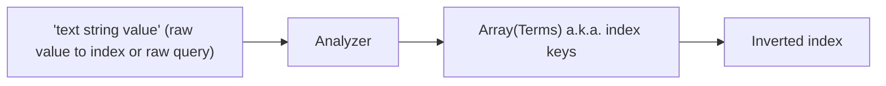
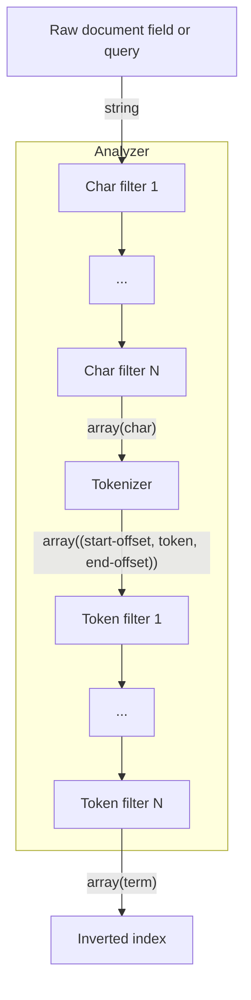

# Elasticsearch: Indexing

- [Elasticsearch: Indexing](#elasticsearch-indexing)
  - [Documents (CRUD)](#documents-crud)
    - [C: Index a document](#c-index-a-document)
    - [R: Read a document](#r-read-a-document)
    - [U: Update a document](#u-update-a-document)
    - [D: Delete](#d-delete)
    - [Relationships](#relationships)
    - [Controlling expensive queries](#controlling-expensive-queries)
  - [Indexing](#indexing)
    - [Create index](#create-index)
    - [Types](#types)
    - [Analyzers](#analyzers)
      - [Overview](#overview)
      - [Built-in analyzers](#built-in-analyzers)
        - [Standard analyzer (the default)](#standard-analyzer-the-default)
      - [Built-in character filters](#built-in-character-filters)
      - [Built-in Tokenizers](#built-in-tokenizers)
      - [Built-in token filters](#built-in-token-filters)
      - [Creating a custom analyzer](#creating-a-custom-analyzer)
      - [Testing analyzers](#testing-analyzers)
    - [Normalizers](#normalizers)
    - [Mappings](#mappings)
      - [Dynamic mapping](#dynamic-mapping)
      - [other](#other)
    - [Mapping: metadata](#mapping-metadata)
      - [Mapping: Fields/Properties](#mapping-fieldsproperties)
      - [Field data types](#field-data-types)
      - [Limiting the number of mappings which can be created](#limiting-the-number-of-mappings-which-can-be-created)
    - [Aliases](#aliases)
    - [Cloning indexes (with potentially new mappings)](#cloning-indexes-with-potentially-new-mappings)
  - [Index templates](#index-templates)

## Documents (CRUD)

### C: Index a document

-   use PUT when you have a document id you want to use.
-   use POST to autogenerate a document id
    -   Autogenerated IDs are 20 character long, URL-safe, Base64-encoded GUID strings.

Examples

```bash
# PUT {index name}/{type name}/{chosen document id}
PUT /website/_doc/1
{
    "title": "My second blog entry",
    "text":  "Still trying this out...",
    "date":  "2014/01/01"
}

# POST will autogenerate an document ID
# POST {index name}/{type name}
POST /website/_doc/
{
    "title": "My second blog entry",
    "text":  "Still trying this out...",
    "date":  "2014/01/01"
}

# PUT {index name}/{type name}/{document id}
curl -XPUT 'localhost:9200/megacorp/_doc/1?pretty' \
  -H 'Content-Type: application/json' \
  -d'{ "first_name" : "John",
       "last_name" :  "Smith",
       "age" :        25,
       "about" :      "I love to go rock climbing",
       "interests": [ "sports", "music" ] }'

# response
{
  "_index": "megacorp",
  "_type": "_doc",
  "_id": "1",
  "_version": 1,
  "result": "created",
  "_shards": {
    "total": 2,
    "successful": 1,
    "failed": 0
  },
  "_seq_no": 0,
  "_primary_term": 1
}
```

### R: Read a document

```sh
# Form is GET /{index name}/{type name}/{document id}
curl -XGET "http://elasticsearch:9200/megacorp/_doc/1"

{
  "_index": "megacorp",
  "_type": "_doc",
  "_id": "1",
  "_version": 1,
  "found": true,
  "_source": {
    "first_name": "John",
    "last_name": "Smith",
    "age": 25,
    "about": "I love to go rock climbing",
    "interests": [
      "sports",
      "music"
    ]
  }
}
```

### U: Update a document

-   You update by POSTing to the `_update` type of the index.
-   It increments the `_version` of the document created for you by ES
-   You can do an UPSERT by passing `doc_as_upsert` param
-   You can pass small executable scripts as text values in your JSON and ES will execute them to get the value
    -   examples
        -   calculate a new value based on the existing value of the field
        -   calculate a new value based on another field in the document

```bash
# Do an UPDATE
# POST /{index_name}/_update/{document_id}
POST /mythings/_update/1
{
  "doc": {
    "price": "28.99"
  }
}


# Do an UPSERT
POST /mythings/_update/1
{
  "doc": {
    "price": "28.99"
  },
  "doc_as_upsert": true
}
```

### D: Delete

You can delete documents by id

```bash
DELETE /mythings/_doc/123
```

### Relationships

https://www.elastic.co/guide/en/elasticsearch/reference/7.17/joining-queries.html

-   ES has two ways to mimic joining tables

1. `nested` query on `nested` field type

-   if your doc has a `nested` field type you can use a `nested` query to query it
-   this is an "expensive query"

2. `has_child` and `has_parent` queries

-   if your doc has a field of type `join` then you can use TODO

### Controlling expensive queries

https://www.elastic.co/guide/en/elasticsearch/reference/7.17/query-dsl.html#query-dsl-allow-expensive-queries

"joining" queries and other expensive queries can be prevented by setting `search.allow_expensive_queries: false`


## Indexing

An index is a logical grouping of related types and documents

| Relational DB | Elasticsearch     |
| ------------- | ----------------- |
| Database      | The whole cluster |
| Table         | Index             |
| Row           | Document          |
| Column        | Field             |

Since 7.0 an index can only contain a single type i.e. the "database" can only contain one "table"

Indexes are auto-created the first time you push a document into it.

You can also create an index before-hand with an "index template" it lets you control the defaults of the index e.g. num shards, type mappings etc.

ES creates an "inverted index" for FTS fields i.e. it stores (conceptually at least) tuples of the form:

    (term, frequency, [document_ids])

This index is the basis of ES

### Create index

```js
// Create an index
PUT /eoin_test_1
{
  "settings": {
    "index": {
      "number_of_shards": 5,
      "number_of_replicas": 2
    }
  }
}
// => response
{
  "acknowledged": true,
  "shards_acknowledged": true,
  "index": "eoin_test_1"
}

PUT /eoin_test_2
{
  "settings": {
    "index": {
      "number_of_shards": 5,
      "number_of_replicas": 2
    }
  },
  "mappings": {
    "properties": {
        "field_1": {
          "type": "text"
        },
        "field_2": {
          "type": "keyword"
        }
    }
  }
}
// =>
{
  "acknowledged": true,
  "shards_acknowledged": true,
  "index": "eoin_test_2"
}
```

### Types

A type consists of

1. a name
2. a mapping
    - describes the fields/properties that this object may have (i.e. defines a schema for the object)

### Analyzers

#### Overview



-   The job of an analyzer is to take the value of a text field and break it into "terms".
-   These terms then become the keys of the inverted index.
-   You can see the analyzers for an index by
    ```bash
    GET /my_index/_settings
    # look at my_index.settings.index.analysis
    ```

Analyzers run:

1. When you add a document to the index (called _Index analyzer_)
2. On the query string(s) when you preform a query (called _Search analyzer_)

NB: Both the document and the query are run through analyzers.

In most cases you want the same analyser at both index and search times but there are times when you want the flexibility to choose a different analyser at search time.

Different text fields in the same document can have different analysers.

An analyzer is the name given to a **chain** of 3 kinds of function:

1. Character filter (0 or more)
    - tidy up a string before it is tokenized
    - custom character filters (which are named configurations of built-in filters) under `settings.index.analysys.char_filter` in mapping JSON
2. Tokenizer (exactly 1)
    - tokenize the string
    - you cannot create custom tokenizers
3. Token filter (0 or more)
    - filters the tokens in various ways
    - custom token filters (which are named configurations of built-in filters) under `settings.index.analysys.filter` in mapping JSON



```
{document-field-or-query-char-stream}
    |> [char-filter-1, ...] -> {[char, char, char, ...]}
    |> [Tokenizer] -> {[start-offset-in-stream, token, end-offset-in-stream], ...}
    |> [token-filter-1, ...] -> {[term1, term2, term3, ...]}
```

#### Built-in analyzers

-   https://www.elastic.co/guide/en/elasticsearch/reference/7.17/analysis-analyzers.html
-   https://opensearch.org/docs/latest/opensearch/query-dsl/text-analyzers/

1. Standard
    - divides text into terms on word boundaries
    - "word boundaries" are defined by _Unicode Text Segmentation_ algorithm
    - removes most punctuation, lowercases terms and supports removing stop words
2. Language specific analyzers
    - e.g. `english`, `french`
    - english seems to
        - lowercase everything
        - remove stop words
        - remove non alphanumeric chars
        - has quite diff output to `standard`
3. Whitespace
    - just creates terms by splitting on whitespace
4. Simple
    - lowercases everything
    - creates a new term whenever it encounters a character which is not a letter
5. Stop
    - Same as simple but allows you to remove stop words
6. Keyword
    - a noop analyzer, just returns it's input as a single term
7. Pattern
    - splits into terms based on regex
    - supports lower-casing and stop words
8. Fingerprint
    - creates a fingerprint which can be used for duplicate detection

If the analyzers above don't work for you, you can create your own "custom" analyzer.

##### Standard analyzer (the default)

The default analyzer for full-text fields is `standard` - it is good for western languages.

The `standard` analyzer is

1. Character filter
    - none
2. Tokenizer
    1. `standard` tokenizer
        - divides text into terms on word boundaries
        - "word boundaries" are defined by _Unicode Text Segmentation_ algorithm
        - removes most punctuation, lowercases terms and supports removing stop words
3. Token filters
    1. `standard` token filter
        - in theory tidies up tokens emitted from the tokenizer but currently does nothing
    2. `lowercase` token filter
        - converts all tokens to lowercase
    3. `stop` token filter
        - removes "stop words" i.e. common words which have little impact on search relevance e.g. the, and, is, an
        - by default the stopword list is set to `_none_` so this filter does nothing unless you configure it to do so.
    4. `edge_ngram`
        - Usually applied as a customised filter

#### Built-in character filters

https://www.elastic.co/guide/en/elasticsearch/reference/7.17/analysis-charfilters.html

-   Built-in character filters
    -   `mapping`
        -   replace substrings within the stream
    -   `html_strip`
        -   remove html tags and decode HTML entities
    -   `pattern_replace`
        -   replaces with regex
-   The tokenizer will see the **output** of the character filter chain
-   AFAIK you cannot create your own character filters.

#### Built-in Tokenizers

https://www.elastic.co/guide/en/elasticsearch/reference/7.17/analysis-tokenizers.html

Tokens take a character stream and create tokens
A token is roughly equivalent to a word

There are a few categories of built-in tokenizers

-   Word oriented tokenizers
    1. `standard`
        - splits input text on word boundaries and removes most punctuation
        - the most poplular
        - suitable for most languages
        - discards punctuation and whitespace characters
    1. `letter`
        - divides text into terms whenever it gets a character which is not a letter
    1. `lowercase`
        - like `letter` but also lowercases everything
    1. `uax_url_email`
        - like `standard` but recognises URLs and email addresses as single tokens
    1. `whitespace`
        - splits text on whitespace only
    1. `classic`
        - Grammar based tokenizer for English
    1. `thai`
        - splits Thai text into words
-   Partial word tokenizers
    1. `ngram`
        - creates n-grams of character
        - defaults to min = 1, max =2 i.e. it creates character unigrams and digrams
    1. `edge_ngram`
-   Structured text tokenizers
    1. `keyword`
        - outputs exactly the string it received
        - this is a very commonly used tokenizer
    1. `pattern`
        - split text on a matching regex
    1. `char_group`
    1. `simple_pattern`
    1. `simple_pattern_split`
    1. `path_heirarchy`

#### Built-in token filters

https://www.elastic.co/guide/en/elasticsearch/reference/7.17/analysis-tokenfilters.html

-   Token filters can add, remove or change tokens
-   ES has approx. 48 built-in token filters - see [docs](https://www.elastic.co/guide/en/elasticsearch/reference/7.17/analysis-tokenfilters.html)

Examples of built-in token filters:

-   `lowercase`
    -   convert token to lowercase
-   `stop`
    -   removes "stop words" i.e. common words which have little impact on search relevance e.g. the, and, is, an
    -   TODO: where does it load its list of stop words?
-   `asciifolding`
    -   removes diacritics
-   `ngram`
    -   suitable for partial matching or autocomplete
-   `edge_ngram`
    -   suitable for partial matching or autocomplete
    -   similar to `ngram` but only outputs ngrams that start at the beginning of a token
-   `truncate`
    -   truncate long tokens

#### Creating a custom analyzer

https://www.elastic.co/guide/en/elasticsearch/reference/7.17/analysis-custom-analyzer.html

You create a custom analyzer by adding it to the `settings` of your index.

```js
// a custom analyzer
{
  settings: {
    analysis: {
      eoin_ngram_search_analyzer: {
        // if type was an existing built-in analyzer you would be configuring it here not defining a new analyzer
        type: "custom" // tells ES we are creating a new kind of analyzer not configuring an existing one
        char_filter: ["html_strip"] // char filters, can be omitted
        tokenizer: "standard", // choose your tokenizer, required
        filter: ["truncate", "lowercase", "asciifolding"], // token filters, can be omitted
      }
    }
  }
}


// Example of creating a custom analyzer
PUT my-index-000001
{
  "settings": {
    "analysis": {
      "analyzer": {
        "my_custom_analyzer": {
          "type": "custom",
          "tokenizer": "standard",
          "char_filter": [
            "html_strip"
          ],
          "filter": [
            "lowercase",
            "asciifolding"
          ]
        }
      }
    }
  }
}

POST my-index-000001/_analyze
{
  "analyzer": "my_custom_analyzer",
  "text": "Is this <b>déjà vu</b>?"
}
```

#### Testing analyzers

You can see the output of the analyzers for a particular index

```js
// Use this to invoke the analyzer configured as the default for this index
POST /myindex/_analyze
{
  "text": "This is 66! Blah-blah.text $% foobar FooB"
}

// Use this form to use the analyzer defined for a given field in a given index
POST /eoin_test_2/_analyze
{
  "field": "f1",
  "text": "This is 66! Blah-blah.text $% foobar FooB http://blah.com and the mail is eoin@foo.com"
}

// Use this to invoke any analyzer
POST _analyze
{
  "tokenizer": "standard", // <-- choose a tokenizer from the list above
  "text": "This is 66! Blah-blah.text $% foobar FooB"
}
// response
{
  "tokens" : [
    {
      "token" : "This",
      "start_offset" : 0,
      "end_offset" : 4,
      "type" : "<ALPHANUM>",
      "position" : 0
    },
    {
      "token" : "is",
      "start_offset" : 5,
      "end_offset" : 7,
      "type" : "<ALPHANUM>",
      "position" : 1
    },
    {
      "token" : "66",
      "start_offset" : 8,
      "end_offset" : 10,
      "type" : "<NUM>",
      "position" : 2
    },
    {
      "token" : "Blah",
      "start_offset" : 12,
      "end_offset" : 16,
      "type" : "<ALPHANUM>",
      "position" : 3
    },
    {
      "token" : "blah.text",
      "start_offset" : 17,
      "end_offset" : 26,
      "type" : "<ALPHANUM>",
      "position" : 4
    },
    {
      "token" : "foobar",
      "start_offset" : 30,
      "end_offset" : 36,
      "type" : "<ALPHANUM>",
      "position" : 5
    },
    {
      "token" : "FooB",
      "start_offset" : 37,
      "end_offset" : 41,
      "type" : "<ALPHANUM>",
      "position" : 6
    }
  ]
}
```

### Normalizers

https://www.elastic.co/guide/en/elasticsearch/reference/7.17/analysis-normalizers.html

-   Analyzers are used for `text` type fields and normalizers are used for `keyword` type fields
-   An analyzer with no tokenizer step
-   A chain of char filters into token filters
-   A normalizer is like an analyzer but it can only emit one token
-   ES ships with just one built-in normalizer - `lowercase`
-   Elasticsearch applies no normalizer by default.
-   You can apply a normalizer to a `keyword` field by adding it to the mapping when you create your index
-   Constraint: You can only only use token filters that take one character at a time input (not all token filters are available for use in a normalizer)

```
{document-field-or-query-char-stream}
    |> [char-filter-1, ...] -> {[char, char, char, ...]}
    |> [token-filter-1, ...] -> {[term1, term2, term3, ...]}
```

### Mappings

#### Dynamic mapping

https://www.elastic.co/guide/en/elasticsearch/reference/7.17/dynamic-field-mapping.html

-   All ES indexes have a schema but it is dynamic.
-   ES is not really "schemaless" but it is capable of dynamically **creating** or **adding** to a schema as you add documents - it will not change or remove an existing field in a schema
-   You can customise how dynamic field mapping happens with _Dynamic templates_

An index mapping can specify how the index will react to fields which are not part of the mapping

-   dynamic=true (the default)
    -   Store the field and automatically add the new field to the mapping
-   dynamic=false
    -   new fields are not added to the mapping. Also they are not indexed or searchable. They will still appear in the `_source` of returned hits
-   dynamic="runtime"
    -   new fields added to the mapping as "runtime fields"
    -   runtime fields are not indexed and are loaded from `_source` at query time
-   dynamic="strict"
    -   if a new field is detected an exception is thrown on the document is rejected

You can set separate dynamic values on inner objects

```js
PUT my_index
{
  "mappings": {
    "dynamic": false, // ignore new fields added by documents
    "properties": {
      "user": {
        "properties": {
          "name": {
            "type": "text"
          },
          "social_networks": {
            "dynamic": true, // allow documents creates to create new fields under `social_networks`
            "properties": {}
          }
        }
      }
    }
  }
}
```

The rules for how JSON types are converted are what you would expect but "string" is a bit more complex:

1. If the string looks like a date then save it as one
2. If the string looks numeric then save it as number
3. Otherwise generate an `my_field` analysed field and a `my_field.keyword` keyword subfield.

#### other

```bash
# view the mapping of an index
GET /indexname/_mapping
GET /indexname/typename/_mapping
```

You should create types within an index to match the _common_ fields in your documents e.g. log lines

https://www.elastic.co/guide/en/elasticsearch/reference/7.17/mapping.html

When defining a mapping we seem to need both an "analyzer" and a "search analyzer"

This example creates two logical properties on the document

1. `my_field` - a FTS enabled chunk of text
2. `my_field.keyword` an unparsed version of the raw string

```json
// I think the shape of this is a default for ES when you give it a string value
// in JSON and don't have a mapping defined

// this defines a property `my_field` indexed as both a 'text' type for FTS and
// as a 'keyword' type for sorting, aggregation and filtering
"my_field": {
  "type": "text",
  "fields": {
    "keyword": {
      "type": "keyword",
      "ignore_above": 256
    }
  }
}
```

The `_all` field:

-   is a catch all field
-   is a meta-field on a **type**
-   can be enabled or disabled

You can add dynamic fields to an index (which are calculated based on stored fields)

A mapping defines:

-   whether string fields should be treated as "full text" or not
    -   `text` type => full text
    -   `keyword` type => exact matches only
-   the format of date values
-   rules creating dynamic fields

A mapping has 2 kinds of fields:

### Mapping: metadata

-   define some metadata about the document's metadata is treated
-   examples
    -   `_index`
        -   the name of the index this document is in
    -   `_type`
        -   the type of this document
    -   `_id`
        -   the id of the document
    -   `_source`
        -   seems to be all the properties of the document i.e. most stuff is in here

#### Mapping: Fields/Properties

-   each field has a data type (see list of data types below)
-   the same field can be indexed multiple times for different purposes - this is called _multi-fields_
    -   the `fields` parameter to a property defines multi-fields

#### Field data types

-   scalar
    -   string
        -   `text` (analysed for full text search)
        -   `keyword` (not FTS analysed, supports sorting, filtering, aggregations)
        -   `search_as_you_type`
            -   https://www.elastic.co/guide/en/elasticsearch/reference/7.17/search-as-you-type.html
            -   text-like field optimized for as-you-type queries
            -   creates a series of subfields
                ```
                my_field # uses default analyzer but you can customise
                my_field._2gram # analyser into shingle token filter of shingle size 2
                my_field._3gram # analyser into shingle token filter of shingle size 3
                my_field._index_prefix # analyzer into an edge n-gram token filter
                ```
    -   Numeric
        -   `byte`
        -   `short`
        -   `integer`
        -   `long`
        -   `float` (IEEE 754 32 bit)
        -   `half_float` (IEEE754 with 16bit precision)
        -   `scaled_float` (float backed by a long and fixed scaling factor)
            -   useful for storing prices - use scaling factor of 100
                -   I'm dubious about that statement - prices should probably be ints of cents
        -   `double` (IEEE 754 64 bit)
    -   `date`
    -   `boolean`
    -   `binary`
    -   Range
        -   `integer_range`
        -   `float_range`
        -   `long_range`
        -   `double_range`
        -   `date_range`
    -   `ip`
        -   store IPv4 and v6 addresses
-   Complex data types

    -   `array`
        -   all elements must be same type
        -   works as expected for arrays of scalar types (`bool`, `string`, `integer` etc.)
        -   array of objects will use `object` type for each object which has trade-offs (see below)
    -   `object`

        -   allows inner objects within the JSON document
        -   is the default dynamic type used if you supply a doc with a nested doc
        -   ES **does not store the documents as nested** - it flattens all nested docs into the outer doc

            ```jsonc
            // this document
            {
              "region": "US",
              "manager": {
                "age":     30,
                "name": {
                  "first": "John",
                  "last":  "Smith"
                }
              }
            }

            // is stored flattened as:
            {
              "region":             "US",
              "manager.age":        30,
              "manager.name.first": "John",
              "manager.name.last":  "Smith"
            }
            ```

        -   flattens the inner objects by grouping the values of each attr into a separate array so you cannot search for e.g

            ```jsonc
              // this nested array of users
              "user" : [
                {
                  "first" : "John",
                  "last" :  "Smith"
                },
                {
                  "first" : "Alice",
                  "last" :  "White"
                }
              ]

              // is actually stored as
              "user.first" : [ "alice", "john" ],
              "user.last" :  [ "smith", "white" ]

              // so you cannot search for first=John, last=Smith because the relationship is broken

              // if you need to avoid this flattening, you should choose `nested` type
            ```

    -   `nested`
        -   supports arrays of inner objects where each object needs to be independently queryable
        -   Internally, nested objects index each object in the array as a separate hidden document, meaning that each nested object can be queried independently of the others with the `nested` query
        -   Use this when you want to retain the maximum amount searching capability of the nested doc and are ok doing expensive searches to achieve this
    -   `flattened`
        -   https://www.elastic.co/guide/en/elasticsearch/reference/7.17/flattened.html
        -   maps a nested object as a single field by parsing out the leaf values and indexing them as keywords
            -   -- the values are always `keyword` not `text` so you cannot do full text search on them
            -   -- the structure of the nested doc is thrown away
            -   roughly speaking, use `flattened` when you want to be able to keyword search the values but don't care about the structure of the nested doc
            -   the flattened data type restricts the query types you can run (values are keywords not text)
            -   use this to avoid "mapping explosion"
            -   mapping explosion
                -   where your docs have a large number of fields e.g. in log management where log lines might have different fields.
                -   every field mapping created (whether dynamic or explicitly created) is stored in the "cluster state" and triggers the node to send the updated cluster state to other nodes
                -   if your index is constantly creating new fields as documents are added, this can add a lot of compute and traffic overhead as the nodes try to keep cluster state in sync
                -   this can cause the cluster to go down - a so called "mapping explosion"

-   special
    -   `geo_point`
        -   stores lat and long
    -   `geo_shape`
        -   store geometric shapes
    -   `completion`
    -   `join`
        -   ES actively recommends you fully denormalize your data instead of using the `join` type
        -   https://www.elastic.co/guide/en/elasticsearch/reference/7.17/parent-join.html
        -   creates a parent/child relation within documents of the **same index**
        -   the mapping defines a new field in the `_source` of a document
        -   on parent docs, it just adds the parent label
        -   on child docs it adds the child label along with the id (the id of the doc in the index) of the parent doc

#### Limiting the number of mappings which can be created

"Mapping explosion" can be caused if you insert a bunch of documents which have very different shapes. You can set some params to control this:

-   `index.mapping.total_fields.limit`
    -   The maximum number of fields in an index.
    -   The default value is 1000.
-   `index.mapping.depth.limit`
    -   The maximum depth for a field, which is measured as the number of inner objects. For instance, if all fields are defined at the root object level, then the depth is 1. If there is one object mapping, then the depth is 2, etc.
    -   The default is 20.
-   `index.mapping.nested_fields.limit`
    -   The maximum number of nested fields in an index, defaults to 50. Indexing 1 document with 100 nested fields actually indexes 101 documents as each nested document is indexed as a separate hidden document.
    -   Default is 50

You don't need to define your fields before-hand but you can create an explicit mapping when you create your index

You can add fields to an existing index too.

Existing type and field mappings **cannot be changed** because it would invalidate existing documents in the index.

> Fields and mapping types do not need to be defined before being used.
> Thanks to dynamic mapping, new mapping types and new field names will be
> added automatically, just by indexing a document.

### Aliases

-   you can alias an index or indexes
-   An alias can have more than one index in it
    -   it's not just a pattern which matches index names
    -   it is more a collection of indexes
-   creates a level of indirection between your users and your indexes
    -   useful to allow you to re-index without breaking your users
        -   Re-index process with aliases:
            1. You have `my_index_v123` which has alias `my_index`
            1. You create `my_index_v_124`
            1. Move the alias

### Cloning indexes (with potentially new mappings)

-   You can copy the data from one index to another
-   Good if you want to migrate your data to an index with a new mapping

```jsonc
// Note it's a cluster level URL
POST /_reindex
{
 "source": {
   "index": "movies"
 },
 "dest": {
   "index": "autocomplete"
 }
}
```

## Index templates

You can create a template for creating new indices
