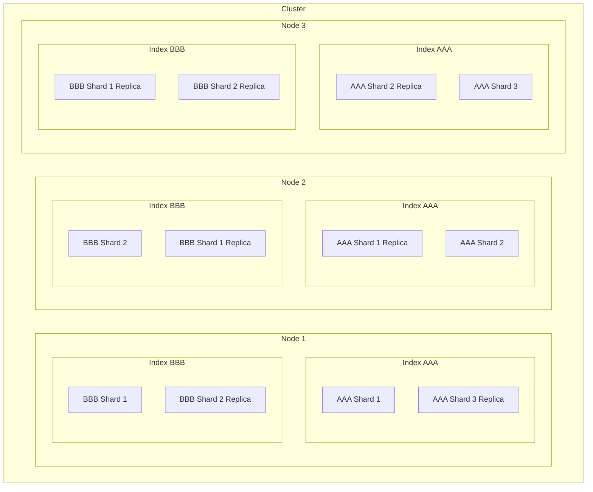

## Physical layout of an Elasticsearch cluster



### Index

- An index is spread across 1-N shards
- ES is _near real-time_ not _real-time_
    - index refreshes are where ES checks for new documents to index in the
      index
        - refreshes are expensive so it happens once per second by default (near
          real-time not real-time)

### Clusters

A cluster

- hosts 1+ indexes
- provides operations like searching and indexing
- is made up of 1+ nodes
- nodes try to join a cluster called `elasticsearch` by default
    - you should edit the cluster name to ensure your node doesn't accidentally
      join another cluster
- how nodes find each other:
    1. You create a list of "seed hosts" in settings (or from a file - this is
       abstracted into a "seed hosts provider" idea
    1. When the server starts, it contacts the nodes in the seed hosts list
    1. These seed hosts tell the node about the other nodes that they know about
- A cluster has one master node
    - The master node can be a dedicated master or can be one of the nodes which
      stores shards
    - The nodes in the cluster vote for the master - see
      https://www.elastic.co/guide/en/elasticsearch/reference/7.17/modules-discovery-quorums.html

### Nodes

- An ES cluster is a collection of nodes running on different machines
- each node has
    - a unique ID
    - a unique name
        - can be assigned by the `config/elasticsearch.yml` config file
- a node is a single instance of the Elasticsearch process
- a node is always part of a cluster, even if it is the only node in the cluster
- nodes try to join a cluster called `elasticsearch` by default
    - you should edit the cluster name to ensure your node doesn't accidentally
      join another cluster
- nodes on the same network will automatically find each other

Question: how do nodes find other nodes? do they spam the network on 9200 or
9300?

### Shards

- Physically it is a directory of files where Lucene stores data for your index
- A shard is the smallest unit of data that can be moved between nodes
- A single index can be split across multiple nodes i.e. it has some documents
  on each node
- The process of dividing an index across nodes is called _sharding_
- Once an index is created the **number** of shards cannot be modified
    - can the location of shards be modified?
- When you query, ES will collect results from all shards on all nodes
- WHen you search an index
    - ES will search a complete set of shards but they can be a mix of primary
      and replica
- A shard is a _Lucene index_
    - A directory of files containing an inverted index
    - => An _Elasticsearch index_ is made up of multiple _Lucene indexes_
      (shards)
- When you index a document the following things get stored
    1. The document itself (provided your index uses the default to store
       `_source`)
    2. Term dictionary
        - maps terms to document ids
        - My guess is that searches only need to look in the term dictionary and
          not at the documents themselves
    3. Term frequencies
        - quick access to the number of appearance of a term in a document
        - used to calculate relevancy

#### Primary shards

- When you index a document it is first sent to one of the primary shards in the
  index
    - That shard is chosen at random based on a hash of the document's ID
    - The shard could be on a different node to the one you connected to
    - Once the primary shard has written the new document it sends it to its
      replicas to keep them in sync

#### Replica shards

- Replica shards provide redundant copies of your data to protect against
  hardware failure and increase capacity to serve read requests like searching
  or retrieving a document.
- shards can be duplicated on other nodes (replica shards) to provide high
  availability
- replica shards are extra copies of the "primary" shard
- replica shards are promoted to primary shard when the node holding the primary
  shard fails
- All read operations .e.g. query operations and aggregations can be executed on
  replica shards too!
    - Only write operations must go to the primary shard I guess?
- Useful for both increasing search performance (searches hit a mix of primary
  and replica shards) and fault tolerance
- ES will never allocate a primary shard and a replica on the same node
    - => If you have a single instance node, and a 1P,1R settings in your index
      then you cluster health will be yellow

## Index lifecycle management

ES scans 9300-9305 on the network it is on for other cluster nodes

https://docs.aws.amazon.com/opensearch-service/latest/developerguide/ism.html

ES defines some lifecycle stages

```
Hot: queried and updated
Warm: queried but not updated
Cold: queried infrequently
Frozen: queried really infrequently
Delete: index should be deleted
```

```bash
# Lifecycle:
Hot -> Warm -> Cold -> Frozen -> Delete
```

You define policies which define when an index should enter each staging in the
chain Use index template to add a lifecycle policy for the index

## Operations Recommendations

- Cluster should have odd number of nodes
    - odd number avoids split-brain in some kinds of network downtime
    - one node cluster is fine for pre-prod envs
    - prod env should probably have 3 unless cost matters a lot and you can
      easily re-create the index
    - You **can easily change** the number of nodes in cluster later on
- Shards should be 20GB - 50GB
    > Aim to keep the average shard size between a few GB and a few tens of GB.
    > For use cases with time-based data, it is common to see shards in the 20GB
    > to 40GB range. Avoid the gazillion shards problem. The number of shards a
    > node can hold is proportional to the available heap space. As a general
    > rule, the number of shards per GB of heap space should be less than 20.
    - You have to choose the number of shards your cluster will have
    - If you don't have 20GB of data then one shard is fine
    - You **cannot change** number of primary shards after index is created
- Number of shard replicas depends on how busy the cluster is (varies by app)
    - You **can easily change** the number of replica shards
- Do your scaling out in phases so you have time to re-index before you hit the
  next phase
- You can use new indices as a scaling strategy
    - You can use aliases to select the subsets of indexes you care about
      searching
    - e.g. have an index for each day and an alias which will search across the
      last 30 days
    - an ali
- According to ES the sweet spot for RAM on an ES instance is
    - 64 GB per machine
        - 32 GB for elasticsearch (this is a max because of pointer length -
          more than 32GB and "pointers will blow up")
        - 32 GB to the OS disk cache (which Lucene will use extensively)
    - Under 8GB RAM is not recommended
    - IO speed matters
        - deadline and noop io scheduler is better
    - Use RAID0 - your cluster is already redundant
    - CPU not that important
    - Use medium to large configurations - too big is bad, too many boxes is bad
      too
- Setting heap size
    - default heap size is 1GB which is almost certainly not suitable for
      production workloads
    - allocate half of physical RAM to elasticsearch, the other half to the OS
      for lucene
    - if you are not aggregating on analyzed string fields, consider using less
      than half for elasticsearch
    - you want to give ES enough but no more than it needs - having more memory
      available for disk cache is better
    - Do NOT allocate more than 32GB as your ES_HEAP_SIZE
        - "above 32GB pointers no longer fit in a 32bit value so everything gets
          slower"
            - Is this true on modern 64bit systems?
    - smaller heaps result in faster GC and more memory for caching
    ```bash
    ES_HEAP_SIZE=10g
    # or
    ES_JAVA_OPTS="-Xms10g -Xmx10g" ./bin/elasticsearch
    ```
- ES does "bootstrap" checks when you start the service in production mode
    - Production mode is determined by whether you are binding to 127.0.0.1 (dev
      mode) or anything else (prod mode)
- `bootstrap.memory_lock`
    - https://www.elastic.co/guide/en/elasticsearch/reference/7.17/_memory_lock_check.html
    - controls whether ES will lock all its pages in memory (prevent them from
      being swapped to disk)
    - THe ES process must have the "memlock unlimited" capability
        - In systemd service file this is `LimitMEMLOCK=Infinity`

## Monitoring

Metricbeat

## Snapshots

> For domains running OpenSearch or Elasticsearch 5.3 and later, OpenSearch
> Service takes hourly automated snapshots and retains up to 336 of them for 14
> days. Hourly snapshots are less disruptive because of their incremental
> nature. They also provide a more recent recovery point in case of domain
> problems.

You backup a whole cluster at a time

Steps:

1. You define a "repo" (S3 or local folder depending on your setup)
1. Then save a snapshot to that directory:

```jsonc
GET /_snapshot/my-repo-name/my-snapshot-name
```

Restore steps

1. Check that the snapshot exists (based on the repo definition in config)

```jsonc
GET /_cat/snapshots/my-snapshot-name
```

1. Set `action.destructive.requires_name: false` in config if on ES 8+ (this is
   a security feature of ES 8+)
1. CLose all indices to prevent writes

```jsonc
POST /_all/_close
```

1. Restore the snapshot

```jsonc
POST /_snapshot/my-repo-name/my-snapshot-name/_restore
```

## \_seq_no and \_primary_term

```json
{
    "_index": "movies",
    "_type": "_doc",
    "_id": "111",
    "_version": 1,
    "_seq_no": 12,
    "_primary_term": 1,
    "found": true,
    "_source": {
        "title": "Eoin 1",
        "year": 2022,
        "genre": ["aaa", "bbb"]
    }
}
```

# Optimistic concurrency control

Each document returned has:

1. `_seq_no`
2. `_primary_term`

- id of the primary shard which owns the sequence

The tuple: `(_seq_no, _primary_term)` identifies a specific revision of a
document and is used to implement optimistic concurrency control.

If you want to update only the document you got then you pass the `_seq_no` and
`_primary_term` as conditions to the update - if ES finds that the most recent
revision does not match your given (seq_no, primary_term) then it fails the
write.

```jsonc
// This uses the (seq_no, primary_term) tuple to only write to the revision of
// the doc that we saw
POST /movies/_update/111?if_seq_no=13&if_primary_term=1
{
  "doc": {
    "title": "Eoin 2"
  }
}
```

Set `retry_on_conflict=N` param on your update request to have ES automatically
retry a write if it fails due to a sequence number conflict.

```jsonc
POST /movies/_update/111?retry_on_conflict=3
{
  "doc": {
    "title": "Eoin 2"
  }
}
```
