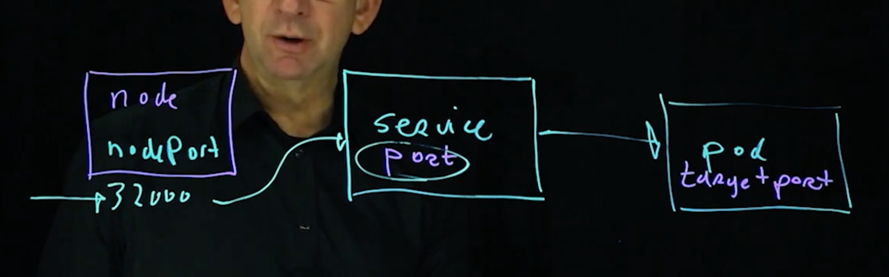

# CKAD

## Exam

- you can use the k8s docs in the exam
    - you can use the docs as a starter for creating complex yaml in the exam

## Overview

- the glibc version gives the container it's "identity" much more than the
  kernel
    - a "centos" libc makes it a centos container, even if running on an ubuntu
      kernel

## Registries

- Docker hub
    - docker hub registry is the default registry in k8s
- Quay.io
    - Run by RedHat

Containers depend on following linux kernel features:

- Kernel namespaces
- isolation
- Kernel CGroups
- resource allocation and limits

## Container solutions

- Docker
    - used everywhere
- Podman
    - parts
        - buildah = managed container images
        - podman = run containers directly on cri-o (no daemon required)
    - used in Redhat environments
    - RHEL 8 dropped support for docker and supports Podman only
- LXC
    - old-school
- systemd-nspawn
    - offers containers integrated in systemd

Kubernetes

- name means "pilot of the ship"
- k8s owned by CNCF which is within Linux Foundation
- is the core of an ecosystem rather than a standalone thing
- things in the ecosystem
    - networking
    - ingress
    - monitoring
    - packaging
- defines Resources using it's API
- distributions
    - vanilla k8s
        - built from source code hosted by CNCF
    - Google Anthos
    - RedHat OpenShift
    - Suse Rancher
    - Canonical Kubernetes
- new release every 3 months
- deprecated features are dropped after 2 releases - quite aggressive
- k8s came from Borg
    - Borg was also the origin of CGroups and namespace features in the Linux
      kernel

- k8s API
- some of the jobs that a server would do in the past for your app are now done
  by the k8s control layer
- accessing k8s
    - `kubectl` (only thing required for CKAD)
    - direct HTTP API access
    - web dashboard

```bash
# create a new deployment (3 nginx pods? containers?)
kubectl create deploy eoinfirstapp --image nginx --replias=3

kubectl get all
kubectl get all -A # more detail, similar to ls -l
kubectl get replicasets
kubectl get nodes

# delete a deployment
kubectl delete deploy eoinfirstapp

kubectl api-resources  # show all resources available

# run a single container and delete it
kubectl run eoin-solo --image nginx
kubectl delete pod eoin-solo

kubectl create deploy eoin-2 --image=nginx --replicas=3

# create ./foo.yml
kubectl apply -f foo.yml
# can also apply from a remote URL
kubectl apply -f https://github.com/raw/foo.yml

# you can apply multiple yaml files at same time
cat foo.yml bar.yml baz.yml | kubectl apply -f -
# can apply on a dir
kubectl apply ./code

# deleting a pod
# kills the pod but the replicaset immediately restarts it
kubectl delete pod/<name-of-pod-from-kubectl-output>

# see and change context

kubectl config get-contexts
kubectl config use-context docker-desktop


# you can scale a ReplicaSet
kubectl scale -n default replicaset <replica-set-id> --replicas=5
# you can also scale a Deployment
kubectl scale -n default deployment eoinfirstapp --replicas=3
# which is correct?

kubectl get pods -n kube-system

# expose a pod
# target-port = the port the app is binding to within the container
# port = the port we want to export
# kubectl expose deployment nginx --port 8888 --target-port 80 --name nginx
kubectl expose deployment eoin-2 --port 8888 --target-port 80 --name something-cool
```

### kubectl proxy

- creates app level gateway between localhost and th ek8s API server

    Q: can it be used to see web traffic from one of your pods? or is that
    terrible idea?

```bash
kubectl proxy

curl http://localhost:8001/
```

### K8s dashboard

```bash
# Setup dashboard
# ###############

# See https://github.com/kubernetes/dashboard for details on the dashboard
kubectl apply -f https://raw.githubusercontent.com/kubernetes/dashboard/v2.5.0/aio/deploy/recommended.yaml
kubectl proxy # takes over terminal


kubectl apply -f code/dashboard-adminuser.yaml
# serviceaccount/admin-user created

kubectl apply -f code/dashboard-clusterrolebinding.yml
# clusterrolebinding.rbac.authorization.k8s.io/admin-user created

kubectl -n kubernetes-dashboard get secret $(kubectl -n kubernetes-dashboard get sa/admin-user -o jsonpath="{.secrets[0].name}") -o go-template="{{.data.token | base64decode}}"

# output is a token you can use to sign in to dashboard

kubectl proxy # this takes over terminal

# Open in browser:
# http://localhost:8001/api/v1/namespaces/kubernetes-dashboard/services/https:kubernetes-dashboard:/proxy/
# paste in key from step above as token to sign in
```

    Q: what does the kubectlproxy command do exactly?
    Q: is the idea that you would keep a dir of yaml which acts a bit like terraform config?

On each node

```bash
# manager node stack
etcd
c-manager | api-server | scheduler
kubelet
containerd
linux kernel

# worker node stack
<your workload containers>
kubelet
containerd
linux kernel


# your laptop
kubelet
```

## API objects

### Pod

- a pod is an abstraction of a server
    - provides everything required to run a single application
    - k8s need extra metadata to manage a container beyond what is in the
      container itself
- all containers in pod run in a single namespace
- pod exposes a single IP address
- k8s does not manage individual containers, it managed pods
- adds features required in the cloud to run the all the containers that contain
  the app
    - pod priority, resources, affinity, anti-affinity
- normally pods always started via a deployment
- but you can run "naked" pods but shouldn't in prod
- naked pods
    - -- not rescheduled in case of failure
    - -- rolling updates don't apply - you can only bring it up and down with
      new settings
    - -- cannot be scaled
    - -- cannot be replaced automatically

```bash
kubectl run mypod --image nginx
kubectl get pods
kubectl get pods -o yaml # gives long detailed output of all pods
# Spec = spec for the pod, is a superset of the containers in the pod
# Status = current managemetn information
kubectl get pods <pod-name> -o yaml # gives long detailed output of single pod

# kubectl describe is a more human friendly version of the data in get -o yaml
kubectl describe pods
kubectl describe pods <pod-name>


# explain is kind of man pages for the yaml
kubectl explain pod
kubectl explain pod.spec
kubectl explain pod.spec.enableServiceLinks
kubectl explain --recursive pod.spec

# 'create' will create only, will not edit
kubectl create -f my-stuff.yml

# 'apply' will create or edit
kubectl apply -f my-stuff.yml


# k8s version of docker exec
kubectl exec -it my-pod -- /bin/sh
kubectl exec -it <pod-name> -- <prog-to-run-as-process>
kubectl exec -it <pod-name> -c <container-name-within-pod-if-multicontainer> -- <prog-to-run-as-process>
```

The etcd stores k8s config as JSON. k8s can convert it to yaml for you

### Tip: ps without ps

To find out about pocesses without `ps ` installed (e.g. in minimal container)

```bash
cd /proc
# dirs with number names are processes
cat 1/cmdline
```

### Logs

- you can send cluster logs to something else to view them all
- STDOUT is sent to the k8s cluster

```bash
# see logs for a single pod
kubectl logs pod-name

# GOTCHA: This command chooses only one pod to stream the logs. It doesn't
# stream the logs from all pods in the replica set/deployment
kubectl logs deployment.apps/<my-deployment> # DO NOT USE
```

How can i see which images the k8s has cached?

### K8s yaml

```yaml
# top level must have apiVersion, kind, metadata, spec
apiVersion: v1
kind: Pod
metadata:
    name: my-busybox
    # "default" is the default namespace
    namespace: default
spec:
    # pod can contain multiple containers
    containers:
        - name: eoin1
          image: busybox
          command:
              - sleep
              - '3600'
          args:
          env:
        - name: eoin2
          image: nginx
# status field exists when you export yaml out of k8s but I susepect you might never set it
status:
```

```yaml
# example of a k8s yaml defining multiple objects
apiVersion: v1
kind: List
items:
    # nested k8s objects
    - apiVersion: v1
    - apiVersion: v1
    - apiVersion: v1
metadata:
    resourceVersion: ''
    selfLink: ''
```

- multiple containers per pod is possible but **it is not common**
    - use-cases for multicontainer pods:
        1. sidecar container
            - provides additional functionality for the main container
            - main and sidecar have access to shared resources e.g. shared
              volumes
            - e.g. logging, monitoring, syncing
            - e.g. Istio
        1. ambassador container
            - re-resents the primary container to the outside world
        1. adapter container
            - transforms the data flowing in/out of the main container
        1. init container pattern
            - a container which is started first, does some work, and the main
              container is only started if the init succeeded
            - k8s has explicit support for this in the `initContainers` key
              which is a peer of `containers` key in YAML
            - can have shared volumes between the main container and the init
              container(s)
            - they can run tasks that happen at app boot
            - **k8s will wait for all the init contaienrs to finish before it
              will start the main container(s)**
                - main containers will be put in the "waiting" state
    - these patterns do not exist explicitly in k8s API
- there are 2 ways to work with 8s
    1. imperative way
        - everybody works on the command line
    1. declarative way
        - your team create a git repo of yaml files for your infra
        - k8s can generate yaml files from the CLI via
          `--dry-run=client -o yml > my.yml`
            - this is recommened over writing yaml from scratch

### Deploy

- represents the app itself
- takes care of the replicaset, which in turn takes care of the pods

### ReplicaSet

- take care of scalability by managing "replicas" of **Pods** (aka instances)
- not normally managed as an independent resource

### Service

- lets you expose the Deploy to users

### ConfigMap

- config for your apps

### Secrets

- secret version of ConfigMap

### PersistentVolume

- lets you store data long-term

### Managing k8s yaml

https://kubernetes.io/docs/concepts/configuration/overview/

> This does imply an ordering requirement - any Service that a Pod wants to
> access must be created before the Pod itself, or else the environment
> variables will not be populated.

Option: Put all your yamls in one dir and apply it all together _ ?? what about
the ordering requiremetn between services and pods? how to ensure services
created first? _ can work around this by using DNS for service discovery instead

### NameSpace (the k8s one,not the linux one)

- linux namespaces proved resource isolation
- k8s can use a namespace across multiple hosts
- k8s NameSpace uses linux namespaces under the hood
- can think of NameSpace as "directories" to apply security settings
    - RBAC defines rights and quotas for a user in a namespace
- you can config a default namespace but it can lead you to errors
- operators create a dedicated namespace
- you can use k8s namespace to set quota or RBAC

```bash
kubectl create namespace my-namespace
kubectl .. -n my-namespace
kubectl get ... --all-namespaces

❯ kubectl get ns
NAME                   STATUS   AGE
default                Active   23d
kube-node-lease        Active   23d
kube-public            Active   23d
kube-system            Active   23d
kubernetes-dashboard   Active   24h

$ kubectl get namespace my-namespace
# this will tell you if any quota or RBAC are applied to the namespac


❯ kubectl get all -A
NAMESPACE              NAME                                            READY   STATUS    RESTARTS         AGE
default                pod/eoin-2-6858f5d88d-2bsn9                     1/1     Running   0                24h
default                pod/eoin-2-6858f5d88d-cp6cd                     1/1     Running   0                24h
default                pod/eoin-2-6858f5d88d-rlnvv                     1/1     Running   0                24h
kube-system            pod/coredns-78fcd69978-29j6r                    1/1     Running   1 (14d ago)      23d
kube-system            pod/coredns-78fcd69978-vd8mx                    1/1     Running   1 (14d ago)      23d
kube-system            pod/etcd-docker-desktop                         1/1     Running   1 (14d ago)      23d
kube-system            pod/kube-apiserver-docker-desktop               1/1     Running   1 (14d ago)      23d
kube-system            pod/kube-controller-manager-docker-desktop      1/1     Running   1 (14d ago)      23d
kube-system            pod/kube-proxy-s7zkd                            1/1     Running   1 (14d ago)      23d
kube-system            pod/kube-scheduler-docker-desktop               1/1     Running   2 (14d ago)      23d
kube-system            pod/storage-provisioner                         1/1     Running   3 (32h ago)      23d
kube-system            pod/vpnkit-controller                           1/1     Running   1119 (12m ago)   23d
kubernetes-dashboard   pod/dashboard-metrics-scraper-c45b7869d-fsm9h   1/1     Running   0                24h
kubernetes-dashboard   pod/kubernetes-dashboard-764b4dd7-fzqm6         1/1     Running   0                24h

NAMESPACE              NAME                                TYPE        CLUSTER-IP       EXTERNAL-IP   PORT(S)                  AGE
default                service/kubernetes                  ClusterIP   10.96.0.1        <none>        443/TCP                  23d
kube-system            service/kube-dns                    ClusterIP   10.96.0.10       <none>        53/UDP,53/TCP,9153/TCP   23d
kubernetes-dashboard   service/dashboard-metrics-scraper   ClusterIP   10.103.4.115     <none>        8000/TCP                 24h
kubernetes-dashboard   service/kubernetes-dashboard        ClusterIP   10.104.129.196   <none>        443/TCP                  24h

NAMESPACE     NAME                        DESIRED   CURRENT   READY   UP-TO-DATE   AVAILABLE   NODE SELECTOR            AGE
kube-system   daemonset.apps/kube-proxy   1         1         1       1            1           kubernetes.io/os=linux   23d

NAMESPACE              NAME                                        READY   UP-TO-DATE   AVAILABLE   AGE
default                deployment.apps/eoin-2                      3/3     3            3           24h
kube-system            deployment.apps/coredns                     2/2     2            2           23d
kubernetes-dashboard   deployment.apps/dashboard-metrics-scraper   1/1     1            1           24h
kubernetes-dashboard   deployment.apps/kubernetes-dashboard        1/1     1            1           24h

NAMESPACE              NAME                                                  DESIRED   CURRENT   READY   AGE
default                replicaset.apps/eoin-2-6858f5d88d                     3         3         3       24h
kube-system            replicaset.apps/coredns-78fcd69978                    2         2         2       23d
kubernetes-dashboard   replicaset.apps/dashboard-metrics-scraper-c45b7869d   1         1         1       24h
kubernetes-dashboard   replicaset.apps/kubernetes-dashboard-6744c4f99d       0         0         0       24h
kubernetes-dashboard   replicaset.apps/kubernetes-dashboard-764b4dd7         1         1         1       24h

```

### Port forwarding (debugging technique)

- for troubleshooting only - not for regular use
- lets you forward a port from the kubectl host to the pod so you can debug
- regular access to pod ports is through 1) services and 2) ingress
- you don't have to have done anything special setup with ports on the pod for
  this to work

```bash
kubectl port-forward <pod-name> <post-on-kubectl-host>:<port-on-pod-container>
kubectl port-forward my-pod 8080:80
```

### Networking

#### Networks in a cluster


1. Pod network
    - all pods in cluster are on a single "pod network"
    - each pod has an IP on that network
    - ?? all pods can talk to each other on this network
    - ?? there is no outside access for pods on this network
    - ?? how do pods get outside access e.g. to pull down a new apt package?
    - ?? how does this work with them being on diff hosts?
2. Cluster network
    - nodes are connected to the cluster network
    - Services are connected to the cluster network
    - because nodes are on both the "real" node network and the internal cluster
      network, they can act as a proxy for traffic from the node network to the
      cluster network (this is called NodePort)
3. Node network
    - this is the network that connects the nodes together
    - I presume:
        - in AWS this would be your VPC network
    - external users come in through this "real" network

#### Service

- services as used as an _API based internal load balancer_
- each application in your cluster would have a service/load-balancer
- the service takes requests from the _cluster network_ and distributes them to
  a set of pods on the _pod network_
- an API resource used to expose a logical set of pods
- apply a round-robin load balancing to forward traffic to a specific set of
  Pods
- set of Pods targetted by a Service is determined by a selector (which is a
  label)
- kube-controller-manager runs in your cluster and continuously scans for pods
  which match the selector label and will add them to the Service
- if pods are added/removed they will show up in the Service after
  kube-controller-manager has run
- Services exist independently from the applications they provide access to
    - deleting your pods won't delete the service
    - the only thing they do is
- Once service can provide access to Pods in multiple Deployments - is used to
  do canary deployments
- kube-proxy
    - runs on each node
        - remember that the Service needs to send the packets to the correct
          node as well as correct Pod on that node
        - so kube-proxy is required to make that happen
    - watches the k8s API for new Services and endpoints (endpoints = Pods on
      that node which have correct label)
    - after creation, it opens random ports an listens for traffic to the
      Service port on the node's cluster IP address
        - it then redirects traffic to a Pod that is specified as an endpoint
    - works in background
    - does not typically require any config
- types of service
    1. ClusterIP
        - default service type
        - exposes the service on an internal cluster IP address
        - has IP on the cluster net
        - lets you load balance traffic from one part of the cluster to another
        - e.g. if you have pods for your front-end app and pods for a back-end
          service. You want to expose a load balancer for the backend pods to
          the front-end pods - Cluster IP service/load-balancer is how you do
          it.
    2. NodePort
        - exposes a high port on each node e.g. 32000
        - the exposed port on the node will forward traffic to the node-port
          Service behind it
        - this is still not for general user access
        - use cases:
        - ???
        - the Ingress uses the services directly, it does not need a node-port
    3. LoadBalancer
        - currently implemented in public clouds only
    4. ExternalName
        - works on DNS names
        - redirection happens at the DNS level
        - useful for migration
- ClusterIP and NodePort are most important for the CKAD exam

- when you expose a Deployment, you actually expose the Pods as endpoints
- you don't actually "expose" the deployment, k8s just uses the deployment label
  to find endpoints
    - Pods created within a Deployment will have a `app=<name-of-deployment>`
      label
- ports
    - targetPort = the port on the container that the services addresses
    - port = the port on which the Service itself is available
        - is a property of the Service itself
        - each Service has a dedicated ip address so you don't need to pick
          obscure ports you can use the default ports
    - nodeport = the port that is exposed externally when using the NodePort
      service type



```bash
# the "expose" command actually creates a service
# when you create a service you must specify the service port
# the target-port defaults to being same as service port
# if you use the NodePort service type you need to specify the node-port
kubectl expose <my-deployment> --port <port-num-service-itself-will-listen-on>

# this also works
kubectl create service


# you can filter kubectl get all by a label
# -o wide shows more info
kubectl get all --selector app=eoin-app-server -o wide
```

pods can come and go and their replicas can come and go so if your pods need to
access other pods, they need to depend on something that will stick around -
services are this they represent a "load balanced service where consumers of
that service (consumers usually other parts of the cluster) can access the
service wihtout knowing how many replicas/pods there are behind the service

A service can be "headless" i.e. does not have a cluster IP

k8s has an internal DNS service it is authoritative for the services in the
cluster when you create service it automatically registers itself with this DNS
server all pods are configured to use the DNS service as a resolver so they will
automatically find services from a pod you can always access a service by name

The dns server is implmeented via the coredns pod and it sits behind the
`service/kube-dns` service in the `kube-system` namespace

```bash
❯ kubectl get svc,pods -n kube-system
NAME               TYPE        CLUSTER-IP   EXTERNAL-IP   PORT(S)                  AGE
service/kube-dns   ClusterIP   10.96.0.10   <none>        53/UDP,53/TCP,9153/TCP   27d
# ^^^^ the service

NAME                                         READY   STATUS    RESTARTS           AGE
pod/coredns-78fcd69978-29j6r                 1/1     Running   1                  27d
pod/coredns-78fcd69978-vd8mx                 1/1     Running   1                  27d
# ^^^ the coredns pods
pod/etcd-docker-desktop                      1/1     Running   1                  27d
pod/kube-apiserver-docker-desktop            1/1     Running   1                  27d
pod/kube-controller-manager-docker-desktop   1/1     Running   1                  27d
pod/kube-proxy-s7zkd                         1/1     Running   1                  27d
pod/kube-scheduler-docker-desktop            1/1     Running   2                  27d
pod/storage-provisioner                      1/1     Running   3                  27d
pod/vpnkit-controller                        1/1     Running   1634 (9m52s ago)   27d


# this is a list of the search domains that a lookup for a service name will try
❯ kubectl exec -it debugpod -- cat /etc/resolv.conf
nameserver 10.96.0.10
search default.svc.cluster.local svc.cluster.local cluster.local
options ndots:5
```

The format of the DNS name is

    <service-name>.<k8s-namespace-name>.svc.cluster.local

Debugging with alpine

```bash
# run an alpine container to do debugging (using alpine because we can install packages if needed)
laptop$ kubectl run alpine-debug --image alpine -- sleep 3600
laptop$ kubectl exec -it alpine-debug -- /bin/sh

# install curl
alpine$ apk --update add curl

alpine$ nslookup eoin-app.default.svc.cluster.local
Server:         10.96.0.10
Address:        10.96.0.10:53


Name:   eoin-app.default.svc.cluster.local
Address: 10.103.15.225


# you can use curl to get to your service running under it's service name (below are all equivalent)
alpine$ curl http://eoin-app
alpine$ curl http://eoin-app.default
alpine$ curl http://eoin-app.default.svc
alpine$ curl http://eoin-app.default.svc.cluster # DOES NOT WORK
alpine$ curl http://eoin-app.default.svc.cluster.local

# you can use curl to get to the k8s API running on the kubernetes service in default namespace
alpine$ curl --insecure https://kubernetes
{
  "kind": "Status",
  "apiVersion": "v1",
  "metadata": {

  },
  "status": "Failure",
  "message": "forbidden: User \"system:anonymous\" cannot get path \"/\"",
  "reason": "Forbidden",
  "details": {

  },
  "code": 403

```

### kubectl debug

```bash
❯ kubectl debug -it pod/eoin-app-server-cfd5fc55c-bw644 --image=alpine --target=pod/eoin-app-server-cfd5fc55c-bw644
Targeting container "pod/eoin-app-server-cfd5fc55c-bw644". If you don't see processes from this container it may be because the container runtime doesn't support this feature.
Defaulting debug container name to debugger-hcqgn.
error: ephemeral containers are disabled for this cluster (error from server: "the server could not find the requested resource").

❯ kubectl version
Client Version: version.Info{Major:"1", Minor:"22", GitVersion:"v1.22.5", GitCommit:"5c99e2ac2ff9a3c549d9ca665e7bc05a3e18f07e", GitTreeState:"clean", BuildDate:"2021-12-16T08:38:33Z", GoVersion:"go1.16.12", Compiler:"gc", Platform:"darwin/arm64"}
Server Version: version.Info{Major:"1", Minor:"22", GitVersion:"v1.22.5", GitCommit:"5c99e2ac2ff9a3c549d9ca665e7bc05a3e18f07e", GitTreeState:"clean", BuildDate:"2021-12-16T08:32:32Z", GoVersion:"go1.16.12", Compiler:"gc", Platform:"linux/arm64"}
```

## Ingress

https://thenewstack.io/ingress-controllers-the-swiss-army-knife-of-kubernetes/

- ingress controller =
    - a load balancer which connects to the k8s nodes
    - an API resource so it can access services directly
        - the API resource contains the spec for the load balancer
        - the load balancer actually implements the spec it gets from the
          Ingress resources
    - incoming requests are forwarded from the "load balancer" part to the "API"
      part
- can be implemented by many load balancers
- k8s has no default ingress solution - ingress depends on the installation env
  of the k8s cluster
- used to provide external access sto internal k8s cluster resources
- uses a load balancer which is present on the external cluster
    - is implemented by the Ingress controller
- has 2 phases
    -   1. load balancer
    -   2. API resource
- Ingress expose HTTP and HTTPS
- Traffic routing is controlled by rules defined on the Ingres resource
- Ingress features
    - Give services externally reachable URLs
    - Load balance traffic
    - Terminate TLS
    - Offer "name based virtual hosting"
- Ingress resources are not same as ingress controller
- ingress resources hav 1+ rules which map URLs to `<service-name>:<port>`
  tuples
- Many ingress controllers exist
    - The setup of different controllers is quite different
    - they don't all have same features e.g.
        - protocol support TCP/UDP and gRPC?
        - canary deployments
        - circuit breakers
        - rate limiting
    - examples
        1. nginx
            - seems to be the recommended way to do ingress with docker-desktop
            - https://kubernetes.github.io/ingress-nginx/deploy/#docker-desktop
            - on AWS you can put this behind a network load balancer
            - I think
            - runs nginx in a pod
            - magically updates the nginx config as your cluster changes
            - doesn't have has many advanced features as the others but is less
              to configure as a result
            - only ingress controller maintained by k8s team
        2. haproxy
        3. traefik
        4. kong
        5. contour
        6. minikube ingress controller
        7. aws-load-balancer-controller
            - https://kubernetes-sigs.github.io/aws-load-balancer-controller/v2.4/how-it-works/
            - will manage AWS ALB/NLBs for you based on what you put in your k8s
              config
            - this controller manages AWS load balancers as if they were k8s
              resources
            - actual user HTTP requests go through the AWS ELB and then to a
              NodePort on a node which then sends the req to the container
        8. Istio
        9. Ambassador

Having ingress controllers be middlemen between your app(s) and the outside
world opens up a lot of opportunties

- controller knows when app is slow or down - is a natural choke point for
  monitoring an observability e.g. hook Prometheus in here
- can do as much fancy load balancing based on health/whatever as you like
- service meshes live here too
- security monitoring tools can observe traffic esp. if the ingress controller
  terminates TLS
- can function as an API gateway
- can do rate-limiting, restarts, timeouts
- can do fine grained access control
- blue/green, canary, other fancy deployment options
- routing for newer protocols e.g. gRPC
- HTTP header and response manipulation
- can integrate WAF
- SNI routing
- advanced routing based on whatever you like
- enforce mTLS

Questions

    how does an ingress controller running in the cluster work?
        I presume DNS has to be setup to hit the IP of that node as the entry point to your cluster
            and the ingress-controller runs as a NodePort service
            do you have to pin your ingress-controller to particular node(s) with affinity?
            how would this work with public+private subnets in AWS
        AWS has made me think of "load balancers" as special things which are not just normal servers
        but k8s treats them just like any other kind of infra

```bash
# install the nginx ingress controller
kubectl apply -f https://raw.githubusercontent.com/kubernetes/ingress-nginx/controller-v1.1.1/deploy/static/provider/cloud/deploy.yaml

# create an Ingress resource
kubectl create ingress <name-of-ingress> --class=nginx --rule=<url-pattern>=<service-name>:<port-name>

kubectl create ingress example-ingress --class=nginx --rule=/*=demo:80


❯ k describe ing eoin-app-ingress
Name:             eoin-app-ingress
Namespace:        default
Address:          localhost
Default backend:  default-http-backend:80 (<error: endpoints "default-http-backend" not found>)
Rules:
  Host        Path  Backends
  ----        ----  --------
  *
              /   eoin-app:80 (10.1.0.48:80,10.1.0.49:80,10.1.0.50:80)
Annotations:  <none>
Events:       <none>
```

You can setup an Ingress with rules that send different URLs to different
Services Rules in the Ingress point at services Do packets actually flow through
the Service or do they flow directly to the Pods in the Service?

Ingress Rule

1. An optional host
    - if no host specified, the rule applies to all inbound HTTP traffic
2. A list of paths
    - each path has it's own backend
    - paths can be a POSIX regex
3. The backend
    - one of two types
        1. Service backend
            - a k8s service
        2. Resource backend
            - often used to refer to cloud based object storage
            - not on CKAD examp
    - you can setup a default backend so that traffic that doesn't match a path
      will go somewhere

- Path types `pathType`
    - two types:
        1. Exact = an exact match should occur
        2. Prefix = only the prefix needs to match
    - ingress will set this by default for you to `Exact` if you omit it
- Ingress types
    1. Ingress backed by a single Service
        - one rule defines access to one backend service
        - e.g. `kubectl create ing my-single --rule="/files=filesservice:80"`
    1. Simple fanout
        - two or more ules definign paths to different services
        - e.g.
          `kubectl create ing my-fanout --rule="/files=files:80" --rule="/db:dbsvc:2345"`
    1. Name-based virtual hosting
        - two or more rules that route requests based on `Host` header
        - each Host must be in DNS e.g.
          `kubectl create ing my-multihost --rule="files.me.com/=files:80" --rule "db.me.com/=dbsvc:2345"`

### IngressClass

- you create an `IngressClass` resource
    - contains config info for that class of ingress e.g. which controller
      should implement it
    - it's kind of like a profile for a ingress controller
- when you create an `Ingress` resource you reference the class that it should
  be configured by
- new in k8s 1.22
    - paving a cow-path in use by controllers already using annotations
- can set a specific ingress controller as the cluster default with the
  `ingressclass.kubernetes.io/is-default-class: "true"` annotation

Network policies

- by default there are no restrictions on network traffic in K8s!
- Pods can always communicate even if they are in other NameSpaces
- to limit this Network Policies are used
- Network Policies must be supported bye the _network plugin_
- network plugin
    - https://kubernetes.io/docs/concepts/extend-kubernetes/compute-storage-net/network-plugins/
    - conforms to the Container Network Interface spec (CNI)
    - the plugin provides the `NetworkPlugin` interface
    - options:
        - cni
        - kubenet
            - simple network plugin, linux only
        - AWS VPC CNI plugin
            - https://docs.aws.amazon.com/eks/latest/userguide/pod-networking.html
    - minikube
        - minikube network plugin does not support
        - you have to start minikube with `--cni=calico` to use the calico
          network plugin
        - note that calico doesn't work well with minikube
- If a network policy is in use then traffic which doesn't match is denied by
  default
- If a network policy is not in use the all traffic is allowed by default
- A NetworkPolicy can be _pod based_ or _namespace based_
- A selector label is used to specify which traffic is allowed to/from the Pods
  that match the selector
- labels are important
- In network policies, 3 different identifiers can be used to match network
  traffic
    1. podSelector
        - allows access to a pod with a matching selector label
    2. namespaceSelector
        - allows incoming traffic from namespaces with the matching selector
          label
    3. ipBLock
        - allows access from a range of cluster-external IPs
- NetworkPOlicies are additive, they do not conflict
    - traffic blocked by default, first match allows traffic through

### Storage
