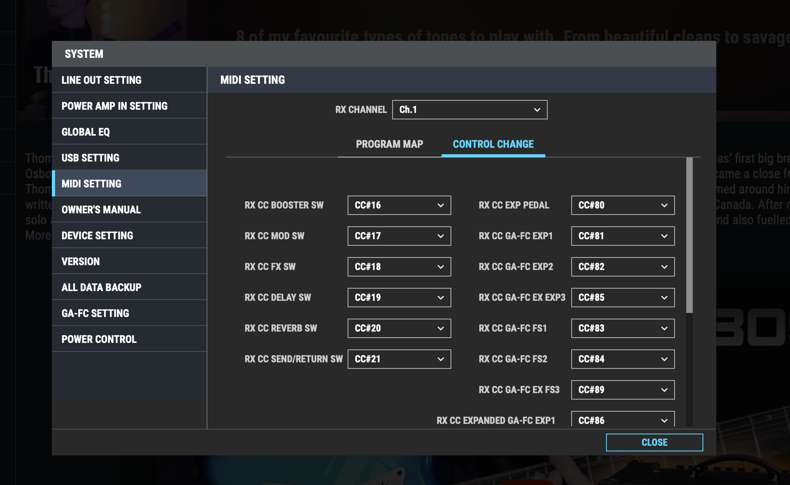

# Boss Katana

- https://www.reddit.com/r/BossKatana/comments/hx2z17/katana_community_presets_comment_with_your/
- https://www.reddit.com/r/BossKatana/comments/85jjdd/compendium_of_katana_resources/

## Katana internals

- 2017 is a common year for this code - maybe katana 1 came out then?
-   Sources
    - https://github.com/katana-dev
    - https://github.com/snhirsch/katana-midi-bridge
    - https://github.com/Pyrrhu5/boss-katana-go (for Katana:Go amp)
-   https://github.com/Conr86/katana-controller
    -   acts as a "control foot switch"
    -   all commits in 2017
- https://github.com/snhirsch/katana-midi-bridge

## Katana midi

It's all RX so you are configuring the Katana to interpret midi signals it receives

- Katana doesn't officially support MIDI over USB
    - But it seems like it is possible: https://www.reddit.com/r/BossKatana/comments/msd597/controlling_the_katana_with_a_midi_controller/
- Katana artist models has a DIN 5pin midi controller for official MIDI support
- You configure
    1. The MIDI channel that the Katana will listen on (1-16)
    2. The PC channel number(?) (legal values: 1-128) that corresponds to each of the 9 memory banks in the Katana (8 presets, 1 panel bank)
    3. The 20 ish CC numbers (legal values: 1-31, 64-95) that correspond to actions that the Katana will accept
- It responds to just a few PC and CC messages but has a pretty rich set of SysEx API similar to GT-100
    - Tone Studio uses MIDI incl SysEx messages to control the amp

## Katana through MIDI Studio on macOS

-   MIDI Studio on mac organises as `device > ports > connectors`
-   Exposes 1 device (KATANA) with 2 ports
    1. KATANA port
    -   has 1 in and 1 out _connector_
    2. KATANA DAW CTRL port
    -   has 1 in and 1 out _connector_
-   Q: how does the "test setup" work?
-   [You can test the I/O to the midi device](https://support.apple.com/en-nz/guide/audio-midi-setup/ams668e66f1d/3.6/mac/14.0)

## Sneaky amps (mk1 and mk2 only)

> This is probably due to the re-design of the Katana with the Gen 3 Series.
> While the original Katana borrowed effects from the popular BOSS ME units, this
> is no longer the case.
> https://www.electrikjam.com/boss-katana-sneaky-amps-guide/

katana mk2 seems to be based on the Boss GT100 platform

## USB Debugging

