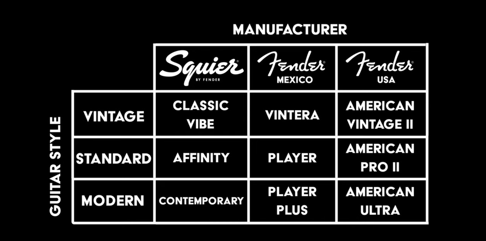

# Fender guitar range

| Range     | Squier by Fender (Asia) | Price USD | Fender mexico | Price USD   | Fender USA          | Price USD   |
| --------- | ----------------------- | --------- | ------------- | ----------- | ------------------- | ----------- |
| vintage   | classic vibe            |           | Vintera ii    | 1150 - 1500 | american vintage ii | 2200 - 2500 |
| standard  | affinity                |           | Player        | 800 - 1000  | american pro ii     | 1750 - 2000 |
| modern    | contemporary            |           | Player plus   | 1000 - 1150 | american ultra      | 2150 - 2300 |
| ???       | contemporary            |           |               |             | american ultra luxe | 2600 - 2700 |
| beginners | sonic                   |           |               |             |                     | 200 - 210   |

American performer 1400 - 1500 USD Other things

meteroa

- Fender japan
    - Short runs
    - High quality
    - Priced between Mexico an entry USA

- Paranormal
    - Mash-ups 
