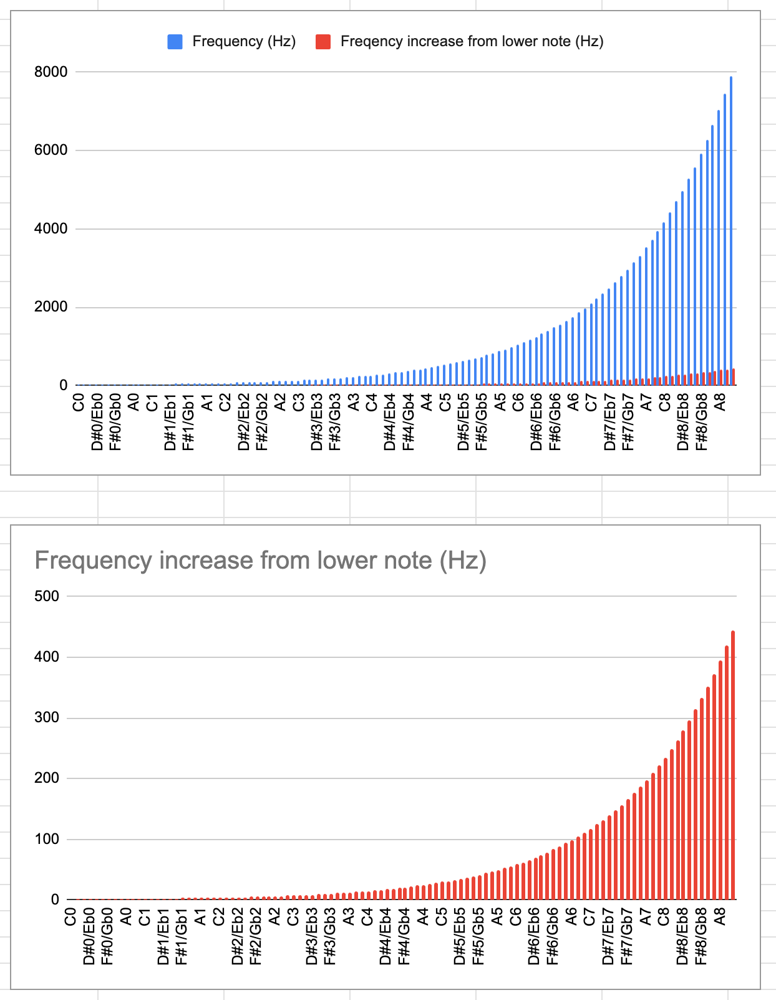

# Music

-   [Music](#music)
    -   [Overview](#overview)
    -   [Tuning](#tuning)
    -   [Origins of notation](#origins-of-notation)
        -   [Why 7 letters?](#why-7-letters)
        -   [Why is C the "starting point"?](#why-is-c-the-starting-point)
        -   [Alternatives to 12 notes/octave](#alternatives-to-12-notesoctave)
        -   [Cents](#cents)
        -   [Temperament](#temperament)
        -   [Our default: 12 tone equal temperament (12ET)](#our-default-12-tone-equal-temperament-12et)
    -   [Intervals](#intervals)
        -   [Interval names and scale names use "major","minor" differently](#interval-names-and-scale-names-use-majorminor-differently)
    -   [Scale degrees](#scale-degrees)
        -   [Intervals vs scale degrees](#intervals-vs-scale-degrees)
        -   [Interval names within a major scale (true for any major scale)](#interval-names-within-a-major-scale-true-for-any-major-scale)
    -   [Scales](#scales)
        -   [Chromatic scale](#chromatic-scale)
        -   [Major scale](#major-scale)
        -   [Minor scales (3 related patterns)](#minor-scales-3-related-patterns)
            -   [Natural minor](#natural-minor)
            -   [Harmonic minor](#harmonic-minor)
            -   [Melodic minor](#melodic-minor)
        -   [Pentatonic scale](#pentatonic-scale)
        -   [Blues scale](#blues-scale)
        -   [Aside: Types of scale](#aside-types-of-scale)
    -   [Modes](#modes)
        -   [7 essential modes](#7-essential-modes)
    -   [Keys (annotating written music)](#keys-annotating-written-music)
        -   [Key signatures](#key-signatures)
            -   [Reading key signatures](#reading-key-signatures)
        -   [Blue notes vs Accidentals](#blue-notes-vs-accidentals)
    -   [Chords \& harmony](#chords--harmony)
        -   [Tertian harmony](#tertian-harmony)
        -   [Major scale harmonies(chords)](#major-scale-harmonieschords)
            -   [Cmaj scale example](#cmaj-scale-example)
        -   [Mapping major scale degrees to intervals](#mapping-major-scale-degrees-to-intervals)
        -   [Natural minor chords](#natural-minor-chords)
    -   [More details](#more-details)

## Overview

There are 4 main aspects of music:

1. Pitch (aka note or tone)
    - the sound itself
    - 12 pitches in western music (within each octave)
    - pitches are organised into scales (a family of notes)
    - scales are the usual birthplaces of melody and harmony
    - melody = the part of music we can sing
    - harmony = two or more pitches at the same time
    - the Hz distance between notes is not constant - the higher the note the bigger the gap to the
      next note
        - seems to be roughly exponential looking (see graph below)
        - example:
            - Guitar open low E -> F is ~10 Hz
            - Guitar high E string 12th fret E -> F is ~78 Hz
2. Rhythm
    - Palpably organised time
    - motion
3. Form
    - most music follows an A-B-A form e.g. verse-chorus-verse, statement-departure-return
4. Tension and release
    - Building and releasing tension is an important facet of a musical piece

 Original:
https://docs.google.com/spreadsheets/d/1jeIa2PHvUnrhHvyD5D9zVmV7eO89LbLETm-np8UuNwY/edit#gid=168383079

Piano Tips

-   C is the white key to the left of two black keys, D is in the middle, E is on the right
-   F is on the left of three black keys cluster, then G, then A and B is on the right

## Tuning

A = 440hz

-   12 named pitches
    -   7 with one name
    -   5 with two possible names (flat or sharp) (these are called _enharmonic_)
-   12 pitches in an octave
    -   so the root must be shared between the octave above and below it
-   It is not the absolute frequencies that matter - it is the intervals between the frequencies.
-   The interval distance in Hz gets larger as notes get higher
-   Human perception of musical intervals is is approximately logarithmic wrt fundamental frequency
-   A melody is a sequence of notes but can also be thought of as a sequence of **intervals**
    counted from the root note.
-   In standard Western equal temperament, the notion of pitch is insensitive to "spelling": the
    description "G4 double sharp" refers to the same pitch as A4; in other temperaments, these may
    be distinct pitches.
-   Pitches can be labeled with:
    -   note name
    -   note name with frequency appended e.g. A440
    -   scientific pitch notation (starting $C_0$ = 16 Hz) e.g. E2, C4 etc.
    -   a number representing the frequency in Hz
    -   _Helmholtz pitch notation_ - a uses chars such as `,'"` to indicate which note it is e.g.
        C', C", C""

## Origins of notation

Ancient greeks noticed:

-   Doubling the length of a string gives a very harmonious outcome
-   Tripling the length of a string gives a harmonious outcome
-   Quadrupling the length of a string gives a very harmonious outcome

They thought in terms of string lengths, we know this maps directly to frequencies now. They
experimented with different length strings to produce different outcomes.

They noticed that the ratios of 3/2 (P5) and 4/3 (M3) made for nice sounding output. This later
solidified into the major triad.

3/2 (P5) and 4/3 (M3) are still a fundamental way we divide up the octave.

### Why 7 letters?

Using the 7 letters mean the same 7 **letters** are used in every key - this is supposedly easier to
understand than having to memorize which letters are skipped. The "no repeat letters" thing applies
most of the time but not always:

-   it's impossible to write the blues scale without double a note given three notes with two half
    step gaps.

In general people try to have each letter used just once in a key.

When an accidental is notated for a letter, you have to notate the "reverting back to natural" the
next time the letter appears. This is two things to add to the music sheet. People generally want to
avoid adding more notation than absolutely necessary so they pick # or b names for enharmonic notes
to keep the notation concise.

> There are different rules in different contexts, but when it comes to scales, the governing rule
> is: one of each note letter.
>
> This means the F major scale has a Bb, while the B major scale has an A#. (Write them out with a
> different letter for each note, and you'll find out why.)
>
> Similar things apply to chords. So an Emaj7 chord has a D#, not a Eb (it's already got an "E",
> right?).
>
> But for major scales, the one-of-each-note-letter rule leads to a more well-known rule: sharps
> only or flats only. (Just three harmonic or melodic minor scales break that rule, but purely to
> obey the "one of each letter" rule. Such as D harmonic minor: D E F G A Bb C#. (Not A# or Db.) )
>
> In actual music, however, it's quite common to have two versions of a single note -
> "chromaticism" - and then the choice is more subtle. So if you have a melody line (in C major)
> running D-Eb-E, that would require two accidentals: a flat on the first E, and then a natural on
> the second one. But making it D# means you only need one accidental. Coming down E-Eb-D is the
> opposite: using D# would then require two, while Eb only needs one. But if the key was Eb major,
> then D-Eb-E only needs one accidental. Descending E-Eb-D would require two (natural then flat),
> but E-D#-D would need three! There are yet other considerations when you have a chromatic chord.
> In key of C major, you might get an E major chord. That needs a G#. But an Ab chord (also quite
> common in C major) needs an Ab, obviously. That's regardless of which way a melody line might be
> running.
>
> https://www.reddit.com/r/musictheory/comments/p4rkqa/comment/h90pv1o/

### Why is C the "starting point"?

-   It's historical accident that C major is treated as "basic."
-   Notes do not "start" with C; C major is just the easiest major key to notate in modern notation.
-   The concept of a major key came about long after letters were assigned to the notes.
-   Before there were major (and minor) keys, people used modes, usually just using the notes of the
    modern white keys and starting and ending in different places.
-   The Ionian mode (which became modern major) was a late addition to the modes.

### Alternatives to 12 notes/octave

There are alternatives to 12 notes in octave:

-   examples
    -   24 notes per octave
    -   19 notes per octave
-   -- much more complicated to play
-   ++ more notes!
-   most people agree that the extra notes are not useful enough for the added complexity
-   12 notes in an octave is the commonly agreed upon compromise
-   some composers have had a play
    -   https://en.wikipedia.org/wiki/Ivan_Wyschnegradsky
        -   https://www.youtube.com/watch?v=tDroa5WTU34
    -   microtonal guitars are a thing
        -   https://www.youtube.com/watch?v=iRsSjh5TTqI

### Cents

-   An equal tempered semitone is divided into 100 cents
-   A unit of measure for the **ratio** between two frequencies
-   An equally tempered semitone is 100 cents **by definition**
-   An octave is 1200 cents by definition

### Temperament


-   "Just intonation" tunes the instrument based on ratios - it is the most mathematically pure way
    to do it
-   if you use ratios to tune your instrument it works fine for one octave root but the ratios do
    not hold if you use one of your other intervals as the root
-   => your music will sound good with one root but not in others
-   => you cannot move your composition around
-   you would have to re-tune your instrument to play in a different key

We fix this with "temperament" - we have to "temper" the intervals to make the tuning more
versatile. Over history various "temperaments" have been used:

1.  Pythagorean
2.  Meantone
3.  Well temperament
4.  Equal temperament

Tempering is a compromise between keeping the intervals within an octave sounding good and being
able to move around

The (almost) universally adopted modern system is _12 tone equal temperament_.

### Our default: 12 tone equal temperament (12ET)

-   12ET makes every interval equidistant.
-   Steps
    1. tune the octave with the perfect mathematical ratio
    2. divide the octave into 12 equal intervals
-   12ET is technical slightly out of tune but we are so used to it that we don't really notice.
    -   Tempering is a compromise between keeping the intervals within an octave sounding good and
        being

| Interval name | Just Int. ratio | 12TET adjustment (cent) |
| ------------- | --------------- | ----------------------- |
| m2            | ?               | +11.73                  |
| M2            | ?               | +3.91                   |
| m3            | 6:5             | +15.64                  |
| M3            | 5:4             | -13.69                  |
| P4            | 4:3             | -1.96                   |
| T             | ?               | -17.49                  |
| P5            | 3:2             | +1.96                   |
| M6            | 8:5             | -15.64                  |
| m6            | 5:3             | -13.69                  |
| M7            | ?               | -11.73                  |
| m7            | ?               | +17.6                   |
| Octave        | 2:1             | 0                       |

So 12TET is sometimes a +/- 17 cents compromise. That's a lot.

## Intervals

So it's all about **frequency intervals** and not much to do with absolute frequencies

-   The octave is the most consonant interval and therefore the most important interval
-   the interval of an octave is the most consonant (we perceive them as so close that they are the
    deeper or higher versions of the "same note") so we give them the same name
-   so the system starts by finding octave intervals
-   the math relationship between octaves are also clean - the frequencies double/halve

So in our imaginary "building music from scratch" we have the octave interval.

-   now we choose to divide the octave up into 12 smaller divisions
-   These divisions have names based on their distance from the octave frequencies
-   The names are based on how they sound to our ears
-   all these divisions are defined as jumps from the "base" octave frequency
-   In general, the more consonant an interval sounds to human ears, the simpler the relationship
    between the two notes.

Notation

```
M = major
m = minor
```

| Interval | Just Int. | To the ear       | 12TET adjustment (cent) |
| -------- | --------- | ---------------- | ----------------------- |
| Unison   | ?         | Most Consonant   | 0                       |
| m2       | ?         | Dissonant        | +11.73                  |
| M2       | ?         | Dissonant        | +3.91                   |
| m3       | 6:5       | Consonant        | +15.64                  |
| M3       | 5:4       | Consonant        | -13.69                  |
| P4       | 4:3       | Highly Consonant | -1.96                   |
| T        | ?         | Dissonant        | -17.49                  |
| P5       | 3:2       | Highly Consonant | +1.96                   |
| m6       | 5:3       | Consonant        | -13.69                  |
| M6       | 8:5       | Consonant        | -15.64                  |
| m7       | ?         | Dissonant        | +17.6                   |
| M7       | ?         | Dissonant        | -11.73                  |
| Octave   | 2:1       | Most Consonant   | 0                       |

Remember we are naming **intervals** (distances) here, not naming notes (points)!

We want the intervals within the octave to be _more or less_ evenly spaced because it makes it much
easier to move music up/down the frequency range (i.e. change key).

Layout of our interval names within an octave

```
root m2 M2 m3 M3 P4 Tritone P5 m6 M6 m7 M7 octave
```

How human ears perceive intervals, from most consonant to most dissonant:

```
Octave (generally accepted) <most consonant>
Perfect 5th/Perfect 4th (generally accepted)

(people disagree with the order from here on)
Major 3rd and Minor 6th
Minor 3rd and Major 6th

(things below here are considered dissonant)
Major 2nd and Minor 7th
Minor 2nd and Major 7th
Tritone
Microtonal intervals (quarter tone etc.) <most dissonant>
```

### Interval names and scale names use "major","minor" differently

NOTE: The "major" and "minor" in the interval names only sometimes correspond to major and minor
scales - it's just a coincidence when they do. There are no _"major scales use the major intervals"_
or _"minor scales use the minor intervals"_ rules. In interval naming, major and minor can be
thought of as "big" and "little"

Major, minor in intervals refers to the distance (in semitones) between notes.

Major, minor in scale names reflects an overall vibe of the scale The scales were names after the
vibe of the 3rd **scale degree** in the scale. If 3rd scale degree = M3 then it's a major scale If
3rd scale degree = m3 then it's a minor scale

## Scale degrees

-   A way of referring to the notes in a scale by their distance from the first and main note of the
    scale
-   A "scale relative" way to refer to notes within a scale
-   A short-hand for naming notes within a scale
    -   Rather than specifying each note, you specify the pair (scale-root, scale-degree)
    -   It tells you about the role of that note rather than just the note e.g. compare "play a D"
        to "play a 2/supertonic/II in C major" - the latter gives you way more usable info.
    -   The role of 2/supertonic/II is the same in any scale so it makes sense for musicians to
        refer to the note by it's job
    -   The conversation still makes sense even if you transpose keys.
-   The distance in semitones between each degree varies and is what gives the scale it's character
-   scale step = distance between two scale adjacent scale degrees.
    -   Maps to variable number of semitones.
-   whole step, half step = distance between intervals
    -   (fixed at whole = 2 semitones, half = 1 semitone)
-   Two names are _enharmonic_ if they are aliases for the same note.
-   Every musical scale has 7 _degrees_. scale.

Scale degrees are named in multiple ways:

1. Numerals: 1-7
2. Roman numerals: I - VII
3. English names
    1. Tonic
    2. Supertonic
    3. Mediant
    4. Subdominant
    5. Dominant
    6. Submediant
    7. Subtonic **or** Leading note
        - called Subtonic when it is a 2 semitones below tonic
        - called Leading note when it is 1 semitone below tonic
4. _movable do solfége_ system: do, re, me, fa, so, la, ti

### Intervals vs scale degrees

-   Intervals map to a fixed number of semitones
-   Scale degrees map to different number of semitones in different keys

### Interval names within a major scale (true for any major scale)

-   The major scale has a fixed mapping between intervals and scale degrees. Given by
    ```
    Degree:       1 2 3 4 5 6 7
    Interval gap: W W H W W W H
    Interval gap: 2 2 1 2 2 2 1
    ```
-   The primary names below are derived from the major scale
-   The natural state of the intervals is the major scale are the "major intervals".

| Interval Name | # semitones | Deg. num | Deg. name    | Primary Name(s) | Aliases                                 |
| ------------- | ----------- | -------- | ------------ | --------------- | --------------------------------------- |
| root          | 0           | 1        | Tonic        | Perfect unison  | Diminished 2nd                          |
| m2            | 1           |          |              | Minor 2nd       | Flat 2nd                                |
| M2            | 2           | 2        | Supertonic   | Major 2nd       | Natural 2nd                             |
| m3            | 3           |          |              | Minor 3rd       | Augmented 2nd, Flat 3rd                 |
| M3            | 4           | 3        | Mediant      | Major 3rd       | Diminished 4th, Natural 3rd             |
| P4            | 5           | 4        | Subdominant  | Perfect 4th     | Augmented 3rd                           |
| T             | 6           |          |              | Tritone         | Augmented 4th, Diminished 5th, Flat 5th |
| P5            | 7           | 5        | Dominant     | Perfect 5th     | Diminished sixth                        |
| m6            | 8           |          |              | Minor sixth     | Augmented 5th, Flat 6th                 |
| M6            | 9           | 6        | Submediant   | Major sixth     | Diminished 7th, Natural 6th             |
| m7            | 10          |          |              | Minor 7th       | Augmented sixth, Flat 7th               |
| M7            | 11          | 7        | Leading note | Major 7th       | Diminished octave, Raised 7th           |
| octave        | 12          | 8        | Tonic        | Octave          | Augmented 7th                           |

-   Alternative names for intervals
    -   all minor intervals also known as "flat" or "flattened" intervals
    -   major intervals can be called "natural" intervals
    -   major 7th can be called "raised 7th"
    -   minor 6 also called augmented 5th
    -   Augmented and diminished intervals
        -   NB: notes are not augmented or diminished - only **intervals** are augmented or
            diminished.
        -   The rules around augmented and diminished intervals are:
            -   When you raise a **perfect** interval by a half-step it is called augmented
            -   When you lower a **perfect** interval by a half-step it is called diminished
            -   When you raise a **major** interval by a half-step it is called augmented
            -   When you lower a **minor** interval by a half-step it is called diminished
            -   you cannot create an augmented interval by raising a minor interval
            -   Note that you cannot create an diminished interval by lowering a major interval

## Scales

What is a scale?

-   Different types of scale have different distances between their degrees. These different
    intervals are what makes the scales different
-   If you play notes which are part of the scale they are _diatonic_. If you play notes outside the
    scale they are _chromatic_ (chroma = color => chromatic notes add color to a piece)
-   There is one major scale and multiple minor scales for each note
-   Major is written with an 'M' and minor is written with an 'm'
-   A scale is defined by
    1. its first degree/tonic note
    2. it's interval pattern
-   Based on their interval patterns, scales are grouped into categories such as major, minor,
    chromatic, pentatonic etc.
-   a bunch of notes arranged in steps into a particular order that gives a sense of "home"
-   the sense of "home" is called tonality
-   tonality is a sort of "musical gravity"
-   scale and key mean the same thing
-   "what key is this in?" == "what scale does this use?"
-   the "home note" of the scale is called the tonic/root/do (as in do-re-me...)/one of the scale
-   scales
    -   7 notes per octave = hepatonic
        -   e.g. major and minor scales
    -   5 notes per octave = pentatonic

### Chromatic scale

A _chromatic_ scale includes all the notes within one octave (including sharps and flats)

    1 1 1 1 1 1 1 1 1 1 1
    half half half half half half half half half half half

### Major scale

A Major scale is defined by it's intervals:

    W W H W W W H
    2 2 1 2 2 2 1
    2 2 1    2    2 2 1 (Ancient greek view: 2x tetrachords joined by a whole step interval, called Ionian mode)
    whole whole half whole whole whole half

On a piano, the C Major scale _happens_ to be just white keys but **all other major scales have
black keys in them** i.e major scales are not "white key scales", it just happens to be the case on
that one instrument (Piano) for that one Major scale (C Major)

Scales can be enharmonic too e.g. C# Major is enharmonic to Db Major

There is a major scale starting on each of the 12 pitches which means there are 12 major scales. 4
of the pitches have two names (# and b) so there are 16 ways to write the 12 scales.

There is only one major scale for each pitch.

### Minor scales (3 related patterns)

There is only one kind of major scale but there are many minor scales. Three are common:

1. Natural minor
2. Harmonic minor (also called Enharmonic minor)
3. Melodic minor

Scales are named after their most significant intervals, which happens to be the 3rd (in both the
major and minor scales). (Major and minor chords, likewise, are named after their 3rds.)

The "major scale" just happens to have the bigger kind of 2nd 6th and 7th as well. But there are
other "major modes", like mixolydian and lydian.

Likewise there are plenty of "minor" scales and modes, all of which share the minor (smaller) 3rd,
but the 2nd 6th and 7th can all vary in size.

#### Natural minor

```
2 1 2 2 1 2 2
whole half whole whole half whole whole

root 2 1 2 2 1 2 2
root whole half whole whole half whole whole
C     D     Eb    F     G     Ab    Bb     C
```

-   Is just a major scale shifted
    -   starts on the 6th degree of it's relative/corresponding major scale
    -   up 9 half-steps or down 3 half-steps
    -   up 5 degrees or down 2 degrees
-   has exactly the same 8 notes as it's corresponding Major scale
-   natural minor is the basis the minor key signatures (not harmonic or melodic minors)

#### Harmonic minor

-   A variation on the natural minor
-   Natural minor but the 7th is raised by one semitone
-   Nice to play, awkward to sing. Hence the melodic minor
-   is a common foundation for chords (harmonies) in minor keys

Naming:

-   1 = half
-   2 = whole
-   3 = aug-2nd

```
root  2 1 2 2 1 3 1
root whole half whole whole half  aug-2nd half
C    D     Eb   F     G     Ab    B       C
```

#### Melodic minor

```
root 2 1 2 2 2 2 1
root whole half  whole whole whole half
C    D     Eb    F     G     A     B     C
```

-   Some (but not all) music theorists use melodic minor when going up a scale but use the natural
    minor notes when going down.

### Pentatonic scale

-   Major and minor scales can also be called heptanoic (7 note per octave) scales but it isn't
    common
-   2 types of pentatonic (5 note per octave) scales
    1. hemitonic = pentatonic which includes semitones
    2. anhemitonic = pentatonic which doesn't include semitones
-   What do the types mean?

1. Major pentatonic
    - built by removing the 4th and 7th from the major scale
    - you play 1 2 3 5 6 on the major scale
    - `root 2 2 3 2 3`
    - other kinds of pentatonic
        - remove 1st and 3rd of major scale
        - remove 1st and 4th of major scale
2. Minor pentatonic
    - `root 3 2 2 3 2`
    - is related to the major pentatonic similar to how the natural minor is to the major
        - each major pentatonic has a relative minor starting on the 6th e.g. C major pentatonic has
          A minor pentatonic starting on the 6th just like Cmaj has C natural minor starting on the
          6th
    - E A D G B E (Guitar open strings) are E minor pentatonic
    - Barre any fret and the notes are in the minor pentatonic of that fret

Minor pentatonic

-   5 shapes on fretboard
-   imagine playing it only on 6th string
    -   each shape starts on one of the scale notes on the 6th string

Example Am pentatonic

5 shapes:

1. Start 6th string A (name: minor shape)
2. Start 6th string C (name: major shape)
    - this is the 2nd shape of Am pentatonic and also first shape of CMaj pentatonic
3. Start 6th string D (name: suspended shape - why?)
4. Start 6th string E (name: blues minor shape - why?)
5. Start 6th string G (name: blues major shape - why?)

After 5th shape it wraps around to the 1st shape again

Am relative major is CMaj

2 x 1-4 followed by 3 x 1-3

root is always the 1 of second 1-4 root is always the 3 of middle 1-3

### Blues scale

> The term blues scale refers to several different scales with differing numbers of pitches and
> related characteristics. A blues scale is often formed by the addition of an out-of-key "blue
> note" to an existing scale, notably the flat fifth addition to the minor pentatonic scale.
> However, the heptatonic blues scale can be considered a major scale with altered intervals.

### Aside: Types of scale

| Name       | Notes per octave |
| ---------- | ---------------- |
| Chromatic  | 12               |
| Nonatonic  | 9                |
| Octatonic  | 8                |
| Heptatonic | 7                |
| Hexatonic  | 6                |
| Pentatonic | 5                |
| Tetratonic | 4                |
| Tritonic   | 3                |
| Ditonic    | 2                |

:question: why no 10 and 11?

:question: Wikipedia describes scales as "being explored" in 19th and 20th century. I guess you just
find a combo of notes that sounds good to you and other people and then you have a scale?

## Modes

Q: are there combinations of notes not represented by the combo of major + minors + modes?

-   Once you get past the major and minor scales, all the other 8 note combinations are called
    **modes** instead of scales.
-   we think of modes are related to a major scale but in practice they are their own set of
    intervals
-   modes give a different twist on the major scale - you get a different feel while staying within
    the same notes of the traditional major scale
-   Modes pre-date scales by a lot (modes date to ancient greece):
    -   Major scale is based on the Ionian mode.
    -   Minor scale based on the Aeolian mode
-   The number and use of modes expanded in the era of the medieval church - these were called
    _church modes_

### 7 essential modes

-   The 7 essential modes are rotations of the major scale intervals
-   each one starts on a different degree of the major scale but uses the same notes as it's major
    scale

| Mode name  | Starting degree | Intervals     | Notes                                                  |
| ---------- | --------------- | ------------- | ------------------------------------------------------ |
| Ionian     | 1               | 2 2 1 2 2 2 1 | **exactly** the major scale                            |
| Dorian     | 2               | 2 1 2 2 2 1 2 | pretty close to natural minor                          |
| Phrygian   | 3               | 1 2 2 2 1 2 2 | pretty close to natural minor                          |
| Lydian     | 4               | 2 2 2 1 2 2 1 | major ish sounding                                     |
| Mixolydian | 5               | 2 2 1 2 2 1 2 | also major ish sounding                                |
| Aeolian    | 6               | 2 1 2 2 2 1 2 | **exactly** the natural minor scale                    |
| Locrian    | 7               | 1 2 2 2 1 2 2 | sounds unusual, unused for centuries, used in Jazz now |

## Keys (annotating written music)

-   A key = a scale
-   Writing the sharp/flat symbol for every note would be annoying to write and to read
-   So the idea of a "key" was invented to set a default in terms of what should be sharp and flat
    for a piece
-   Each key corresponds to a scale.
-   When you assign a key to apiece then people assume most of the notes will stay within that scale
    and you only have to annotate the exceptions.
-   The exceptions are called "accidentals", a name which makes more sense in this context than in
    the "general name for sharps and flats" context

### Key signatures

-   There are 12 major scales (ignoring enharmonics) so there are 12 major keys
-   You specify a key by setting a "key signature" at the very start of a piece.
-   The key signature specifies which sharps and flats to use for the whole piece
-   There is a key for each scale
-   Natural minor scales are rotations of the major scales so they share the same key signature as
    their corresponding major scale because they include the same notes

### Enharmonic

-   There are 5 enharmonic notes but they do not map directly to enharmonic keys
    1. C#/Db
    2. D#/Eb
    3. F#/Gb
    4. G#/Ab
    5. A#/Bb
-   Some key signatures have an enharmonic equivalent that contains the same pitches, albeit spelled
    differently.
-   In twelve-tone equal temperament, there are three pairs each of major and minor enharmonic keys
    -   major enharmonic keys
        1.  B major/C♭ major
        2.  F♯ major/G♭ major
        3.  C♯ major/D♭ major
    -   minor enharmonic keys
        1.  G♯ minor/A♭ minor
        2.  D♯ minor/E♭ minor
        3.  A♯ minor/B♭ minor
-   In some strict sense there are 12 + 5 = 17 major scales but some of them are so fiddly to notate
    when you stick to only using each letter once that they are never used.
    -   Using each note once forces you to use double sharps (annotated with the &#x1D12A; symbol
        but I'm using `##` for convenience here)
-   Extremely fiddly to notate major keys
    1. D# major = D♯, E♯, F##, G♯, A♯, B♯, C##
    2. G# major = G♯, A♯, B♯, C♯, D♯, E♯, F##
    3. A# major = A♯, B♯, C, D♯, E♯, F## and G##
-   Extremely fiddly to notate minor keys
    1. C#
    2. F#

#### Reading key signatures

-   Single flat => Key of F
-   Multiple flats => Look at the next-to-last flat to get the key
-   look at last sharp, next note up is the key
    -   last sharp in th key signature represents the 7th degree of that particular scale so the
        tonic of the scale is the next note up

### Blue notes vs Accidentals

-   Notes outside the current key (scale) are called "accidentals"
-   Bends make "blue notes", notes which are not exactly on a semitone, come from jazz and blues

## Chords & harmony

### Tertian harmony

-   Tertian harmony is the most commonly used - is built from 3rds (in scale degrees).
-   Or you can think of it as being built by skipping one scale degree before adding a note to the
    chord
-   Sometimes called 1-3-5 chords (where the numbers are _scale degrees_)

```
root
third (+2 scale degree, actual interval varies by scale)
fifth (+2 scale degrees, actual interval varies by scale)
```

You can continue building chords by skipping one scale degree before adding a note e.g.

```
1-3-5
1-3-5-7
1-3-5-7-9
1-3-5-7-9-11
1-3-5-7-9-11-13
etc.
```

### Major scale harmonies(chords)

#### Cmaj scale example

You can (and should) memorise the 1-3-5 chords created by the major scale:

```conf
# major scale
major minor minor major major minor diminished

# Cmaj scale
C     D     E     F     G     A     B
Cmaj  Dmin  Emin  Fmaj  Gmaj  Amin  Bdim
```

These chords fall out of following the 1-3-5 pattern for each note.

### Mapping major scale degrees to intervals

Depending on the first note of the chord, the interval sizes (in semi-tones) will be different e.g.
in Cmaj scale:

```
For root note (C)
deg 1 = C
deg 3 = E (+4 semitones from root = major 3rd)
deg 5 = G (+7 semitones from root = perfect 5th)
=> Cmaj

For 2nd note (D)
deg 1 = D
deg 3 = F (+3 semitones from root = minor 3rd = flat 3rd)
deg 5 = A (+7 semitones from root = perfect 5th)
=> Dmin

For 3nd note (E)
deg 1 = E
deg 3 = G (+3 semitones from root = minor 3rd = flat 3rd)
deg 5 = B (+7 semitones from root = perfect 5th)
=> Emin

For 4th note (F)
deg 1 = F
deg 3 = A (+4 semitones from root = major 3rd)
deg 5 = C (+7 semitones from root = perfect 5th)
=> Fmaj

For 5th note (G)
deg 1 = G
deg 3 = B (+4 semitones from root = major 3rd)
deg 5 = D (+7 semitones from root = perfect 5th)
=> Gmaj

For 6th note (A)
deg 1 = A
deg 3 = C (+3 semitones from root = minor 3rd = flat 3rd)
deg 5 = E (+7 semitones from root = perfect 5th)
=> Amin

For 7th note (B)
deg 1 = B
deg 3 = D (+3 semitones from root = minor 3rd = flat 3rd)
deg 5 = F (+6 semitones from root = tritone = diminished fifth = flat fifth)
=> Bdim
```

You can describe the intervals in semitones but using the interval name is more common.

If you go beyond 1-3-5 chords, you can also memorise the chords built from more complex harmonies

```conf
# using 1-3-5-7 chords
maj7 min7 min7 maj7 dom7 min7 min7b5

# using 1-3-5-7-9 chords
maj9 min9 min7b9 maj9 dom9 min9 min7b5(b9)
```

_minor 7 flat 5_ chord also called _half diminished_

You can use the 7,9,11 etc. chord in place of the equivalent basic 1-3-5 to give your playing some
spice.

### Natural minor chords

The chords made from the natural minor are the same as the ones made from it's related major

```conf
# natural minor scale
min dim maj min min maj maj
# or
i, iidim, III, iv, v, VI, VII

# so for Amin scale
A    B    C    D    E    F    G
Amin Bdim Cmaj Dmin Emin Fmaj Gmaj

# Compare this to the related Cmaj scale
C     D     E     F     G     A     B
Cmaj  Dmin  Emin  Fmaj  Gmaj  Amin  Bdim
```

## More details

-   https://www.youtube.com/watch?v=lvmzgVtZtUQ
