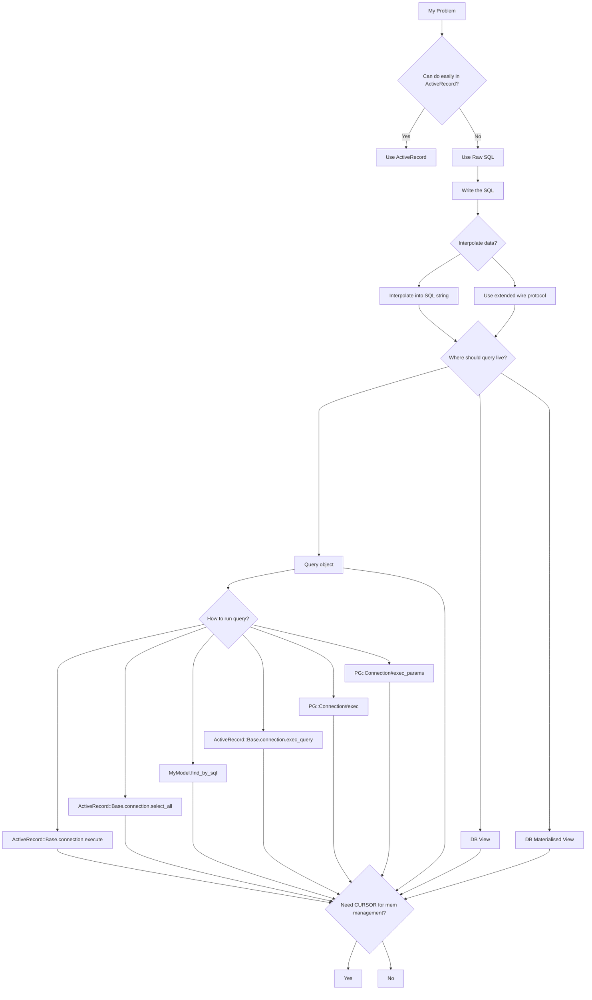
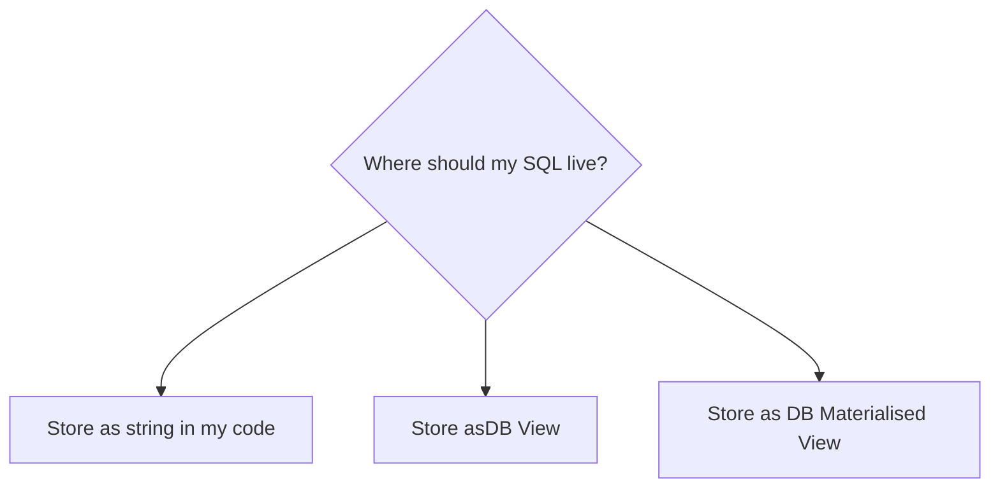
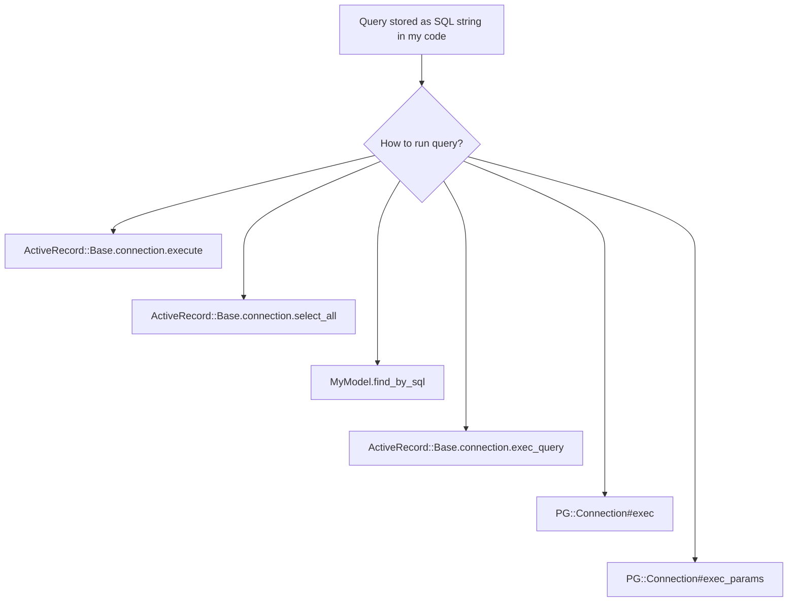

# Managing raw SQL in Rails

- [Managing raw SQL in Rails](#managing-raw-sql-in-rails)
  - [This document assumes PostgreSQL](#this-document-assumes-postgresql)
  - [When should I use raw SQL?](#when-should-i-use-raw-sql)
  - [What do I give up by choosing raw SQL?](#what-do-i-give-up-by-choosing-raw-sql)
  - [What decisions do I need to make?](#what-decisions-do-i-need-to-make)
  - [Essential background: Ways to run raw SQL](#essential-background-ways-to-run-raw-sql)
  - [Essential background: Postgres wire protocol versions](#essential-background-postgres-wire-protocol-versions)
  - [Essential background: Writing good raw SQL](#essential-background-writing-good-raw-sql)
  - [How do I store my raw SQL?](#how-do-i-store-my-raw-sql)
    - [Option 1: Store as string in code](#option-1-store-as-string-in-code)
      - [1. ActiveRecord::Base.connection.execute --> PG::Result](#1-activerecordbaseconnectionexecute----pgresult)
      - [2. ActiveRecord::Base.connection.select_all --> ActiveRecord::Result](#2-activerecordbaseconnectionselect_all----activerecordresult)
      - [3. MyModel.find_by_sql --> Array\<MyModel\>](#3-mymodelfind_by_sql----arraymymodel)
      - [4. ActiveRecord::Base.connection.exec_query --> ActiveRecord::Result](#4-activerecordbaseconnectionexec_query----activerecordresult)
      - [5. PG::Connection#exec --> PG::Result](#5-pgconnectionexec----pgresult)
      - [6. PG::Connection#exec_params --> PG::Result](#6-pgconnectionexec_params----pgresult)
    - [Option 2: Send as database view](#option-2-send-as-database-view)
    - [Option 3: Send as materialised views](#option-3-send-as-materialised-views)
  - [Appendices](#appendices)
    - [Appendix: Do I need to call PG::Result#clear?](#appendix-do-i-need-to-call-pgresultclear)
    - [Appendix: What about MySQL?](#appendix-what-about-mysql)
    - [Appendix: %q and %Q are handy when building large SQL strings](#appendix-q-and-q-are-handy-when-building-large-sql-strings)
    - [Appendix: `?` confusion (hint: it's not bound parameters in ActiveRecord)](#appendix--confusion-hint-its-not-bound-parameters-in-activerecord)
    - [Appendix: Debugging tips](#appendix-debugging-tips)
    - [Appendix: Sanitizing SQL strings](#appendix-sanitizing-sql-strings)
    - [Appendix: Alternatives to ActiveRecord](#appendix-alternatives-to-activerecord)
    - [Appendix: Suggested development workflow](#appendix-suggested-development-workflow)
      - [Debugging with Wireshark](#debugging-with-wireshark)
    - [Appendix: Avoiding SQL injection with prepared statements](#appendix-avoiding-sql-injection-with-prepared-statements)
    - [Appendix: Avoiding excessive memory usage with a CURSOR](#appendix-avoiding-excessive-memory-usage-with-a-cursor)
    - [Appendix: Bulk transfer data to/from the DB with SQL COPY](#appendix-bulk-transfer-data-tofrom-the-db-with-sql-copy)
    - [Appendix: Rails 'binds' parameter](#appendix-rails-binds-parameter)
    - [Appendix: Sanitizing a SQL string in Rails](#appendix-sanitizing-a-sql-string-in-rails)
    - [Appendix: Using PG::Result efficiently](#appendix-using-pgresult-efficiently)

## This document assumes PostgreSQL

This document assumes PostgreSQL because that is what I know. A lot of this advice will also apply to MySQL but will differ in the lower level details.

## When should I use raw SQL?

We want the following outcomes when we interact with a database:

1. We want the queries to be **fast enough**.
2. We don't want to allocate **too much** memory to perform the query and get the results into a usable form.
3. We want to be safe from SQL injection.

Most of the time, we can all these outcomes from normal `ActiveRecord` methods. This document is about what to do when that doesn't work.

You will notice that the goals above have some squishy language about _fast enough_ and _not too much_ memory because the exact meaning depends on your application - it's too slow if **your team** thinks it is too slow.

## What do I give up by choosing raw SQL?

All architectural decisions have trade-offs. Here are some of the costs of using raw SQL in Rails:

1. The relationships between your tables, which normally lives solely in the Rails relationships between your models, is now duplicated in the raw SQL queries. If you need to change the relationships in future, you will need to change both places.
1. Sometimes ActiveRecord will be faster than raw SQL. ActiveRecord (or any ORM) implements some kinds of caching which can speed up SQL queries which you application uses a lot.
1. Future maintainers have to know enough SQL to be able to maintain what you wrote. Who will maintain this if you aren't around?

## What decisions do I need to make?

Broadly speaking, these are the sequence of decisions and actions you will need. The rest of this document explains these in more detail.

1. Verify that you cannot achieve the outcomes you need with just normal ActiveRecord queries and you do actually need to write raw SQL.
1. Write the SQL query you want to use.
1. If the query needs parameters then decide how to handle them
    1. Escape them yourself and interpolate them into the query string
    2. Use SQL bound parameters by wrapping your SQL in PREPARE...EXECUTE
    2. Use SQL bound parameters via ActiveRecord API
2. Decide whether that query should live in a
   1. _query object_,
   2. a _database view_
   3. or a _materialised database view_.
3. If it should live in a query object, choose which API to use to invoke it
4. Decide whether you need to use a CURSOR to manage memory usage of the results

```
TODO: is this always available or depends on API choice?
```




## Essential background: Ways to run raw SQL

There are a few layers available to interact with the DB in a Rails app. I have grouped these APIs into arbitrary high, middle, low "layers" to help understand them.

* "High-level" API (Ignoring because we use them all the time)
    * Standard everyday `ActiveRecord` methods that we use all the time.
* "Mid-level" API (**These are the APIs we are interested in**)
    1. ActiveRecord methods which let you pass raw SQL
    1.  `pg` gem methods
* "Low-level" API layers (Ignoring because not accessible from Rails)
    * There are layers below what is accessible from rails:
        1. libpq (C layer, not accessible from Rails)
            * C lib, ships with Postgres itself
            * Fully supports all Postgres features in V3 of the wire protocol
            * Almost all clients use this except:
                * ODBC (I _think_ - not entirely sure if the ODBC driver compiles it in?)
                * Javascript has a few packages which implement the wire protocol directly
                    * https://github.com/panates/postgresql-client (Pure TS client)
                    * https://github.com/brianc/node-postgres (optional libpq bindings)
        1. Postgres wire protocol
            * It's never practical to go this low for real work.
            * I've found WireShark the best tool for actually seeing it in action

## Essential background: Postgres wire protocol versions

Your app can use one of 3 "sub-protocols" to exchange data with the PostgreSQL server. These sub-protocols are [well documented in the PostgreSQL manual](https://www.postgresql.org/docs/current/protocol-overview.html).

The sub-protocols are:

1. Simple query
    * Your app sends a single string (which already has all required data vaules interpolated into it). The string is parsed and immediately executed by the server.
    * This is simple, less secure, less flexible, and can have worse performance than the "extended query" sub-protocol
2. Extended query
    * Query processing split into multiple steps. You app sends a separate message to the database for each step
        1. Parsing (textual-query --> [Parser] --> prepared-statement)
        2. Binding parameter values (prepared-statement --> [Binder] --> portal)
        3. Execution (portal --> [Executor] --> results)
    * This protocol is more complex but also more flexible, more secure, and has better performance for repeated queries.
3. `COPY` operations protocol
    * This is a special sub-protocol for copying large volumes of data to/from the database e.g. during import or export.
    * We are not interested in this protocol in today's discussion

ActiveRecord and clients like `psql` exclusively use the _Simple query sub-protocol_. I'm not sure why.

    TODO: WHY does AR always use the simple protocol? why does psql use it?

You can use the _Extended query sub-protocol_ via `PG::Connection#exec_params` (see below).

## Essential background: Writing good raw SQL

A full discussion of writing good SQL is outside of scope of this doc. The following tips may be useful:

* Write SQL for clarity first. Split large queries into smaller subqueries with `WITH` whenever possible
* Use the [GitLab SQL style guide](https://about.gitlab.com/handbook/business-technology/data-team/platform/sql-style-guide/) directly or as a starting point for your in-house style  guide.
* Think in terms of a pipeline of tables, starting with tables on disk flowing into tempoarary tables in memory and finally an in-memory table that gets sent to your app
* Be familiar with some particularly useful PostgreSQL functions
	* [COALESCE()](https://www.postgresql.org/docs/14/functions-conditional.html#FUNCTIONS-COALESCE-NVL-IFNULL) (to set fallback values)
	* [CASE](https://www.postgresql.org/docs/14/functions-conditional.html#FUNCTIONS-CASE) statements (to do if else logic)
	* [TO_*() functions](https://www.postgresql.org/docs/14/functions-formatting.html) to cast between types

## How do I store my raw SQL?



You have some choices about how to have the database invoke your SQL:

1. Store as a string constant in your code and send as regular SQL query
2. Save as a database view
3. Save as a materialised database view


### Option 1: Store as string in code



    Things to cover for each option
        perf pros/cons
        how to sanitize values
        security review
        practicality review

There are 6 main ways of sending a SQL string to a PostgreSQL database in Rails:

* ActiveRecord API
    1. `ActiveRecord::Base.connection.execute => PG::Result`
    2. `ActiveRecord::Base.connection.select_all => ActiveRecord::Result`
    3. `MyModel.find_by_sql => Array<MyModel>`
    4. `ActiveRecord::Base.connection.exec_query => ActiveRecord::Result`
* PG gem API:
    1. `PG::Connection#exec => PG::Result`
    2. `PG::Connection#exec_params => PG::Result`

#### 1. ActiveRecord::Base.connection.execute --> PG::Result

    Signature = ActiveRecord::Base.connection.execute(sql, name = nil) -> PG::Result
    Return type = PG::Result
    Errors: Raises PG::Error (or a child of PG::Error e.g. PG::UndefinedTable)
    Sub-protocol = Always simple
    Built-in SQLi protection = none
    Memory usage:
        Allocates AR models = no
        ?? num copies of data made
        ?? for every 1k of result from the DB how much mem allocated?
    Gotchas =
        You probably have to call #clear to clean up memory ???
    Notes
        The `name` param is not sent to the DB but it is used as a prefix for the query line in the log - you should include it
    Avoid SQLi by
        Use PREPARE...EXECUTE in your SQL (remembering that you will need to `DEALLOCATE stmtname;` after you get your results)
        OR
        escape your values before you interpolate them (riskier)

* calls `connection.async_exec(sql)` under the hood (wrapped in some logging and sql transformation)
* returns `PG::Result` - this is basically just a slightly lower level version of `exec_query`
    * Rails docs recommend `exec_query` unless you need the `PG::Result` specifically because  you have call clear manually
    * -- main down side of this method is that you cannot pass it bound params (even though the stuff it calls within AR supports them)
* Always uses _Simple Query sub-protocol_ at Postgres wire protocol level
* To avoid SQLi, you must either
    1. use `PREPARE...EXECUTE` in your SQL string to get separation
    1. OR just rely on escaping.
* Example: `ActiveRecord::Base.connection.execute(sql, name = nil)`
* Executes an SQL statement, returning a PG::Result object on success or raising a PG::Error exception otherwise. Note: the PG::Result object is manually memory managed; if you don't need it specifically, you may want consider the exec_query wrapper
* example:
    ```ruby
    sql = "SELECT ..."
    pg_result = ActiveRecord::Base.connection.execute(sql)
    results = pg_result.values
    pg_result.clear

    results
    ```
* You can do a SQL level `PREPARE...EXECUTE` to get more safety with this method:
    ```ruby
    def do_safe_exec(sql_query, params)
        sql_query = "#{sql_query};" unless sql_query.ends_with?(";")

        stmt_name = "a#{Time.now.to_i}"
        unrolled_params = params.map { |param| "'#{param}'" }.join(",")

        prepared_sql = <<~EO_SQL
            PREPARE #{stmt_name} AS #{sql_query}
            EXECUTE #{stmt_name}(#{unrolled_params});
        EO_SQL

        pg_result = ActiveRecord::Base.connection.execute(prepared_sql)

        # clear the statement from the DB. TODO: is this required?
        ActiveRecord::Base.connection.execute("DEALLOCATE #{stmt_name};")

        results = pg_result.to_a

        # Clear the memory associated with the PG::Result
        pg_result.clear

        results
    end
    ```
* A caveat to using execute is depending on your database connector, the result returned by this method might require manual garbage collection. Consider using exec_query instead.
    * TODO: docs mention this but I can't find examples of doing the cleanup

Conclusion

#### 2. ActiveRecord::Base.connection.select_all --> ActiveRecord::Result

* Documented in Rails guide
* Works a bit like `MyModel.find_by_sql` but does not instantiate ActiveRecord objects - it returns arrays of hashes wrapped in an `ActiveRecord::Result`
* returns: `ActiveRecord::Result`
* Example: `ActiveRecord::Base.connection.select_all`
* `ActiveRecord::Base.connection.select_all(arel, name = nil, binds = [], preparable: nil)`
* Note: lives on the connection adapter, not the model but can get at the instance of the connection adapter class via **any** model
        * e.g. `ActiveRecord::Base.connection == User.connection == Page.connection`
* Returns an instance of `ActiveRecord::Result` which can be converted to an array of hashes
* Just runs a SQL query and gives back data - it does not create ActiveRecord objects from that data. This makes it very useful for building reports if we don't need to do "Active Model" things with the returned data.
* Does Parse/Bind/Describe/Execute/Sync at the Postgres protocol level but only safer if you use `binds`.
* You can send bound parameters but it has the same ergonomic problems as `ActiveRecord::Base.connection.exec_query`

Conclusion

* -- bound params handling is a faff, relies on private-ish API
* ?? What does ActiveRecord::Result have that PG::Result doesn't? Is it worth the memory copying
* ++ it supports prepared statements but doesn't force you to use them

#### 3. MyModel.find_by_sql --> Array\<MyModel\>

    Signature: MyModel.find_by_sql(sql, binds = [], preparable: nil, &block) -> Array\<MyModel\>

* Calls `connection.select_all` under the hood
* Documented in Rails guide
* Example: `SomeModel.find_by_sql`
* returns an actual `Array` of `SomeModel` objects (not an `ActiveRecord::Relation`)
* examples:
    ```ruby
    Page.find_by_sql("select * from pages where id = 3") # => Array<Page>

    # If the `sql` param is an array, then AR will interpret it as a SQL string
    # template with values to interpolate in. Note that the ? and :foo are
    # replaced by AR not Postgres.  All the `?` and `:foo` values are
    # interpolated into the string **before** it is sent to Postgres. The
    # examples below send exactly the same SQL to Postgres!
    Page.find_by_sql("select * from pages where id = 3") # => Array<Page>
    Page.find_by_sql(["select * from pages where id = ?", 3]) # note we have to wrap the SQL in an array - bit goofy
    Page.find_by_sql(["select * from pages where id = :some_id", {some_id: 3}])
    ```
* Caveat: Not really suitable for doing INSERT/UPDATE/DELETE
* Caveat: Wrapping all args in an array when you want to interpolate data is goofy
* Does Parse/Bind/Describe/Execute/Sync at the Postgres protocol level but doesn't actually BIND any params (data values are interpolated into the SQL)
* You can send bound parameters but it has the same ergonomic problems as `ActiveRecord::Base.connection.exec_query`

Conclusion:

* -- bound params handling is a faff, relies on undocumented Rails stuff
* -- can only be used for SELECT queries
* ++/-- Creates actual AR model instances for data returned. This
    * could be really handy or annoying if you are trying to minimize memory usage

#### 4. ActiveRecord::Base.connection.exec_query --> ActiveRecord::Result

* Returns instance of `ActiveRecord::Result` which can be converted to an array of hashes
    * ActiveRecords::Result object which has handy methods like .columns and .rows to access headers and values.
* Example: `ActiveRecord::Base.connection.exec_query(sql, name = "SQL", binds = [], prepare: false)`
* Technically this is private API
* Executes sql statement in the context of this connection using `binds` as the bind substitutes. `name` is logged along with the executed sql statement.
* Uses Postgres Parse/Bind/Describe/Execute/Sync protocol messages properly but only if you supply data in `binds`
* Caveat: creating the bind parameters is really fiddly and uses a bunch of undocumented AR objects - it all _feels_ like private API
* example:
    ```ruby
    # works
    full_sql = "select * from pages where template = 'topics'"
    ActiveRecord::Base.connection.exec_query(full_sql)
    # => ActiveRecord::Result

    # works
    sql = "select * from pages where template = $1"
    binds = [
        ActiveRecord::Relation::QueryAttribute.new(
        nil,                          # name
        "August 2019",                # value
        ActiveRecord::Type::Text.new  # type
        )
    ]
    ActiveRecord::Base.connection.exec_query(sql, 'blah', binds)
    # => ActiveRecord::Result
    ```
Conclusion:

* ++ ActiveRecord::Result has some handy methods
* ++ it calls #clear for you on the pg_result
* ++ having a prefix for the logs is handy
* -- An unknown amount of mem copying happens to get the `PG::Result` into the `ActiveRecord::Result`
* -- Using `binds` not well documented, so hopefully devs remember to quote their data before embedding it in the SQL
* -- bound params handling is a faff, relies on undocumented Rails stuff


#### 5. PG::Connection#exec --> PG::Result

> **warning** I'm documenting this so you know to avoid it. Use #exec_params instead.

To use API from this layer you need to get access to the `PG::Connection` from ActiveRecord via `ActiveRecord::Base.connection.raw_connection`
* sends raw SQL, gets back arrays of hashes
* fields in the hashes have types set by the relevant PG Type-map
* seems to be a pretty close wrapper to the libpq API
* -- Always uses simple protocol
* -- You must do sanitization yourself to avoid SQLi

Conclusion:

* -- I can't think of a reason to use this instead of exec_params
* -- Don't use this method, exec_params is a safer version of this

#### 6. PG::Connection#exec_params --> PG::Result

https://deveiate.org/code/pg/PG/Connection.html#method-i-exec_params

> If the types are not specified, they will be inferred by PostgreSQL. Instead
> of specifying type oids, it's recommended to simply add explicit casts in the
> query to ensure that the right type is used.

```ruby
# TODO: this code untested

conn = ActiveRecord::Base.connection.raw_connection

# SQL with explicit type casts
# we use explicit type casts because it's less fiddly than trying to cast the params before sending them to the DB
# just lookup the types of the columns that the values are searching with \dt in psql and use those as the cast
sql = "SELECT * FROM users where id = $1::int AND email = $2::character varying"

# params should all be strings according to the docs
params = [
    12.to_s,
    "foo-1@example.com"
]
pg_result = conn.exec_params(sql, params)
p pg_result.to_a
pg_result.clear

# OR

conn.exec_params(sql, params) do |pg_result|
p pg_result.to_a
    # pg_result.clear automatically called at end of block
end
```

* Does Parse/Bind/Describe/Execute/Sync at the Postgres protocol level
* ++ You can pass bound parameters
* ++ Passing bound parameters is fairly straight forward
* ++ it doesn't create a prepared statement that you later have to clean up
* ++ there are less layers of AR sugar to get through which might copy results and increase memory usage
* ++ only allows one SQL statement per execution (this could also be annoying but mostly it's better for SQLi safety
* Seems to work well for executing raw SQL in the safest manner possible

Q: Should we still quote/sanitize values before using this method?


### Option 2: Send as database view

Recommendation: Use https://github.com/scenic-views/scenic to manage your views

Reasons to use a view

It lets you write raw SQL but then use normal activerecord methods to query it
    ++ maintainable for other devs
    ++ you can ignore the whole seciton about "how should I send my raw SQL"
++ view data is never out of date (compared to materialized view)
++ works great if query is fast enough for your need

### Option 3: Send as materialised views

Recommendation: Use https://github.com/scenic-views/scenic to manage your views

* ++ queries just as fast as any other table
* -- you need to be able to tolerate somewhat stale data
    * in a report export I guess you could refresh the view as first step but not sure how slow that would be?

How to setup triggers in rails to update it when any of the tables involved are updated?
* -- a cron job of some kind needs to run to update it

Examples: spreadsheet import or export

TODO: is SQL COPY usefule for this? I have never tried

    Q: can views take params from code? Presume not? but you can do SQL queries on the view instead

## Appendices

### Appendix: Do I need to call PG::Result#clear?

> Explicit calling clear can lead to better memory performance, but is not
> generally necessary.
>
> https://deveiate.org/code/pg/PG/Result.html

### Appendix: What about MySQL?

The equivalent of PG::Result#clear in MySQL is called `free`. See https://github.com/noahgibbs/mysql_bloat_test/blob/master/mb_test.rb

### Appendix: %q and %Q are handy when building large SQL strings

Use %q or %Q to simplify quoting in long strings which contain single and double quotes e.g. SQL

```
%q = create a string using "single quote rules" but you can choose your own delimiter
%Q = create a string using "double quote rules" but you choose your own delimiter i.e. use %Q if you need variable interpolation
```

Examples:

```ruby
[22] pry(main)> x = 34
34

[23] pry(main)> %q[this is literally #{x}!]
"this is literally \#{x}!"

[24] pry(main)> %Q[this is literally #{x}!]
"this is literally 34!"
```

### Appendix: `?` confusion (hint: it's not bound parameters in ActiveRecord)

ActiveRecord can interpolate values into a SQL string for you via

1. Placeholder maker `?` which causes AR to match up its usage to the position of an arg within an array
1. Named placeolder e.g. `:foo` which is used as the key in a hash to get the value to replace

The `?` syntax **looks like MySQL bound parameters** but using it does not mean that the query will use bound parameters when sent to the DB.

It does mean that you are telling AR to do escaping for you on the value which is probably safer than doing it yourself or (worst case) just interpolating it into the string yourself.

### Appendix: Debugging tips

Options

* Rails log file
    * usually this is all you need
    * ++ in development mode it's pretty good record of what queries are sent to DB
    * -- doesn't tell you whether Rails is using the simple or extended wire protocol for a particular method.
* Use Wireshark to spy on the traffic to/from the DB
    * ++ the wire protocol is the ground truth
    * ++ easy enough to understand the conversation between Rails and DB - messages are pretty sensible looking to human eyes
    * -- fiddly setup especially if you don't use Wireshark on the regular


### Appendix: Sanitizing SQL strings

You should try use methods which use the extended query sub-protocol (e.g. `PG::Connection#exec_params`) - these methods are safer because they don't try to interpolate data values into the SQL string

If you can used a method which uses the _extended query subp-protocol_, then Rails has a number of helpers to make interpolating a data value into a SQL string safer.

There are different helpers depending on which clause of the SQL query you are inserting your string.

The helpers are documented in https://api.rubyonrails.org/classes/ActiveRecord/Sanitization/ClassMethods.html

Examples (from the docs):

```ruby
sanitize_sql_array(["name=? and group_id=?", "foo'bar", 4])
# => "name='foo''bar' and group_id=4"

sanitize_sql_array(["name=:name and group_id=:group_id", name: "foo'bar", group_id: 4])
# => "name='foo''bar' and group_id=4"

sanitize_sql_array(["name='%s' and group_id='%s'", "foo'bar", 4])
# => "name='foo''bar' and group_id='4'"
```

### Appendix: Alternatives to ActiveRecord

* https://github.com/discourse/mini_sql
    * wraps `pg` gem and provides some sugar
    * a collection of raw SQL helpers that Discourse created for themselves
    * does some statement caching so can be faster than `pg` in some cases
    * unknowns
      * what it does at the wire protocol layer

### Appendix: Suggested development workflow

I use the following workflow to create raw SQL queries in a Rails app:

1. I create a script which defines the SQL I need and runs it, then run that script in the Rails environment with [rails runner](https://guides.rubyonrails.org/command_line.html#bin-rails-runner)
2. Once the basic SQL statement is working, I can move it into a query object or a Scenic view as required.

```ruby
# ./my_sql.rb
# Usage:
#     $ bundle exec rails runner ./my_sql.rb

sql = ~<<EO_SQL
  SELECT * FROM ...
EO_SQL

# capture some timestamps for very basic profiling
start_ts = Time.zone.now

pg_result = ActiveRecord::Base.connection.execute(sql)

# do stuff with pg_result here, maybe print it, maybe insert a pry statement to work with it interactively

end_ts = Time.zone.now

# you don't **need** to do this in this script but it's a good habit to get
# into.
pg_result.clear

puts "Finished. Took #{end_ts - start_ts} secs"
```

Then in terminal:

```bash
# terminal #1 ###########################
# load the Rails app and run ./my_sql.rb. This behaves a bit like a
# non-interactive version of `rails console`
$ bundle exec rails runner ./my_sql.rb


# terminal #2 ###########################
# Follow the output of the log file to see what SQL commands Rails is actually
# running.
$ tail -f log/development.log
```


what about database views and materialised views
    anything to do with this doc?

#### Debugging with Wireshark

```bash
# start rails server to not use SSL to local postgres so traffic can be inspected with Wireshark
$ PGSSLMODE=disable bundle exec rails s
```

In wireshark: capture on loopback (`lo0`) with the filter `port 5432` to capture all postgres traffic on your localhost

### Appendix: Avoiding SQL injection with prepared statements

TODO
this might be better covered elsewhere?

### Appendix: Avoiding excessive memory usage with a CURSOR

TODO

### Appendix: Bulk transfer data to/from the DB with SQL COPY

TODO

### Appendix: Rails 'binds' parameter

* Appears in the following method calls:
    ```
    SomeModel.find_by_sql(sql, binds = [], preparable: nil, &block)
    ActiveRecord::Base.connection.exec_query(sql, name = "SQL", binds = [], prepare: false)
    ```
* You give it a ruby value and it will convert it into a database type before sending it to the DB
* Is poorly documented, is probably somewhat private API
* Alternatively you could add explicit type casts to your SQL and pass all params in a strings

```ruby
# can be array of ActiveRecord::Relation::QueryAttribute instances
binds = [
    ActiveRecord::Relation::QueryAttribute.new(
    nil,                          # name, unsure where this is used
    "August 2019",                # value before type cast
    ActiveRecord::Type::Text.new  # type
    )
]
# WARNING: Some examples online show it being an array of 2-tuple arrays but
#   this always fails for me with Postgres
# binds = [
#     [nil, "30d90923-c51b-4f15-8043-ff1d7eca960b"]
# ]
```

Types:

* The type seems to determine a set of transformations applied ot the raw value
Q: are there "types" sent to the DB? does postgres accept types?

```ruby
ActiveRecord::Type.constants.map { |c| "ActiveRecord::Type::#{c}" }
=> ["ActiveRecord::Type::Date",
 "ActiveRecord::Type::HashLookupTypeMap",
 "ActiveRecord::Type::DateTime",
 "ActiveRecord::Type::Binary",
 "ActiveRecord::Type::Value",
 "ActiveRecord::Type::Integer",
 "ActiveRecord::Type::String",
 "ActiveRecord::Type::Text",
 "ActiveRecord::Type::Json",
 "ActiveRecord::Type::Time",
 "ActiveRecord::Type::AdapterSpecificRegistry",
 "ActiveRecord::Type::DecimalWithoutScale",
 "ActiveRecord::Type::Decimal",
 "ActiveRecord::Type::Internal",
 "ActiveRecord::Type::BigInteger",
 "ActiveRecord::Type::Serialized",
 "ActiveRecord::Type::UnsignedInteger",
 "ActiveRecord::Type::Float",
 "ActiveRecord::Type::Registration",
 "ActiveRecord::Type::Boolean",
 "ActiveRecord::Type::DecorationRegistration",
 "ActiveRecord::Type::TypeMap",
 "ActiveRecord::Type::ImmutableString"]
```

Examples in usage:

```ruby
[44] pry(main)> User.find_by_sql("select * from users where id = $1", [[nil, "11"]]) # broken
# TypeError: can't cast Array
# from /Users/eoinkelly/.rbenv/versions/3.0.3/lib/ruby/gems/3.0.0/gems/activerecord-7.0.2.2/lib/active_record/connection_adapters/abstract/quoting.rb:43:in `type_cast

# this works but throws an error while logging
User.find_by_sql("select * from users where id = $1", [11])
# Could not log "sql.active_record" event. NoMethodError: undefined method `name' for "1":String

# this works but throws an error while logging
User.find_by_sql("select * from users where id = $1", ["11"])
# Could not log "sql.active_record" event. NoMethodError: undefined method `name' for 1:Integer

# This works but you should really set a name for better logging
[42] pry(main)> User.find_by_sql("select * from users where id = $1", [ActiveRecord::Relation::QueryAttribute.new(nil, "11", ActiveRecord::Type::String.new)])
#   User Load (1.3ms)  select * from users where id = $1  [[nil, "11"]]

# This works and is good choice
[43] pry(main)> User.find_by_sql("select * from users where id = $1", [ActiveRecord::Relation::QueryAttribute.new("eoinx", "11", ActiveRecord::Type::String.new)])
#   User Load (1.2ms)  select * from users where id = $1  [["eoinx", "11"]]
```

Q: How to know which type to use?
Can dodge the Q by just passing everything as string/text and using type casts in your sql


Q: do you need to escape values if you are using them in binds?

Conclusions

* It **seems** like you could just use the string type for everything (but I haven't tested on stuff like JSON)


### Appendix: Sanitizing a SQL string in Rails

* https://api.rubyonrails.org/classes/ActiveRecord/Sanitization/ClassMethods.html
* https://github.com/rails/rails/blob/main/activerecord/lib/active_record/sanitization.rb


Conclusion: Use `sanitize_sql_array` because it is

1. Part of Rails, not the PG gem so should also work with diff adapters
2. is the most "honest", other sanitize_* methods just call it anyway with more confusing argument handling

```ruby
# sanitize_sql(condition) # alias for:
sanitize_sql_for_conditions(condition)
    # calls sanitize_sql_array(condition) to do the actual work (if you don't give it an array it just returns what you gave it)

sanitize_sql_array(ary)
    # first element in ary is the SQL statement
    # all other elements are values to be sanitized and interpolated into the SQL statement
    # calls connection.quote_string() to quote the values

ActiveRecord::Base.connection.quote("August '2019")
connection.quote
    # implementation differs depending on which DB adapther you are using
    # inspects the type of the arg and calls the appropriate quoting method e.g. if type is string then it calls quote_string and wraps it in single quotes
connection.quote_string
    # In PG adapter it calls raw_connection.escape(str)
connection.quote_column_name
    # just calls #to_s
```

### Appendix: Using PG::Result efficiently

What is the most memory efficent way to use a pg result?

```
pg_res = conn.exec_params(...)
pg_res.values
pg_res.to_a
pg_res.clear

```