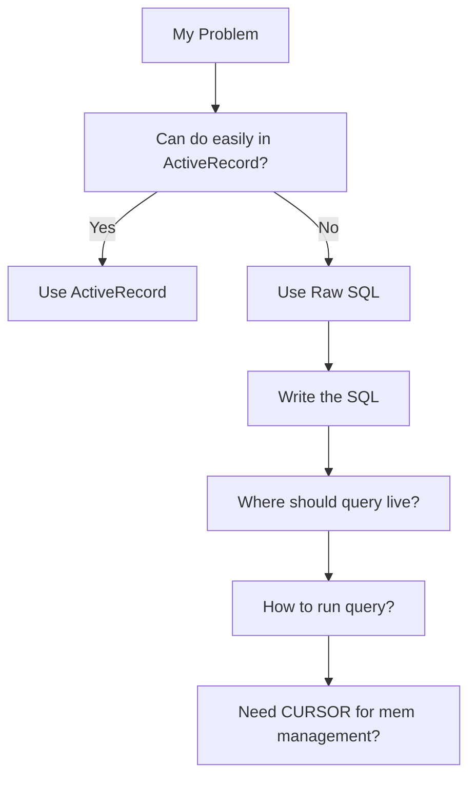
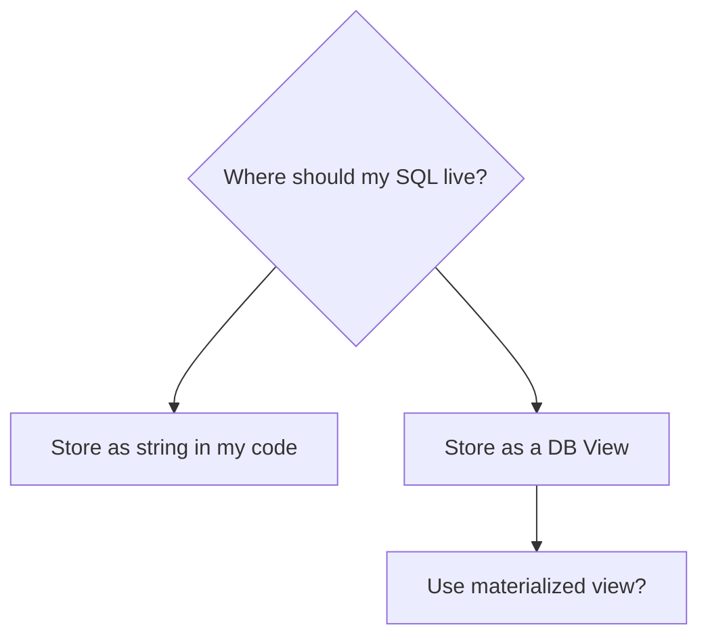

# Managing raw SQL in Rails

- [Managing raw SQL in Rails](#managing-raw-sql-in-rails)
  - [This document assumes PostgreSQL](#this-document-assumes-postgresql)
  - [What decisions do I need to make?](#what-decisions-do-i-need-to-make)
  - [Essential background knowledge](#essential-background-knowledge)
    - [Essential background: Layers of APIs which can run SQL](#essential-background-layers-of-apis-which-can-run-sql)
    - [Essential background: Postgres wire protocol versions](#essential-background-postgres-wire-protocol-versions)
  - [Step: Verify I actually need need raw SQL](#step-verify-i-actually-need-need-raw-sql)
    - [When should I use raw SQL?](#when-should-i-use-raw-sql)
    - [What do I give up by choosing raw SQL?](#what-do-i-give-up-by-choosing-raw-sql)
  - [Step: Write a good raw SQL query](#step-write-a-good-raw-sql-query)
  - [Step: Interpolate data values safely](#step-interpolate-data-values-safely)
  - [Step: Store the raw SQL query](#step-store-the-raw-sql-query)
    - [Option 1: Store as string in code](#option-1-store-as-string-in-code)
      - [1. ActiveRecord::Base.connection.execute --> PG::Result](#1-activerecordbaseconnectionexecute----pgresult)
      - [2. ActiveRecord::Base.connection.select_all --> ActiveRecord::Result](#2-activerecordbaseconnectionselect_all----activerecordresult)
      - [3. MyModel.find_by_sql --> Array\<MyModel\>](#3-mymodelfind_by_sql----arraymymodel)
      - [4. ActiveRecord::Base.connection.exec_query --> ActiveRecord::Result](#4-activerecordbaseconnectionexec_query----activerecordresult)
      - [5. PG::Connection#exec --> PG::Result (hint: don't use this)](#5-pgconnectionexec----pgresult-hint-dont-use-this)
      - [6. PG::Connection#exec_params --> PG::Result](#6-pgconnectionexec_params----pgresult)
    - [Option 2: Save as database view](#option-2-save-as-database-view)
      - [Consider a materialized view](#consider-a-materialized-view)
  - [Appendices](#appendices)
    - [Appendix: Do I need to call PG::Result#clear?](#appendix-do-i-need-to-call-pgresultclear)
    - [Appendix: What about manually freeing MySQL result memory?](#appendix-what-about-manually-freeing-mysql-result-memory)
    - [Appendix: %q and %Q are handy when building large SQL strings](#appendix-q-and-q-are-handy-when-building-large-sql-strings)
    - [Appendix: `?` confusing in ActiveRecord (hint: it is NOT bound parameters )](#appendix--confusing-in-activerecord-hint-it-is-not-bound-parameters-)
    - [Appendix: Debugging tips](#appendix-debugging-tips)
    - [Appendix: Alternatives to ActiveRecord](#appendix-alternatives-to-activerecord)
    - [Appendix: Suggested development workflow for writing raw SQL in Rails](#appendix-suggested-development-workflow-for-writing-raw-sql-in-rails)
    - [Appendix: Debugging with Wireshark](#appendix-debugging-with-wireshark)
    - [Appendix: Avoiding excessive memory usage with a CURSOR](#appendix-avoiding-excessive-memory-usage-with-a-cursor)
      - [PostgreSQL Cursors](#postgresql-cursors)
      - [Pros/cons of SQL cursors vs Rails batches API:](#proscons-of-sql-cursors-vs-rails-batches-api)
      - [Related gems](#related-gems)
      - [Worked example of using a SQL cursor with Rails](#worked-example-of-using-a-sql-cursor-with-rails)
    - [Appendix: Rails 'binds' parameter](#appendix-rails-binds-parameter)
      - [Types](#types)
      - [Examples in usage](#examples-in-usage)
    - [Appendix: Sanitizing SQL strings in Rails](#appendix-sanitizing-sql-strings-in-rails)
    - [Appendix: Using PG::Result efficiently](#appendix-using-pgresult-efficiently)
    - [Appendix: How much memory copying happens when converting PG::Result into ActiveRecord::Result?](#appendix-how-much-memory-copying-happens-when-converting-pgresult-into-activerecordresult)
    - [Appendix: Do I need to use a prepared statement?](#appendix-do-i-need-to-use-a-prepared-statement)
    - [Appendix: Bulk transfer data to/from the DB with SQL COPY](#appendix-bulk-transfer-data-tofrom-the-db-with-sql-copy)

## This document assumes PostgreSQL

This document assumes PostgreSQL because that is what I know. Most of this advice will also apply to MySQL but will differ in the lower level details. MySQL is a feature rich database so it should be straightforward to find the MySQL equivalent of any Postgres specific functions mentioned below.

## What decisions do I need to make?

Broadly speaking, these are the sequence of decisions and actions you will need. The rest of this document explains these in more detail.



1. Verify that you cannot achieve the outcomes you need with just normal ActiveRecord queries and you do actually need to write raw SQL.
1. Write the SQL query you want to use.
1. Choose how to embed data values into your SQL (if required). Options are:
    1. Use bound parameters using the separate PARSE and BIND steps in the Postgres wire protocol
    1. Escape the values yourself and interpolate them directly into the query string
    1. Use SQL bound parameters by wrapping your SQL in PREPARE...EXECUTE
2. Decide where to store the query, one of:
   1. A _query object_ e.g. `app/queries/quarterly_report_query.rb` or `app/services/quarterly_report_query.rb`
   2. A _database view_
   3. A _materialised database view_
3. If it should live in a query object, choose how much memory copying you are ok with. Options are:
    * I **need** absolutely minimal memory copying so need lower level APIs
        * Decide whether you need to use a CURSOR to manage memory usage of the results
    * Some data copying is ok
    * I don't care about memory usage because my dataset is small enough

## Essential background knowledge

Before we get into these decisions in detail, there is some background knowledge we need.

### Essential background: Layers of APIs which can run SQL

There are multiple APIs available to interact with the DB. I have grouped these APIs into arbitrary high, middle, low "layers".

API layers from highest to lowest:

* _High-level_ API Layer (Ignoring because we use them all the time)
    1. Standard everyday `ActiveRecord` methods that we use all the time.
* _Mid-level_ API Layer (**These are the APIs we are interested in**)
    1. ActiveRecord methods which let you pass raw SQL
    1.  `pg` gem methods
* _Low-level_ API layer (Ignoring because not accessible from Rails)
    * There are layers below what is accessible from Rails:
        1. [libpq](https://www.postgresql.org/docs/current/libpq.html) (C layer, not accessible from Rails)
            * Is the C library which `pg` gem uses
            * ships with Postgres itself
            * Almost all clients use this except ODBC (I _think_ - not entirely sure if the ODBC driver compiles it in?)
        1. [Postgres wire protocol](https://www.postgresql.org/docs/current/protocol.html)
            * Defines the format of the messages exchanged between your app and the database
            * Surprisingly human readable with [Wireshark](https://www.wireshark.org/) (more on this later)
            * It's never practical to code this low for real work but inspecting it can be useful for debugging what ActiveRecord is doing on your behalf.

### Essential background: Postgres wire protocol versions

Your app can use one of 3 "sub-protocols" to exchange data with the PostgreSQL server. These sub-protocols are [well documented in the PostgreSQL manual](https://www.postgresql.org/docs/current/protocol-overview.html).

The sub-protocols are:

1. Extended query sub-protocol
    * Query processing split into multiple steps. You app sends a separate message to the database for each step
        1. Parsing (textual-query --> [Parser] --> prepared-statement)
        2. Binding parameter values (prepared-statement --> [Binder] --> portal)
        3. Execution (portal --> [Executor] --> results)
    * This protocol is more complex than the _Simple query_ sub-protocol (see below) but also more flexible, more secure, and has better performance for repeated queries.
    * **It completely eliminates SQLi if you bind all your data values!** The database receives the SQL string and the data values as different messages so it cannot get confused and treat a data value as part of the SQL string.
1. Simple query sub-protocol
    * Your app sends a single string (which already has all required data values interpolated into it). The string is parsed and immediately executed by the server.
    * This is the older sub-protocol. It is simpler but less flexible and less secure than the _Extended query sub-protocol_
1. `COPY` operations sub-protocol
    * This is a special sub-protocol for copying large volumes of data to/from the database e.g. during import or export.
    * We are not interested in this protocol in today's discussion

ActiveRecord will try to use the _Extended query_ sub-protocol when it can and otherwise fall back to the _Simple query sub-protocol_. You can tell which sub-protocol is used by looking at the log output of the SQL query in your Rails log. Queries that use the _Extended query_ sub-protocol have the data binding markers visible in them e.g. `$1`, `$2` etc.

You can force usage of the _Extended query sub-protocol_ by running your SQL via `PG::Connection#exec_params`. Sometimes that is desirable. More on this later.

## Step: Verify I actually need need raw SQL

### When should I use raw SQL?

We want the following outcomes when we interact with a database:

1. We want the queries to be **fast enough**.
2. We don't want to allocate **too much** memory to perform the query and get the results into a usable form.
3. We want to be safe from SQL injection.

Most of the time, we can all these outcomes from normal `ActiveRecord` methods. This document is about what to do when that doesn't work.

You will notice that the goals above have some squishy language about _fast enough_ and _not too much_ memory because the exact meaning depends on your application. It's too slow if **your team** thinks it is too slow.

### What do I give up by choosing raw SQL?

All architectural decisions have trade-offs. Here are some of the costs of using raw SQL in Rails:

1. The relationships between your tables, which normally lives solely in the Rails relationships between your models, is now duplicated in the raw SQL queries. If you need to change the relationships in future, you will need to change both places.
1. Sometimes ActiveRecord will be faster than raw SQL. ActiveRecord (or any ORM) implements some kinds of caching which can speed up SQL queries which you application uses a lot.
1. Future maintainers have to know enough SQL to be able to maintain what you wrote. Who will maintain this if you aren't around?

## Step: Write a good raw SQL query

A full discussion of writing good SQL is outside of scope of this doc. The following tips may be useful:

* Think in terms of a pipeline of tables, starting with tables on disk flowing into temporary tables in memory and finally an in-memory table that gets sent to your app
* Write SQL for clarity first. Split large queries into smaller subqueries with `WITH` whenever possible.
* Use the [GitLab SQL style guide](https://about.gitlab.com/handbook/business-technology/data-team/platform/sql-style-guide/) directly or as a starting point for your in-house style  guide.
* Be familiar with some particularly useful PostgreSQL functions:
	* [COALESCE()](https://www.postgresql.org/docs/14/functions-conditional.html#FUNCTIONS-COALESCE-NVL-IFNULL) (to set fallback values)
	* [CASE](https://www.postgresql.org/docs/14/functions-conditional.html#FUNCTIONS-CASE) statements (to do if-else logic)
	* [TO_*() functions](https://www.postgresql.org/docs/14/functions-formatting.html) to cast between types


## Step: Interpolate data values safely

    TODO
    this depends on how you choose to run the query
    if you make a db view, then you can use normal AR to interpolate data values in
    options
        string interpolation
            wrap query in PREPARE..EXECUTE
            sanitize values before interpolate
                use sanitize_sql_array method to operate on string directly
        use extended query sub-protocol
                use binds param with rails QueryAttribute objects
                use PG::Connection#exec_query

    ===========================
    Appendix: Avoiding SQL injection

    If possible, use methods which use the extended query sub-protocol to completely avoid SQLi. If that isn't feasible then you can wrap your raw SQL in a prepared statement.

    Pros/cons of PREPARE...EXECUTE

    * ?? How does it compare to sanitizing your SQL string? It seems safer because it eliminates the possibility of the sanitization failing
    * ++ It gives you good protection against SQLi
    * -- You have to clean up the prepared statement afterwards
    * -- You have to use raw SQL to achieve this
    * -- It's more fiddly than using the extended query sub-protocol

## Step: Store the raw SQL query



You have some choices about how to have the database invoke your SQL:

1. Store as a string constant in your code and send as regular SQL query
2. Save as a database view, optionally as a materialized view


### Option 1: Store as string in code


There are 6 main ways of sending a SQL string to a PostgreSQL database in Rails:

| Method name                              | Return type          | Allows bound params? | Allow prepared stmts? | Recommended?       | Mem efficient?      |
| ---------------------------------------- | -------------------- | -------------------- | --------------------- | ------------------ | ------------------- |
| MyModel.find_by_sql                      | Array\<MyModel\>     | :white_check_mark:   | :white_check_mark:    | :white_check_mark: | :warning: :warning: |
| ActiveRecord::Base.connection.select_all | ActiveRecord::Result | :white_check_mark:   | :white_check_mark:    | :white_check_mark: | :warning:           |
| ActiveRecord::Base.connection.exec_query | ActiveRecord::Result | :white_check_mark:   | :white_check_mark:    | :white_check_mark: | :warning:           |
| ActiveRecord::Base.connection.execute    | PG::Result           | :x:                  | :x:                   | :x:                | :warning:           |
| PG::Connection#exec_params               | PG::Result           | :white_check_mark:   | :x:                   | :white_check_mark: | :white_check_mark:  |
| PG::Connection#exec                      | PG::Result           | :x:                  | :x:                   | :x:                | :white_check_mark:  |


    TODO: the prepared statement flags are barely documented in Rails api, do they matter here?

#### 1. ActiveRecord::Base.connection.execute --> PG::Result

    Signature = ActiveRecord::Base.connection.execute(sql, name = nil) -> PG::Result
    Return type = PG::Result
    Errors: Raises PG::Error (or a child of PG::Error e.g. PG::UndefinedTable)
    Sub-protocol = Always simple
    Built-in SQLi protection = none
    Memory usage:
        Allocates AR models = no
        ?? num copies of data made
        ?? for every 1k of result from the DB how much mem allocated?
    Gotchas =
        You probably have to call #clear to clean up memory ???
    Notes
        The `name` param is not sent to the DB but it is used as a prefix for the query line in the log - you should include it
    Avoid SQLi by
        Use PREPARE...EXECUTE in your SQL (remembering that you will need to `DEALLOCATE stmtname;` after you get your results)
        OR
        escape your values before you interpolate them (riskier)

* calls `connection.async_exec(sql)` under the hood (wrapped in some logging and sql transformation)
* returns `PG::Result` - this is basically just a slightly lower level version of `exec_query`
    * Rails docs recommend `exec_query` unless you need the `PG::Result` specifically because  you have call clear manually
    * -- main down side of this method is that you cannot pass it bound params (even though the stuff it calls within AR supports them)
* Always uses _Simple Query sub-protocol_ at Postgres wire protocol level
* To avoid SQLi, you must either
    1. use `PREPARE...EXECUTE` in your SQL string to get separation
    1. OR just rely on escaping.
* Example: `ActiveRecord::Base.connection.execute(sql, name = nil)`
* Executes an SQL statement, returning a PG::Result object on success or raising a PG::Error exception otherwise. Note: the PG::Result object is manually memory managed; if you don't need it specifically, you may want consider the exec_query wrapper
* example:
    ```ruby
    sql = "SELECT ..."
    pg_result = ActiveRecord::Base.connection.execute(sql)
    results = pg_result.values
    pg_result.clear

    results
    ```
* You can do a SQL level `PREPARE...EXECUTE` to get more safety with this method:
    ```ruby
    def do_safe_exec(sql_query, params)
        sql_query = "#{sql_query};" unless sql_query.ends_with?(";")

        stmt_name = "a#{Time.now.to_i}"
        unrolled_params = params.map { |param| "'#{param}'" }.join(",")

        prepared_sql = <<~EO_SQL
            PREPARE #{stmt_name} AS #{sql_query}
            EXECUTE #{stmt_name}(#{unrolled_params});
        EO_SQL

        pg_result = ActiveRecord::Base.connection.execute(prepared_sql)

        # clear the statement from the DB. TODO: is this required?
        ActiveRecord::Base.connection.execute("DEALLOCATE #{stmt_name};")

        results = pg_result.to_a

        # Clear the memory associated with the PG::Result
        pg_result.clear

        results
    end
    ```
* A caveat to using execute is depending on your database connector, the result returned by this method might require manual garbage collection. Consider using exec_query instead.
    * TODO: docs mention this but I can't find examples of doing the cleanup

Conclusion

#### 2. ActiveRecord::Base.connection.select_all --> ActiveRecord::Result

* Documented in Rails guide
* Works a bit like `MyModel.find_by_sql` but does not instantiate ActiveRecord objects - it returns arrays of hashes wrapped in an `ActiveRecord::Result`
* returns: `ActiveRecord::Result`
* Example: `ActiveRecord::Base.connection.select_all`
* `ActiveRecord::Base.connection.select_all(arel, name = nil, binds = [], preparable: nil)`
* Note: lives on the connection adapter, not the model but can get at the instance of the connection adapter class via **any** model
        * e.g. `ActiveRecord::Base.connection == User.connection == Page.connection`
* Returns an instance of `ActiveRecord::Result` which can be converted to an array of hashes
* Just runs a SQL query and gives back data - it does not create ActiveRecord objects from that data. This makes it very useful for building reports if we don't need to do "Active Model" things with the returned data.
* Does Parse/Bind/Describe/Execute/Sync at the Postgres protocol level but only safer if you use `binds`.
* You can send bound parameters but it has the same ergonomic problems as `ActiveRecord::Base.connection.exec_query`

Conclusion

* -- bound params handling is a faff, relies on private-ish API
* ?? What does ActiveRecord::Result have that PG::Result doesn't? Is it worth the memory copying
* ++ it supports prepared statements but doesn't force you to use them

#### 3. MyModel.find_by_sql --> Array\<MyModel\>

    Signature: MyModel.find_by_sql(sql, binds = [], preparable: nil, &block) -> Array\<MyModel\>

* Calls `connection.select_all` under the hood
* Documented in Rails guide
* Example: `SomeModel.find_by_sql`
* returns an actual `Array` of `SomeModel` objects (not an `ActiveRecord::Relation`)
* examples:
    ```ruby
    Page.find_by_sql("select * from pages where id = 3") # => Array<Page>

    # If the `sql` param is an array, then AR will interpret it as a SQL string
    # template with values to interpolate in. Note that the ? and :foo are
    # replaced by AR not Postgres.  All the `?` and `:foo` values are
    # interpolated into the string **before** it is sent to Postgres. The
    # examples below send exactly the same SQL to Postgres!
    Page.find_by_sql("select * from pages where id = 3") # => Array<Page>
    Page.find_by_sql(["select * from pages where id = ?", 3]) # note we have to wrap the SQL in an array - bit goofy
    Page.find_by_sql(["select * from pages where id = :some_id", {some_id: 3}])
    ```
* Caveat: Not really suitable for doing INSERT/UPDATE/DELETE
* Caveat: Wrapping all args in an array when you want to interpolate data is goofy
* Does Parse/Bind/Describe/Execute/Sync at the Postgres protocol level but doesn't actually BIND any params (data values are interpolated into the SQL)
* You can send bound parameters but it has the same ergonomic problems as `ActiveRecord::Base.connection.exec_query`

Conclusion:

* -- bound params handling is a faff, relies on undocumented Rails stuff
* -- can only be used for SELECT queries
* ++/-- Creates actual AR model instances for data returned. This
    * could be really handy or annoying if you are trying to minimize memory usage

#### 4. ActiveRecord::Base.connection.exec_query --> ActiveRecord::Result

* Returns instance of `ActiveRecord::Result` which can be converted to an array of hashes
    * ActiveRecords::Result object which has handy methods like .columns and .rows to access headers and values.
* Example: `ActiveRecord::Base.connection.exec_query(sql, name = "SQL", binds = [], prepare: false)`
* Technically this is private API
* Executes sql statement in the context of this connection using `binds` as the bind substitutes. `name` is logged along with the executed sql statement.
* Uses Postgres Parse/Bind/Describe/Execute/Sync protocol messages properly but only if you supply data in `binds`
* Caveat: creating the bind parameters is really fiddly and uses a bunch of undocumented AR objects - it all _feels_ like private API
* example:
    ```ruby
    # works
    full_sql = "select * from pages where template = 'topics'"
    ActiveRecord::Base.connection.exec_query(full_sql)
    # => ActiveRecord::Result

    # works
    sql = "select * from pages where template = $1"
    binds = [
        ActiveRecord::Relation::QueryAttribute.new(
        nil,                          # name
        "August 2019",                # value
        ActiveRecord::Type::Text.new  # type
        )
    ]
    ActiveRecord::Base.connection.exec_query(sql, 'blah', binds)
    # => ActiveRecord::Result
    ```
Conclusion:

* ++ ActiveRecord::Result has some handy methods
* ++ it calls #clear for you on the pg_result
* ++ having a prefix for the logs is handy
* -- An unknown amount of mem copying happens to get the `PG::Result` into the `ActiveRecord::Result`
* -- Using `binds` not well documented, so hopefully devs remember to quote their data before embedding it in the SQL
* -- bound params handling is a faff, relies on undocumented Rails stuff


#### 5. PG::Connection#exec --> PG::Result (hint: don't use this)

> **warning** I'm documenting this so you know to avoid it. Use #exec_params instead.

To use API from this layer you need to get access to the `PG::Connection` from ActiveRecord via `ActiveRecord::Base.connection.raw_connection`
* sends raw SQL, gets back arrays of hashes
* fields in the hashes have types set by the relevant PG Type-map
* seems to be a pretty close wrapper to the libpq API
* -- Always uses simple protocol
* -- You must do sanitization yourself to avoid SQLi

Conclusion:

* -- I can't think of a reason to use this instead of exec_params
* -- Don't use this method, exec_params is a safer version of this

#### 6. PG::Connection#exec_params --> PG::Result

https://deveiate.org/code/pg/PG/Connection.html#method-i-exec_params

> If the types are not specified, they will be inferred by PostgreSQL. Instead
> of specifying type oids, it's recommended to simply add explicit casts in the
> query to ensure that the right type is used.

```ruby
# TODO: this code untested

conn = ActiveRecord::Base.connection.raw_connection

# SQL with explicit type casts
# we use explicit type casts because it's less fiddly than trying to cast the params before sending them to the DB
# just lookup the types of the columns that the values are searching with \dt in psql and use those as the cast
sql = "SELECT * FROM users where id = $1::int AND email = $2::character varying"

# params should all be strings according to the docs
params = [
    12.to_s,
    "foo-1@example.com"
]
pg_result = conn.exec_params(sql, params)
p pg_result.to_a
pg_result.clear

# OR

conn.exec_params(sql, params) do |pg_result|
p pg_result.to_a
    # pg_result.clear automatically called at end of block
end
```

* Does Parse/Bind/Describe/Execute/Sync at the Postgres protocol level
* ++ You can pass bound parameters
* ++ Passing bound parameters is fairly straight forward
* ++ it doesn't create a prepared statement that you later have to clean up
* ++ there are less layers of AR sugar to get through which might copy results and increase memory usage
* ++ only allows one SQL statement per execution (this could also be annoying but mostly it's better for SQLi safety
* Seems to work well for executing raw SQL in the safest manner possible

Q: Should we still quote/sanitize values before using this method?


### Option 2: Save as database view

    in some ways a view just moves your problem
    you can choose whether you need raw SQL to access the view or standard AR

Recommendation: Use https://github.com/scenic-views/scenic to manage your views

Reasons to use a view

It lets you write raw SQL but then use normal activerecord methods to query it
    ++ maintainable for other devs
    ++ you can ignore the whole seciton about "how should I send my raw SQL"
++ view data is never out of date (compared to materialized view)
++ works great if query is fast enough for your need

#### Consider a materialized view


Recommendation: Use https://github.com/scenic-views/scenic to manage your views

* ++ queries just as fast as any other table
* -- you need to be able to tolerate somewhat stale data
    * in a report export I guess you could refresh the view as first step but not sure how slow that would be?

How to setup triggers in rails to update it when any of the tables involved are updated?
* -- a cron job of some kind needs to run to update it

Examples: spreadsheet import or export

TODO: is SQL COPY useful for this? I have never tried

    Q: can views take params from code? Presume not? but you can do SQL queries on the view instead

## Appendices

### Appendix: Do I need to call PG::Result#clear?

> Explicit calling clear can lead to better memory performance, but is not
> generally necessary.
>
> https://deveiate.org/code/pg/PG/Result.html

### Appendix: What about manually freeing MySQL result memory?

The equivalent of PG::Result#clear in MySQL is called `free`. See https://github.com/noahgibbs/mysql_bloat_test/blob/master/mb_test.rb

### Appendix: %q and %Q are handy when building large SQL strings

`%q` or `%Q` are handy to simplify quoting in long SQL strings which contain single and double quotes.

```
%q = create a string using "single quote rules" but you can choose your own delimiter
%Q = create a string using "double quote rules" but you choose your own delimiter i.e. use %Q if you need variable interpolation
```

Examples:

```ruby
[22] pry(main)> x = 34
34

[23] pry(main)> %q[this is literally #{x}!]
"this is literally \#{x}!"

[24] pry(main)> %Q[this is literally #{x}!]
"this is literally 34!"
```

### Appendix: `?` confusing in ActiveRecord (hint: it is NOT bound parameters )

ActiveRecord can interpolate values into a SQL string for you via:

1. Placeholder maker `?` which causes AR to match up its usage to the position of an arg within an array
1. Named placeholder e.g. `:foo` which is used as the key in a hash to get the value to replace

The `?` syntax **looks like MySQL bound parameters** but using it does not mean that the query will use bound parameters when sent to the DB!

It does mean that you are telling ActiveRecord to do escaping for you on the value which is probably safer than doing it yourself or (worst case) just interpolating it into the string yourself.

### Appendix: Debugging tips

Options

* Rails log file
    * usually this is all you need
    * The rails log will show you whether bound parameters where used or not
        ```ruby
        # This ruby ...
        User.where(created_at: (1.year.ago)..(1.second.ago))
        # ... generates the following log line. Notice the $1 and $2 and the nested
        # arrays of bound params - these are only present if bound parameters are
        # used
        #
        # User Load (1.1ms)  SELECT "users".* FROM "users" WHERE "users"."created_at" BETWEEN $1 AND $2  [["created_at", "2021-07-12 22:18:14.991108"], ["created_at", "2022-07-12 22:18:13.991346"]]
        ```
    * ++ in development mode it's pretty good record of what queries are sent to DB
    * -- doesn't tell you whether Rails is using the simple or extended wire protocol for a particular method.
* Use Wireshark to spy on the traffic to/from the DB
    * ++ the wire protocol is the ground truth
    * ++ easy enough to understand the conversation between Rails and DB - messages are pretty sensible looking to human eyes
    * -- fiddly setup especially if you don't use Wireshark on the regular


### Appendix: Alternatives to ActiveRecord

* https://github.com/discourse/mini_sql
    * wraps `pg` gem and provides some sugar
    * a collection of raw SQL helpers that Discourse created for themselves
    * does some statement caching so can be faster than `pg` in some cases
    * unknowns
      * what it does at the wire protocol layer

### Appendix: Suggested development workflow for writing raw SQL in Rails

I use the following workflow to create raw SQL queries in a Rails app:

1. I create a script which defines the SQL I need and runs it, then run that script in the Rails environment with [rails runner](https://guides.rubyonrails.org/command_line.html#bin-rails-runner). I may start the script in an interactive SQL environment such as [pgAdmin]() or [psql]() depending on how complex it is.
2. Once the basic SQL statement is working, I can move it into a query object or a Scenic view as required.

```ruby
# ./my_sql.rb
# Usage:
#     $ bundle exec rails runner ./my_sql.rb

sql = ~<<EO_SQL
  SELECT * FROM ...
EO_SQL

# capture some timestamps for very basic profiling
start_ts = Time.zone.now

pg_result = ActiveRecord::Base.connection.execute(sql)

# do stuff with pg_result here, maybe print it, maybe insert a pry statement to work with it interactively

end_ts = Time.zone.now

# you don't **need** to do this in this script but it's a good habit to get
# into.
pg_result.clear

puts "Finished. Took #{end_ts - start_ts} secs"
```

Then in terminal:

```bash
# terminal #1 ###########################
# load the Rails app and run ./my_sql.rb. This behaves a bit like a
# non-interactive version of `rails console`
$ bundle exec rails runner ./my_sql.rb


# terminal #2 ###########################
# Follow the output of the log file to see what SQL commands Rails is actually
# running.
$ tail -f log/development.log
```

### Appendix: Debugging with Wireshark

```bash
# start rails server to not use SSL to local postgres so traffic can be inspected with Wireshark
$ PGSSLMODE=disable bundle exec rails s
```

In wireshark: capture on loopback (`lo0`) with the filter `port 5432` to capture all postgres traffic on your localhost.


### Appendix: Avoiding excessive memory usage with a CURSOR

You might not need a SQL cursor. Use the [ActiveRecord batches API](https://api.rubyonrails.org/v7.0.3/classes/ActiveRecord/Batches.html) if it'll do the job. It's a bit more limited but a lot less faff.

    I think the best way would be to create a cursor in your raw SQL and use it to get rows if that's possible
    can you do that, would you need a prepared statement because exec_params will only run one statement at a time?
    TODO: try to do this and see if it's practical

#### PostgreSQL Cursors

* DECLARE
    * https://www.postgresql.org/docs/current/sql-declare.html
    * `WITH HOLD` allows the cursor to be accessed by later transactions in the same session (after the creating transaction has ended)
* OPEN
    * Part of SQL standard but Postgres doesn't implement it - cursors are considered OPEN when they are DECLAREd
* FETCH
    * https://www.postgresql.org/docs/current/sql-fetch.html
    * fetch results from the cursor
* MOVE
    * https://www.postgresql.org/docs/current/sql-move.html
    * move cursor within the result set without returning records
* CLOSE
    * https://www.postgresql.org/docs/current/sql-close.html
    * close the cursor and free all resources associated with it (open cursors copy their records to a tmp table in memory)

Use the `pg_cursors` system view to see all open cursors

```sql
my_db=# select * from pg_cursors;
 name | statement | is_holdable | is_binary | is_scrollable | creation_time
------+-----------+-------------+-----------+---------------+---------------
(0 rows)
```

#### Pros/cons of SQL cursors vs Rails batches API:

* -- cursors are more work to implement
* -- Use cursors only for large result sets. They have more overhead with the database than ActiveRecord selecting all matching records.
* ++ give you fine grain control over how much data your rails app gets from the DB in each page
* ++ you can get results in any order with cursors (unlike batches which are limited to id field order)
* ++ cursors work with tables that don't use sequential integers as id values


#### Related gems

* https://github.com/afair/postgresql_cursor
    * seems good but maybe a bit dead
    * might be useful as a reference

* https://github.com/xing/rails_cursor_pagination
    * seems more maintained
    * it still gets all the results from the db and puts them in memory, and then filters them for you
        * => it isn't what we want here
    * doesn't use SQL cursors, instead base64 encodes the record id and the record value of a chosen ordering field

#### Worked example of using a SQL cursor with Rails

    TODO

### Appendix: Rails 'binds' parameter

* Appears in the following method calls:
    ```
    SomeModel.find_by_sql(sql, binds = [], preparable: nil, &block)
    ActiveRecord::Base.connection.exec_query(sql, name = "SQL", binds = [], prepare: false)
    ```
* Is poorly documented, is probably somewhat private API
* Alternatively you could add explicit type casts to your SQL and pass all params in strings

```ruby
# can be array of ActiveRecord::Relation::QueryAttribute instances
binds = [
    ActiveRecord::Relation::QueryAttribute.new(
    nil,                          # name, unsure where this is used
    "August 2019",                # value before type cast
    ActiveRecord::Type::Text.new  # type
    )
]
# WARNING: Some examples online show it being an array of 2-tuple arrays but
#   this always fails for me with Postgres
# binds = [
#     [nil, "30d90923-c51b-4f15-8043-ff1d7eca960b"]
# ]
```

#### Types

* The type determines a set of transformations applied to the raw value

```ruby
ActiveRecord::Type.constants.map { |c| "ActiveRecord::Type::#{c}" }
=> ["ActiveRecord::Type::Date",
 "ActiveRecord::Type::HashLookupTypeMap",
 "ActiveRecord::Type::DateTime",
 "ActiveRecord::Type::Binary",
 "ActiveRecord::Type::Value",
 "ActiveRecord::Type::Integer",
 "ActiveRecord::Type::String",
 "ActiveRecord::Type::Text",
 "ActiveRecord::Type::Json",
 "ActiveRecord::Type::Time",
 "ActiveRecord::Type::AdapterSpecificRegistry",
 "ActiveRecord::Type::DecimalWithoutScale",
 "ActiveRecord::Type::Decimal",
 "ActiveRecord::Type::Internal",
 "ActiveRecord::Type::BigInteger",
 "ActiveRecord::Type::Serialized",
 "ActiveRecord::Type::UnsignedInteger",
 "ActiveRecord::Type::Float",
 "ActiveRecord::Type::Registration",
 "ActiveRecord::Type::Boolean",
 "ActiveRecord::Type::DecorationRegistration",
 "ActiveRecord::Type::TypeMap",
 "ActiveRecord::Type::ImmutableString"]
```

#### Examples in usage

```ruby
[44] pry(main)> User.find_by_sql("select * from users where id = $1", [[nil, "11"]]) # broken
# TypeError: can't cast Array
# from /Users/eoinkelly/.rbenv/versions/3.0.3/lib/ruby/gems/3.0.0/gems/activerecord-7.0.2.2/lib/active_record/connection_adapters/abstract/quoting.rb:43:in `type_cast

# this works but throws an error while logging
User.find_by_sql("select * from users where id = $1", [11])
# Could not log "sql.active_record" event. NoMethodError: undefined method `name' for "1":String

# this works but throws an error while logging
User.find_by_sql("select * from users where id = $1", ["11"])
# Could not log "sql.active_record" event. NoMethodError: undefined method `name' for 1:Integer

# This works but you should really set a name for better logging
[42] pry(main)> User.find_by_sql("select * from users where id = $1", [ActiveRecord::Relation::QueryAttribute.new(nil, "11", ActiveRecord::Type::String.new)])
#   User Load (1.3ms)  select * from users where id = $1  [[nil, "11"]]

# This works and is good choice
[43] pry(main)> User.find_by_sql("select * from users where id = $1", [ActiveRecord::Relation::QueryAttribute.new("eoinx", "11", ActiveRecord::Type::String.new)])
#   User Load (1.2ms)  select * from users where id = $1  [["eoinx", "11"]]
```

    Q: How to know which type to use?
    Q: Can dodge choosign a type by just passing everything as string/text and using type casts in your sql?
    Q: do you need to escape values if you are using them in binds?

Conclusions

* It **seems** like you could just use the string type for everything (but I haven't tested on stuff like JSON)

### Appendix: Sanitizing SQL strings in Rails

If you can't used the Postgres extended query sub-protocol for some reason you will need to properly escape your data values before interpolating them into the SQL string.

There are different helpers for sanitizing SQL depending on which clause of the
SQL query you are inserting your string.  The helpers are documented in

* https://api.rubyonrails.org/classes/ActiveRecord/Sanitization/ClassMethods.html
* https://github.com/rails/rails/blob/main/activerecord/lib/active_record/sanitization.rb

There are also a number of aliased method names. TL;DR I recommend `sanitize_sql_array` because:

1. It is part of Rails itself, not the `pg` gem so should also work with MySQL too.
2. It is the most "honest" method name, other `sanitize_*` methods just call it anyway and I find their argument syntax more confusing

```ruby
# sanitize_sql(condition) # alias for:
sanitize_sql_for_conditions(condition)
    # calls sanitize_sql_array(condition) to do the actual work (if you don't give it an array it just returns what you gave it)

sanitize_sql_array(ary)
    # first element in ary is the SQL statement
    # all other elements are values to be sanitized and interpolated into the SQL statement
    # calls connection.quote_string() to quote the values

ActiveRecord::Base.connection.quote("August '2019")
connection.quote
    # implementation differs depending on which DB adapther you are using
    # inspects the type of the arg and calls the appropriate quoting method e.g. if type is string then it calls quote_string and wraps it in single quotes
connection.quote_string
    # In PG adapter it calls raw_connection.escape(str)
connection.quote_column_name
    # just calls #to_s
```

Examples (from the docs):

```ruby
sanitize_sql_array(["name=? and group_id=?", "foo'bar", 4])
# => "name='foo''bar' and group_id=4"

sanitize_sql_array(["name=:name and group_id=:group_id", name: "foo'bar", group_id: 4])
# => "name='foo''bar' and group_id=4"

sanitize_sql_array(["name='%s' and group_id='%s'", "foo'bar", 4])
# => "name='foo''bar' and group_id='4'"
```

### Appendix: Using PG::Result efficiently

https://deveiate.org/code/pg/PG/Result.html

* PG::Result stores the result tuples it gets from the DB as a single blob of "C" memory i.e. it's not on the Ruby heap.
* When you read a tuple in Ruby, the data is **copied** from the blob of C memory, **converted to a Ruby object** (which inflates its size somewhat) and **saved** to the Ruby heap.
* In a test in [./code/explore_pg_result.rb](./code/explore_pg_result.rb), 17.65 MB of tuples from the DB became 27.25 MB Ruby objects for a total memory allocation of 44.9 MB

Tips

*  Don't fetch data from the DB you won't use because everything we fetch from the DB gets stored **twice**!
*  Don't access data within the PG::Result that you don't need - this will avoid copying it into Ruby memory unnecessarily.
*  Clear the PG::Result as soon as you have got the values you need! This won't prevent allocations but will free up memory on your system.

```ruby
require "pg"
require "memory_profiler"

db_name = ENV.fetch("DB_NAME")
table_name = ENV.fetch("TABLE_NAME")

conn = PG.connect(dbname: db_name)

# res.inspect # => "#<PG::Result:0x0000000102a67040 status=PGRES_TUPLES_OK ntuples=10 nfields=15 cmd_tuples=10>"
# res.clear
# res.inspect # => "#<PG::Result:0x0000000102a67040 cleared>"

# Testing PG::Result#values
# #########################

# Test 1:
########
# Allocates 44.9 MB total
report = MemoryProfiler.report do
	res  = conn.exec(%Q(select * from #{table_name})) # allocates 17.65 MB
	xx = res.values # allocates 27.25 MB
end
report.pretty_print(scale_bytes: true)

# Test 2:
########
# Allocates 17.65 MB total
report = MemoryProfiler.report do
	res  = conn.exec(%Q(select * from #{table_name)) # allocates 17.65 MB
end
report.pretty_print(scale_bytes: true)

# Conclusion: PG::Result#values allocates significant memory, up to 1.5x the memory used by PG::Result to hold the tuples

# Q: is there any way to get the data out of a PG::Result without paying that cost?
# A: I don't think there is. You just have to be aware.
```

### Appendix: How much memory copying happens when converting PG::Result into ActiveRecord::Result?

* It gets initialized from a PG::Result
* It doesn't seem to do much memory copying during init
* If you call `#rows` then you are getting the return value of PG::Result#values which doesn't allocate extra memory
* But any method which calls the private #hash_rows will create a Hash from the contents of PG::Result#values
* public methods which call `#hash_rows`:
    ```
    #each
    #to_a
    #to_ary
    #[](idx)
    #last(n)
    ```

Creating `ActiveRecord::Result` from a `PG::Result` doesn't allocate significantly more memory **but** `ActiveRecord::Result` makes it easy to create yet another copy of your data if you are not careful.

```ruby
# worked example for ActiveRecord::Result
require "active_record"
require "pg"
require "memory_profiler"

db_name = ENV.fetch("DB_NAME")
table_name = ENV.fetch("TABLE_NAME")
conn = PG.connect(dbname: db_name)

# Test 3:
########
# Allocates 70.15 MB total
report = MemoryProfiler.report do
	res  = conn.exec(%Q(select * from #{table_name})) # allocates 17.65 MB
	ar_res = ActiveRecord::Result.new(res.fields, res.values) # allocates 27.25 MB (for the 2nd arg)
	example_ary = ar_res.to_a # allocates  25.01 MB (because it builds a hash from the res.values we passed in
end
report.pretty_print(scale_bytes: true)
```

### Appendix: Do I need to use a prepared statement?

Probably not.

A prepared statement lets you send a query to the DB once and then re-run that saved (named) query multiple times with different bound parameters.
This means the DB doesn't have to re-parse the query each time. Most of the time this is not an optimization you need to care about.

### Appendix: Bulk transfer data to/from the DB with SQL COPY

    TODO
