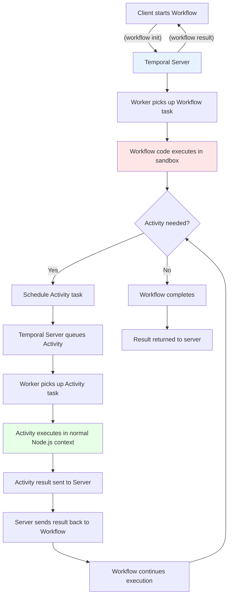

```bash
temporal server start-dev --db-filename hello_world.sqlite
```

- Temporal server: `localhost:7233`
    - TCP or gRPC
        - TODO: Is gRPC built on IP not TCP?
- Temporal UI: http://localhost:8233/namespaces/default/workflows
- Metrics: http://localhost:49955/metrics
    - TODO: what format, how to use?

TODO: research otel and prometheus

Prometheus scrapes metrics from a port on the worker process
otel requires us to push the metrics to the otel server via gRPC _I think_?
tracing information is sent from client to worker in protobuf header and then forwarded on from worker to server in another protobuf headers for future invocations

TODO: Temporal UI has "views" of commonly used kinds of query. Try them out for real. You can define custom views - try this out too

# Logging

Workflows may not use regular Node.js loggers because:

Workflows run in a sandboxed environment and cannot do any I/O.
Workflow code might get replayed at any time, which would result in duplicated log messages.

> Internally, Workflow logging uses Sinks, and is consequently subject to the same limitations as Sinks. Notably, logged objects must be serializable using the V8 serialization.
>
> Sinks enable one-way export of logs, metrics, and traces from the Workflow isolate to the Node.js environment.
> Sinks are written as objects with methods. Similar to Activities, they are declared in the Worker and then proxied in Workflow code, and it helps to share types between both.

# surprises

workflow runs in special context
activities run in normal context  - how?

you only import the activity **types** into the workflow code

when your workflow function "calls" an activity function, this is what actually happens:
(check these, these are just guesses)

1. workflow: schedule the activity on the server by sending gRPC message to server
    * send the name of the activity and a JSON serialisation of any arguments
    * NOTE: this means your args must be ok to serialise
1. workflow: go to sleep waiting to be kicked by server
1. server: dispatches the execution of the activity to the next available worker polling that task queue
    * assume the activity will run on a different worker - it _might_ run on the same one but that's just luck - it's better to have the mental model of it running somewhere else
1. activity-worker: runs the activity in a regular nodejs context
1. activity-worker: returns activity response to server
1. server: restart the workflow with the activity response
1. workflow: continue on from return value of the activity
1. workflow: loop if more activities required
1. workflow: at end, send final return value of the workflow to the server
1. workflow: stop


### workflows are not regular ts
- think of workflow as JS code that your node app sends to a special "browser" to run it -
    - that browser has constraints
- workflow ts files are better thought of a TS alike DSL rather than regular TS
- there are banned modules in workflow code
- workflow code runs inside it's own VM within the nodejs VM
- be careful what you import
- notice that you don't actually do a regular import of the activity functions
    - you just import the types and the "proxy activities" thing
    - you import a proxy function for each activity that you name to look like the activity
    - when you await an activity proxy function, it will put the whole workflow to sleep

TODO: visualise a worker as having a activity runtime and a workflow runtime
Diagram of



* client only ever talks to temporal server
* worker only ever talks to temporal server

### pro tip
> t's a good practice to send a single, serializable data structure into a Workflow as its input, rather than multiple, separate input variables. As your Workflows evolve, you may need to add additional inputs, and using a single argument will make it easier for you to change long-running Workflows in the future.

=> have a big "args" object that the workflow takes and put everything in there
keep workflow code as small as possible because it has to be replayed and can be long running

architect things to minimise the number of times we need to change workflow code


Things which act as clients:

1. Temporal UI
2. `tctl` cli tool
3. client apps I write

Note I can only talk to the server from a client - never to the workers

## workflow chunks

The worker must break the workflow up into chunks so it can restart in the middle - how does it do that?
when the worker gets a task from the queue and that task is "execute a workflow" it must also tell it which chunk to start at


## Gotcha temporal sdk update can cause NDE

crazily, even no code change could cause NDE
On the other hand, not changing workflow code could also cause NDEs, in some rare cases. For example, this recent Temporal SDK release changed the coroutine(thread) ordering for updateHandlers. By just upgrading your workflow code to use release cloud just cause a NDE, even though there are no other code changes from you.

Workflows are broken up into tasks
Workers actually work on tasks not whole workflows

Gotcha: Workflow tasks that take mor than 1 sec are failed automatically!

the sdk has a rust core and exposes to ts/python/ruby via C FFI

> Workflow tasks contain history and are responded to with commands

## Namespaces

There are 2 namespaces by default:

1. `default`
2. `temporal-system` (hidden in Temporal UI)

The following are set at the namespace level:

* Retention
* search attributes
* whether history archival and visibility archival is enabled

You can read the following from the namespace UI in Temporal UI
* versions of Temporal UI and Temporal server

## Schedules (cron like control)

Temporal has a cron feature where you can run workflows on intervals


## Importing history

You can import history JSON into a server by uploading a JSON file to Temporal UI.

Why?

## Deployments

You can view something about them in Temporal UI but not sure what

## Nexus

I think it's some sort of service mesh thingy for Temporal

Multiple teams exist
Each manages a bunch of workflows
nexus lets you connect the workflows together


> Temporal Nexus allows you to reliably connect Temporal Applications. It promotes a more modular architecture for sharing a subset of your team's capabilities with well-defined microservice contracts for other teams to use. Nexus was designed with Durable Execution in mind and enables each team to have their own Namespace for improved modularity, security, debugging, and fault isolation.
> Nexus Services are exposed from a Nexus Endpoint created in the Nexus Registry. Adding a Nexus Endpoint to the Nexus Registry deploys the Endpoint, so it is available at runtime to serve Nexus requests.
> A Nexus Endpoint is a reverse proxy that decouples the caller from the handler and routes requests to upstream targets. It currently supports routing to a single target Namespace and Task Queue. Nexus Services and Nexus Operations are often registered in the same Worker as the underlying Temporal primitives they abstract