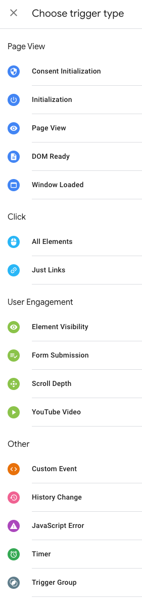

# Google Tag Manager

## Open questions

    Are paused tags still downloaded in the JS file(s) that GTM downloads?

    When do I use a separate workspace vs creating an environment?[
## Workspaces vs environments

* Workspace
  * Lets multiple team members work on changes to the container at the same time
* Environment
    * Lets you deploy a set of changes to a server with different GTM-id
    * you have one environment for each of your code envs (dev, staging, live)

## Overview

-   https://developers.google.com/tag-platform/tag-manager
-   Has a REST API https://developers.google.com/tag-platform/tag-manager/api/v2/devguide
-   Important doc: https://github.com/google/data-layer-helper

## Taxonomy

-   Container
    -   A collection of tags, triggers, variables, and related configurations installed on a given website or mobile app is called a container.
    -   Your container is compiled down to one or more JS files which are downloaded and executed on the page
    -   You can think of the GTM web interface as a GUI for creating JS
    -   AFAICT none of your container actually runs on GTM servers - GTM just compiles it to JS and gives it to your page upon request
    -   => the bigger your container the more JS must be downloaded and executed
-   Tag
    -   A JS snippet of code that executes on a page
    -   Most tags send data to another system e.g. Google Analytics
    -   Without GTM you would add these JS code snippets directly to the page (this is what gtag is about)
-   Trigger
    -   GTM listens for all user events and checks each one for matching triggers. If a trigger matches then the associated tag is run
    -   They are little snippets of code which implement yes/no logic
    -   ?? Does this mean that GTM has to run through all triggers on every event? How do they optimize this?
-   Variable
    -   A placeholder in tag or trigger code which is dynamically replaced by a real value from the page
    -   Variables can derive from other variables - they can be a transformation of another variable

## Data layer

-   Sources
    -   https://support.google.com/tagmanager/answer/6164391?hl=en&ref_topic=3441647&sjid=383055523388983861-AP
    -   https://www.simoahava.com/gtm-tips/remember-to-flush-unused-data-layer-variables/
    -   https://www.simoahava.com/analytics/google-tag-manager-data-model/
-   Temporarily holds values in the client so they can be used by tags, triggers, variables
-   It does **not** persist across page loads. You start from scratch at every page load
-   A layer of abstraction between the "raw" values of the page which come from JS variables, the DOM, first-party cookies and what your tags and triggers reference
    -   Your page JS should add stuff to the data layer and your tags/triggers should only depend on the values in the data layer
-   Tags can reach directly into the DOM, cookies and JS variables but it's brittle because changes in the code/DOM/cookies will break your tags
-   Some tags fire when the page loads so you need to fill your data layer with values they need **before** page load. This boils down to filling the data layer before the GTM JS runs.
-   URL and referrer are always available to tags even without a data layer
-   When to use a data layer:
    -   if tags fire only at page load (and not in response to user interaction) and tags only need URL and referrer then no data layer needed
    -   if tags fire only at page load (and not in response to user interaction) and tags need info beyond URL and referrer then you need a data layer. The data layer needs to set before the GTM JS fires.
    -   if the data your tags need isn't available until after some user interaction then you need to push that data into the data layer and write your tags/triggers to reference it.
-   You don't control when the data layer data is actually used (that happens when the tag fires)

### Data layer vs GTM data model

-   Sources:
    -   https://www.simoahava.com/analytics/google-tag-manager-data-model/
-   The `dataLayer` is designed to be a generic place to store data agnostic of the analtics/tag framework being used.
    -   It is not just a GTM thing.
    -   It is the interface between the dev team(s) and the marketing team(s)
    -   there is an attempt to standardise it https://www.w3.org/2013/12/ceddl-201312
    -   it is designed so that you can have multiple analytics tools on the page which all pull from the data layer
    -   More in https://www.simoahava.com/analytics/data-layer/
    -   > a Data Layer is a data structure which ideally holds all data that you
        > want to process and pass from your website (or other digital context) to
        > other applications that you have linked to
-   The data model treats dataLayer as a queue or a message bus
-   The `dataLayer` is a queue of messages you are sending to GTM. GTM processes each message by updating it's internal data structure.
    -   Google have a helper lib that copies data from the `dataLayer` to their internal abstract data model: https://github.com/google/data-layer-helper
-   The message in the `dataLayer` Array is left untouched.
-   If multiple messages have keys with the same name then their values are **merged together**
    -   primitive scalars just replace the old value
    -   Arrays and objects will recursively merge in the new values. Gothca.
        -   Array example:
        1. push [1, 2, 3]
        2. push [4, 5]
        3. result is [4, 5, 3]
            - first and second elements of the of the first array are overwritten by the second array
        -   Array keys have special `.push` suffix on the key name then GTM will update it's data model by pushing rather than just replacing
-   Removing values from the GTM data model
    -   It's not enough to remove them from the `dataLayer`
    -   You have to push `undefined` as the value for the key e.g. `dataLayer.push({myKey: undefined})` to do a delete
-   If you have a SPA you might need to empty the `dataLayer` manually to avoid a memory leak

### The 'event' key is special

Pushing a message with an `event` key into the data layer triggers the firing of that event
e.g. `{event: 'my_event_name'}

### How GTM loads

Looking at network inspector as GTM loads on a page

1. HTTP GET `https://www.googletagmanager.com/gtm.js?id=GTM-AAAAA`
    - 304KB uncompressed
    - this seems to be GTM JS itself plus maybe some of the container
        - this response has different sizes depending on which site you are on which implies it is tweaked by site or contains part of the container
    - it also downloads hotjar and downloads a small amount of JS from `https://googleads.g.doubleclick.net/pagead/viewthroughconversion/977483861`
    - this script is the initiator of downloading the next request below
2. HTTP GET `https://www.googletagmanager.com/gtag/destination?id=G-WDW88RX51B&l=dataLayer&cx=c`
    - 282KB uncompressed
    - this is presumably the container

### Built-in trigger types



Documented in https://support.google.com/tagmanager/answer/7679322?hl=en&ref_topic=7679108&sjid=10695198469116496935-AP

Individual triggers (the things you use in your tags) are built by customising a trigger type.
Note the trigger type icons - these help distinguish the type when looking at your actual triggers.

#### Page view triggers

GTM has a number of built-in triggers which fire on page load.  Details: https://support.google.com/tagmanager/answer/7679319?hl=en

The triggers are:

1. Consent initialization
    * Fired first by GTM, presumably ASAP after GTM JS loads
2. Initialization
    * Fired right after consent initialization, again presumably on GTM JS load
3. Page view
    * fired "when user begins to load the page" - presumably this is as early as possible in a page load
4. DOM Ready
   * Fired on `DomContentLoaded`
5. Window loaded
   * Fired on `window.load`

## Client side tagging (the default implementation of GTM)

> In client-side tagging, a single container resides on the website or app.
>
> The container holds all tags, triggers, variables, and related code used to
> measure user interactions.
>
> When a user visits a page, the container is activated and loads the related
> tags. When the user performs an action that triggers a tag, the event data gets
> dispatched into one or more HTTP requests from the browser or device to your
> Google products or advertising partners.

## Server side tagging

-   https://support.google.com/tagmanager/answer/13387731?hl=en&ref_topic=3441647&sjid=383055523388983861-AP
-   the server bit runs in GCP app engine

## 'Google Tag Manager' vs 'gtag.js'

> Google Tag Manager and the Google tag (gtag.js) are both fully supported
> methods for the deployment of tags for Google products, such as Google Ads and
> Google Marketing Platform
>
> https://support.google.com/tagmanager/answer/7582054

Confusingly "gtag.js" seems to be the name of a way of managing tags directly in
JS without having the GTM console and also sometimes a thin wrapper function
around the data layer?

```js
// gtag is the conventional name for a wrapper function around dataLayer.push
function gtag() {
    dataLayer.push(arguments);
}

// You can define your own wrappers
function gevent(name, data) {
    gtag("event", name, data);
}

// sample
gevent("level_up", { userId: 123, prevLevel: 12, currLevel: 13 });
gevent("logout", { userId: 123 });
```
