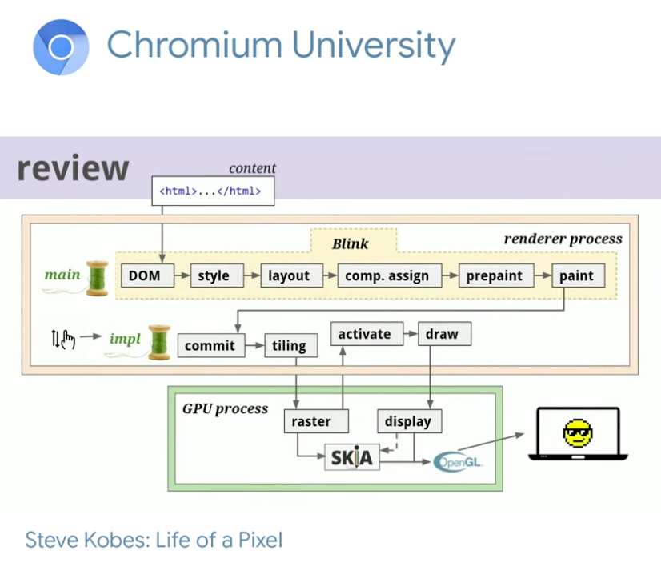

# Chromium University talk: Life of a pixel

-   Sources
    -   https://www.youtube.com/watch?v=K2QHdgAKP-s&list=PL9ioqAuyl6ULp1f36EEjIN1vSBEfsb-0a&index=4
    -   https://docs.google.com/presentation/d/1boPxbgNrTU0ddsc144rcXayGA_WF53k96imRH8Mp34Y/edit#slide=id.ga884fe665f_64_45



-   The renderer process is sandboxed
    -   this process contains:
        -   Blink
        -   Chrome Compositor (CC)
-   From renderer pov, content = HTML, CSS, JS, images, video WebGL etc.
-   The renderer is a pipeline from "content" --> pixels
    ```
    Content -> Chrome -> renderer -> OpenGL -> DirectX (Win only) -> OS Device Driver -> Graphics card -> Pixels on screen
    ```
-   Chrome only supports OpenGL as of 2021
-   There is the initial render and then many updates
-   Chrome has to create intermediate data structures to enable efficient initial render and efficient updates
-   Rendering is organised as a pipeline of _stages_. Each stage takes an intermediate data structure and generates a different one
    ```
    {HTML document} --> HTMLDocumentParser --> HTMLTreeBuilder --> {Document Object Model incl. Shadow DOMs}
    ```
-   The GPU process
    -   just one on the machine
    -   gets inputs from many renderers
    -   The viz thread runs in VPU process - it sends data to the `gpu`

### Pipeline step within Blink (which runs on the main thread of the renderer process and competes with JS)

1. DOM creation
    - The DOM is both the: 1. internal representation of the parsed HTML 2. the API exposed to Javascript via _bindings_ (thin wrappers around the C++) into V8
        - There can be multiple DOMs e.g. custom elements shadow tree.
        - Chrome creates a data structure called a `FlatTreeTraversal` which presents a composed view of all the DOMs and allows walking over all the DOMs for some things
        - Rendering needs this composed view because it corresponds to how the tree should be laid out
2. Style engine
    - Next the _Style engine_ rendering reads all the CSS and builds a tree of
    - For each stylesheet active in the document:
        ```
        {CSS Text} --> CSSParser --> {StyleSheetContents}
        ```
    - For each element in the DOM, the style engine queries the StyleSheetContent object for what the value of each property should be. The output is the _computed style_.
    - When you see computed style in devtools it doesn't strictly show the output of this process - e.g. the value of a property may be `auto` but devtools will resovle it to its final laid out value.
3. Layout
    - Next we determine the visual geometry of each element - this is done by _Layout_
    - Layout uses [HarfBuzz](https://github.com/harfbuzz/harfbuzz) to compute the length of runs of text based on the font.
        - HarfBuzz handles the kerning, ligatures etc.
    - Layout keeps track of
        - border box rectangle
        - layout overflow rectangle
    - Layout is complex
    - Layout operates on a separate tree called the _Layout tree_ which is separate from the DOM
        - In simple cases DOM nodes are 1:1 with Layout objects
        - In other cases a DOM node can create 0 (display: none) or 1+ layout blocks (e.g. `li` element)
    - Chrome's NextGen layout caches the immutable `LayoutResult` objects which are the output of layout nodes
        - There is a tree of LayoutResult
        - Each node describes the physical geometry of a fragment e.g. text broken across lines will generate multiple fragments
        - The fragments are what gets pained
4. Compositing assignments
5. Prepaint
    - Prepaint builds property tree
6. Paint
    - Paint builds a list of drawing instructions called _paint ops_.
    - The output of `Paint` stage is `PaintArtifact`
    - Initially we build a tree of paint ops
    - Paint runs in multiple phases (this is where z-index can change things). Paint phases (simplified): Background -> Floats -> Foregrounds -> outlines
        - Each paint phase does it's own traversal of the stacking context
        ```
        {Paint ops} -> Rasterisation -> {bitmap of color values in}
        ```
    - In the future they are adding compositing layers after paint
    - Each layer is painted separately
    - Paint happens on the main thread and then sends output across to the Impl (aka compositor) thread

### Steps within GPU process

1. Raster
    - Rasterisation is the one that references the data in an image and decodes it to turn it into a bitmap
    - The bitmaps are usually in GPU memory
    - Modern GPUs can be hardware accelerated
    - Raster uses an OSS library called [Skia]() to issue GL calls
    - Raster runs in a separate _GPU Process_ - the stream of PaintOps (wrapped in a Command buffer object) crosses the boundary between processes
    - As of 2018, They are working on supporting Vulkan which his the replacement for OpenGL
2. Display

We don't want to go through that whole process for every render

The renderer produces _animation frames_ (we are aiming for 60fps)
We don't want to take more than 1/60 sec to render the frame

Each pipeline stage tracks granular asynchronous **invalidations**. Outputs re reused from previous frames if possible.

This has shortcomings:
This doesn't work very well if we have to Paint->Raster large chunks of text on scroll
Paint->Raster competes with JS on the main thread so JS can make us miss our 1/60 sec appointments

Building the Layout tree happens at the end of style resolution
Properties are the things which change rendering
A style can influence the rendering of nodes below and around it on the tree

Enter the _compositor_

1. Decompose the page into layers which raster independently
2. Compbine the layers on another thread
    - the layers can be moved aroudn without having to draw every layer from scratch
    - layers are built on the main thread
    - the "impl" (aka the compositor) thread does the moving
    - if a container has a layer then it's children become part of that layer
    - layers can scrol, pinch+zoom, etc
    - the compistor thread gets the first cracck at handling the event
    - if the compistor cannot handle it it puts it on the task queue of th te main thread
    - layers are created b "promoting" elements whichi have \*_compositing triggers_
    - elements which are scollable create a whole bunch of layers for the scroll bars etc.
    - can apppply effects like transforms, clipping, opacity, scrolling etc.

Building the layer tree is a separate step in the pipeline called \_compositing assignments

DOM -> Style -> Layout -> Compositing assignments -> Prepaint -> Paint

Layers raster independnely
Layers are broken into tiles for raster
N raster tasks which run on a pool of raster worker threads
Tiles are "drawn" as quads
These quads are wrapped ina `ComopositorFrame` and this is the output that is sent to the GPU process


